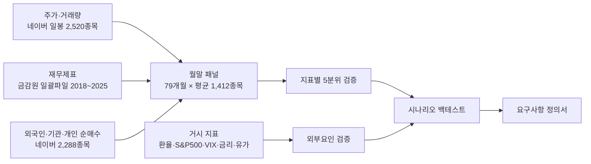

# 지표·외부요인 영향 검증 (2020-01 ~ 2026-08)

## 3줄 요약
- 주가에 **예측력이 있던 지표는 재무 지표(이익 대비 저평가, 자기자본이익률, 영업이익 성장)와 "덜 출렁이고 덜 과열된 종목"**이었다.
- **외국인·기관 수급, 거래량 급증, 단기 상승 추격은 예측력이 없거나 손실**이었다. 외부 요인(미국 증시, 환율, 변동성지수)은 같은 달 주가와 강하게 움직이지만 다음 달은 예측하지 못한다.
- 검증된 지표를 묶은 월 1회 교체 전략은 연 19%로 **코스피 단순 보유와 수익이 같았고**, 하락장 회피 규칙을 붙이면 최대 손실폭이 -35%에서 -16%로 줄었다.

## 방법
| 항목 | 내용 |
|---|---|
| 시점 | 매월 말 종가에 지표 계산, 다음 달 말까지 보유 |
| 대상 | 보통주, 주가 1,000원 이상, 20일 평균 거래대금 5억 이상, 시가총액 500억 이상 |
| 5분위 검증 | 지표 순으로 5등분해 상위 20%와 하위 20%의 다음 달 수익률 차이를 본다 |
| 재무 시점 | 결산일 95일 뒤부터 사용 (발표 전 정보를 쓰지 않기 위함) |
| 비용 | 교체 1회당 왕복 0.3% |

## 결과 1. 지표별 예측력 (상위 20% - 하위 20%, 월 평균)
t값은 우연이 아닐 가능성의 척도다. 절대값 2 이상이면 통계적으로 의미 있다고 본다.

| 구분 | 지표 | 월 수익 차이 | t값 | 맞은 달 비율 | 판정 |
|---|---|---|---|---|---|
| 재무 | 영업이익 성장률 | +1.24% | 4.4 | 67% | 유효 |
| 재무 | 자기자본이익률(ROE) | +1.09% | 2.9 | 68% | 유효 |
| 재무 | 이익/시총 (PER의 역수) | +1.04% | 2.6 | 63% | 유효 |
| 재무 | 매출/시총 | +1.18% | 2.0 | 62% | 유효 |
| 재무 | 자본/시총 (PBR의 역수) | +0.79% | 1.3 | 56% | 약함, 2025년 역효과 |
| 가격 | 60일 변동성 높음 | -1.88% | -2.9 | 32% | 피해야 함 |
| 거래 | 20일 회전율 높음 (과열) | -1.85% | -3.1 | 30% | 피해야 함 |
| 가격 | 52주 고가 근접 | +1.14% | 1.8 | 63% | 경계선 |
| 가격 | 12개월 상승률 | +0.49% | 0.9 | 46% | 무효 |
| 가격 | 3개월 상승률 | -0.68% | -1.2 | 46% | 무효, 추격하면 손해 |
| 거래 | 최근 5일 거래량 급증 | +0.35% | 0.8 | 61% | 무효 |
| 수급 | 외국인 20일 순매수 | +0.31% | 1.4 | 52% | 무효 |
| 수급 | 기관 20일 순매수 | -0.16% | -0.7 | 43% | 무효 |
| 수급 | 개인 60일 순매수 | -0.57% | -1.7 | 44% | 약한 역신호 |

## 결과 2. 외부 요인
| 외부 요인 | 같은 달 코스피 상관 | 다음 달 코스피 상관 | 해석 |
|---|---|---|---|
| S&P500 수익률 | +0.60 | +0.08 | 같이 움직이지만 예측은 안 됨 |
| 변동성지수(VIX) 변화 | -0.39 | -0.06 | 위와 같음 |
| 달러지수 변화 | -0.43 | -0.12 | 위와 같음 |
| 원달러 환율 변화 | -0.19 | -0.09 | 위와 같음 |
| 미 10년 금리 변화 | -0.24 | +0.17 | 위와 같음 |

- 미국 증시가 밤사이 -1.5% 이하였던 121일: 한국 시가가 평균 -1.22% 낮게 시작하고 장중에는 +0.09%. **외부 충격은 시가에 이미 반영되어 장중에 쓸 수 없다.**
- 쓸 만했던 것은 하나다. **코스피가 10개월 평균 위에 있을 때 다음 달 평균 +3.28%, 아래일 때 -0.45%.** 예측이 아니라 하락장 회피 스위치로 쓴다.
- 공포 구간(VIX 25 초과, S&P500 월 -5% 이하) 다음 달은 오히려 평균 수익이 높았다. 표본이 9~19개월로 작아 규칙으로 쓰지 않는다.

## 결과 3. 시나리오 백테스트 (20종목 동일 비중, 월 1회 교체)
| 시나리오 | 연복리 | 최대 손실폭 | 2020~23 | 2024~26 |
|---|---|---|---|---|
| 종합 (저평가+우량+저변동) | 19.0% | -35% | 22.0% | 14.7% |
| 종합 + 하락장 현금 전환 | 18.5% | -16% | 24.2% | 10.8% |
| 모멘텀 | 17.2% | -40% | 1.5% | 46.3% |
| 저평가만 | 10.9% | -37% | 9.3% | 13.3% |
| 수급 추종 (외국인+기관) | -5.5% | -62% | -7.5% | -2.2% |
| 거래량 급증 추격 | -20.6% | -81% | -18.1% | -24.3% |
| 기준: 코스피 | 19.4% | -35% | 4.2% | 47.5% |
| 기준: 전 종목 동일 비중 | 4.3% | -42% | 6.5% | 1.1% |

종합 시나리오는 종목 수 10~50개, 비용 1.0%, 대형·중형주 한정으로 바꿔도 연 8.5~21.6%로 모두 플러스였다 (robust_results.csv).

## 결과 4. 정보가 들어오는 시점의 영향 (영업이익 성장 지표로 검증)
| 조건 | 월 수익 차이 | t값 | 맞은 달 비율 |
|---|---|---|---|
| 연 1회 갱신 (결산 95일 뒤) | +1.24% | 4.4 | 67% |
| 분기마다 갱신 (분기말 50일 뒤) | +1.63% | 6.0 | 76% |
| 실적 공개 후 0~30일 된 정보만 | +2.18% | 5.2 | 85% |
| 실적 공개 후 61~90일 된 정보만 | +0.77% | 1.6 | 81% |
| 참고: 분기말 20일 뒤에 전 종목 실적을 안다고 가정 (상한선, 실제로는 불가능) | +2.63% | 8.4 | 82% |

같은 지표라도 **정보가 신선할수록 효과가 크고, 공개 후 두 달이 지나면 절반 이하로 줄어든다.** 달력 기준 월 1회 교체보다 각 회사의 실적 공개일 기준으로 움직이는 편이 유리하다.

## 결과 5. 상장폐지 종목을 포함한 재검증
2019년 이후 상장폐지 496건 중 스팩·펀드를 뺀 349건을 대상으로 했다. 네이버에 남아 있는 폐지 종목 시세(정리매매 폭락 포함) 295개를 받고, 주식 수는 재무제표의 순이익 ÷ 주당순이익으로 역산했다(현재 상장 2,481종목으로 검증 시 중앙값 0.99배). 보유 중 거래정지되면 거래 재개나 정리매매 종료 시점의 가격으로 청산한 것으로 계산했다.

| 항목 | 생존 종목만 | 폐지 포함 |
|---|---|---|
| 영업이익 성장 (월 수익차 / t값) | +1.24% / 4.4 | +1.34% / 4.7 |
| 자기자본이익률 | +1.09% / 2.9 | +1.30% / 3.4 |
| 이익/시총 | +1.04% / 2.6 | +1.25% / 3.1 |
| 고변동성 | -1.88% / -2.8 | -2.11% / -3.2 |
| 종합 전략 (연복리 / 최대 손실폭) | 19.0% / -35% | 18.8% / -39% |
| 종합 + 하락장 현금 전환 | 18.5% / -16% | 19.1% / -15% |
| 거래량 급증 추격 | -20.6% / -81% | -23.1% / -84% |
| 전 종목 동일 비중 | 4.3% / -42% | 3.7% / -43% |

- **결론이 바뀌지 않았다.** 지표 효과는 오히려 조금 커졌다. 부실 폐지 종목이 지표 하위 구간에 몰려 있기 때문이다. 부실 폐지 종목의 관측 502건 중 68%가 종합점수 최하위 20%, 2%만 최상위 20%에 있었다.
- 종합 전략이 79개월간 고른 1,520건 중 이후 폐지된 종목은 9개였고, 그중 부실 폐지는 1개(CNH, 보유 1개월 -12%)였다. 나머지 8개는 합병·자진폐지로 대부분 수익이었다.
- **남은 한계**: 폐지 종목 90개는 주식 수를 구하지 못해 빠졌다. 그중 85개는 금감원 일괄 파일에 재무 자료 자체가 없다(부실 폐지 49개 포함). 당시에는 재무 자료가 있었을 것이므로 실제로는 선택 대상이었을 수 있다.

## 한계 (결과를 실제보다 좋게 만드는 방향)
| 한계 | 영향 |
|---|---|
| 폐지 종목 349개 중 90개는 자료 부족으로 제외 (결과 5 참고) | 영향은 작을 것으로 보이나 0은 아님 |
| 시가총액을 현재 주식 수로 근사 | 증자한 회사의 과거 지표가 부정확 |
| 월말 종가에 계산하고 같은 종가에 체결 가정 | 실제로는 다음 날 체결, 소형주는 체결 오차 큼 |
| 79개월, 상승장 2회 포함 | 다른 국면에서 재현 보장 없음 |
| 뉴스는 검증하지 않음 | 언어모델로 과거 뉴스를 평가하면 모델이 이미 결과를 알고 있어 검증이 오염됨 |
