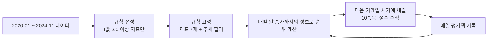

# 100만원 모의 운용 (2025-01-02 ~ 2026-09-01)

## 3줄 요약
- 2024년 12월까지의 데이터만으로 규칙을 고르고 고정한 뒤, 2025년 1월부터 100만원을 하루 단위로 운용했다. **결과는 1,428,649원(+42.9%), 최대 손실폭 -25.2%**다.
- 같은 기간 **코스피는 +184.9%**였다. 대형주 중심의 기록적 상승장이었고, 이 전략은 지수를 크게 밑돌았다. 전 종목 동일 비중(+22.6%)과 코스닥(+21.1%)보다는 높았다.
- **추세 필터는 이 기간에 손해였다.** 2025년 1~4월을 현금으로 보내 수익을 놓쳤고(필터 없이는 +61.1%), 손실폭도 줄이지 못했다(-25.2% 대 -25.9%).

## 미래 정보 차단 방법
| 항목 | 처리 |
|---|---|
| 규칙 선정 | 2024-11 말 매수분까지만 사용. 지표 12개 후보 중 월 수익차의 t값 절대값 2.0 이상만 채택한다는 기준을 먼저 고정 |
| 매매 판단 | 월말 종가까지 공개된 정보만 사용. 재무는 결산 95일 뒤, 분기 실적은 분기말 50일 뒤부터 |
| 체결 | 판단 다음 거래일 시가. 거래정지 종목은 매매 불가 |
| 추세 필터 | 판단 시점까지의 코스피 월말 종가 10개만 사용 |
| 종목 범위 | 당시 거래되던 종목 전체. 이후 상장폐지된 종목 포함 |

## 고정된 규칙
| 구분 | 내용 |
|---|---|
| 매수 점수 (높을수록) | 이익/시총, 매출/시총, 자기자본이익률, 영업이익 성장(연간), 영업이익 성장(분기) |
| 매수 점수 (낮을수록) | 60일 변동성, 20일 회전율 |
| 기각된 후보 | 자본/시총, 12개월 상승률, 3개월 상승률, 52주 고가 근접, 거래량 급증 |
| 대상 | 주가 1,000원 이상, 20일 평균 거래대금 5억 이상, 시총 500억 이상 |
| 보유 | 점수 상위 10종목, 1주 가격이 평가액의 10% 이하인 종목만, 종목당 평가액의 10% |
| 매도 | 월말 재계산에서 상위 10위 밖으로 나가면 다음 거래일 시가에 매도 |
| 추세 필터 | 코스피 월말 종가가 최근 10개월 평균 아래면 전량 현금 |
| 비용 | 수수료 0.015%, 매도세 0.15%(2025)·0.20%(2026), 체결 오차 매수·매도 각 0.2% |

## 결과
| 항목 | 추세 필터 적용 | 추세 필터 미적용 | 코스피 | 코스닥 | 전 종목 동일 비중 |
|---|---|---|---|---|---|
| 최종 평가액 | 1,428,649원 | 1,610,858원 | 2,848,855원 | 1,211,000원 | 1,226,000원 |
| 수익률 | +42.9% | +61.1% | +184.9% | +21.1% | +22.6% |
| 최대 손실폭 | -25.2% | -25.9% | -38.6% | - | - |
| 낸 비용 | 61,607원 | 81,894원 | - | - | - |

## 매매 내역 요약 (추세 필터 적용)
| 항목 | 값 |
|---|---|
| 매매 완료 | 80건 (이익 41건, 손실 39건) |
| 실현 손익 | +400,026원 |
| 건당 평균 / 최고 / 최저 | +5.8% / +85.4% (삼지전자) / -21.8% (케이카) |
| 2026-09-01 보유 | 10종목, 평가손익 +28,623원, 현금 144,810원 |
| 현금 보유 기간 | 2025-01 ~ 2025-04 (추세 필터) |
| 최저점 | 2026-06-26, 고점 대비 -25.2% |

월별 평가액은 `equity_trend.csv`, 전체 매매 내역은 `ledger_trend.csv`에 있다.

## 지수 상장지수펀드와 섞었을 때
지수 부분은 KODEX 200을 2025-01-02 시가(30,992원)에 정수 주식으로 사서 보유했다. 전략 부분은 줄어든 자금으로 모의 운용을 다시 돌렸다. 중간에 비율을 다시 맞추지 않았다. 아래는 추세 필터 미적용 기준이다.

| 전략 비중 | 지수 비중 | 최종 평가액 | 수익률 | 최대 손실폭 | 최악의 달 |
|---|---|---|---|---|---|
| 0% | 100% | 3,460,427원 | +246.0% | -40.7% | -21.3% |
| 20% | 80% | 3,011,898원 | +201.2% | -37.8% | -19.2% |
| 40% | 60% | 2,642,027원 | +164.2% | -33.9% | -17.0% |
| 50% | 50% | 2,476,915원 | +147.7% | -31.2% | -16.6% |
| 60% | 40% | 2,246,810원 | +124.7% | -27.0% | -14.4% |
| 80% | 20% | 1,951,431원 | +95.1% | -18.5% | -12.8% |
| 100% | 0% | 1,610,858원 | +61.1% | -25.9% | -10.2% |

- 전략과 지수의 월 수익률 상관은 0.25였다. 지수가 하락한 5개월 동안 지수는 평균 -9.6%, 전략은 평균 +0.7%였다.
- 그래서 **80 대 20으로 섞으면 손실폭(-18.5%)이 둘 중 어느 쪽 단독보다도 작았다.**
- 추세 필터를 적용한 결과는 `blend_results.csv`에 있다. 모든 비율에서 미적용보다 수익이 낮았다.

## 해석
- 승률은 51%로 동전 던지기와 비슷했다. 수익은 **이익 거래의 크기가 손실 거래보다 컸던 것**에서 나왔다. 검증 단계에서 본 "개별 종목은 못 맞히고 묶음으로 확률이 기운다"는 결과와 같다.
- 지수를 크게 밑돈 이유는 이 기간 코스피 상승이 소수 대형주에 집중됐기 때문이다. 이 전략은 주가가 10만원 이하인 중소형주만 살 수 있었다.
- 2026년 5~6월 두 달 연속 -8%가 가장 나쁜 구간이었다. 그때 코스피는 +28%, 0%였다.

## 한계
| 한계 | 영향 |
|---|---|
| 시가 체결 가정, 체결 오차 0.2% 고정 | 소형주에서는 실제 오차가 더 클 수 있음 |
| 배당 미반영 | 실제보다 낮게 나옴 |
| 재무 수치가 정정 반영본, 시총은 현재 주식 수로 근사 | 작은 미래 정보가 남아 있음 |
| 20개월, 시장 국면 1개 | 다른 국면에서의 결과는 알 수 없음 |
