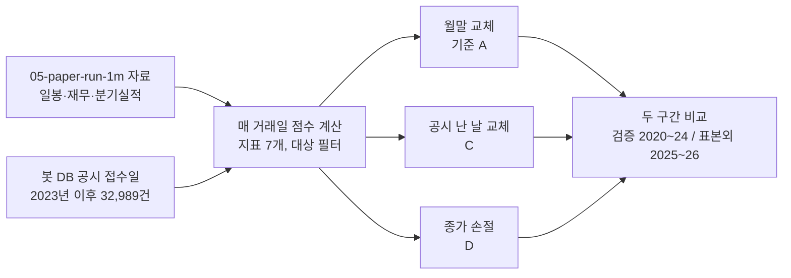

# 매일 신호 검증: 실적 공시 즉시 반영, 종목별 손절 (2020-02 ~ 2026-09)

## 3줄 요약
- **실적 공시가 나온 날 바로 종목을 바꾸는 규칙(C)은 효과가 거의 없었다.** 수익은 연 +0.1~0.9%p 늘었지만 매매가 16~22% 늘어 비용이 연 0.5~0.8%p 더 나갔고, 손실폭은 줄지 않았다. 채택하지 않는다.
- **종목별 손절(D)은 수익을 조금 내주고 손실폭을 줄이는 거래였다.** 공짜 개선이 아니다. 문턱 세 개 모두 두 구간에서 손실폭이 줄었고(-36% → -28~-33%), 수익은 대체로 조금 낮아졌다. 20%를 지수에 두는 실제 구성(80:20)에서는 표본외 구간의 손실폭 개선이 사라졌다.
- 덤으로 확인한 것: **실제 공시 접수일을 쓰면 기준 전략 자체가 연 1~2%p 좋아진다**(가정 공개일보다 정보가 일찍 들어온다). 봇은 이미 실제 접수일을 쓴다.

## 방법
| 항목 | 내용 |
|---|---|
| 기반 | `05-paper-run-1m/scripts/simulate.py`를 그대로 옮긴 엔진. 같은 자료로 돌려 **기존 결과(추세 필터 없음 1,610,858원, 있음 1,428,649원)와 원 단위까지 같음**을 먼저 확인했다 |
| 규칙 | 지표 7개(`rules.json`), 주가 1,000원·거래대금 5억·시총 500억 이상, 10종목, 1주 가격 ≤ 평가액의 10%, 다음 거래일 시가 체결 |
| 비용 | 수수료 0.015%, 체결 오차 매수·매도 각 0.2%, 매도세 연도별(2020 0.25%, 2021~22 0.23%, 2023 0.20%, 2024 0.18%, 2025 0.15%, 2026 0.20%) |
| 시작 자금 | 100만원. 80:20은 전략 80만원 + KODEX 200 20만원을 첫날 사서 계속 보유 |
| 구간 | **검증** 2020-02 ~ 2024-12, **표본외** 2025-01 ~ 2026-09-01. 지표는 2024-11까지의 자료로 골랐으므로 표본외가 진짜 시험이다 |
| 재무 공개일 | `actual`: 2023년 이후 공시는 봇 DB의 **실제 최초 접수일**(정정 제외), 그 전은 가정. `assumed`: 검증 때 가정(결산+95일, 분기말+50일) |
| 상장폐지 | 포함. 폐지되면 마지막 가격으로 정리 |

### 시나리오
| 이름 | 규칙 |
|---|---|
| A 기준 | 지금 봇 규칙. 월말에 교체 |
| B 추세 필터 | 코스피 월말 종가가 최근 10개월 평균 이하면 전략 부분을 전량 현금으로 (참고용) |
| C 공시 반영 | 월말 교체는 그대로. 추가로 **매 거래일**, 그날 새 재무가 공개된 종목만 보고 ① 그 보유 종목이 20위 밖으로 밀렸으면 팔고 ② 그 종목이 10위 안에 들어왔으면 산다(자리가 없으면 10위 밖의 가장 낮은 보유 종목과 바꾼다). 다음 거래일 시가 체결 |
| D 손절 | 종가가 매수가 대비 -10%, -15%, -20%에 닿으면 다음 거래일 시가에 판다. 빈자리는 **월말까지 현금** 또는 **월말 순위의 다음 종목으로 바로 채움**(그 달 손절한 종목 제외) |
| E | C + 손절 -15%(채움) |

손절 문턱은 세 개를 미리 정하고 전부 적는다. 가장 좋은 값만 고르면 과거에 맞춘 숫자가 된다.

## 결과 (실제 접수일 기준)

| 시나리오 | 구간 | 연복리 | 최대 손실폭 | 최악의 달 | 연 매매 | 연 비용률 | 80:20 연복리 | 80:20 손실폭 |
|---|---|---|---|---|---|---|---|---|
| **A 기준** | 검증 | 16.5% | -36.1% | -14.9% | 110건 | 3.35% | 15.6% | -36.0% |
| | 표본외 | 35.4% | -22.8% | -10.3% | 126건 | 3.57% | 51.0% | -18.2% |
| B 추세 필터 | 검증 | 16.2% | **-15.4%** | -5.1% | 76건 | 2.20% | 13.4% | -15.9% |
| | 표본외 | 26.9% | -22.2% | -9.7% | 102건 | 3.01% | 44.8% | -18.8% |
| C 공시 반영 | 검증 | 16.6% | -35.4% | -14.5% | 128건 | 3.84% | 15.8% | -35.5% |
| | 표본외 | 36.3% | -23.3% | -11.4% | 154건 | 4.35% | 50.5% | -19.7% |
| D 손절 -10% (현금) | 검증 | 15.8% | -28.0% | -11.7% | 125건 | 3.77% | 14.4% | -28.1% |
| | 표본외 | 33.6% | -18.0% | -9.0% | 135건 | 3.83% | 49.8% | -19.0% |
| D 손절 -15% (현금) | 검증 | 16.4% | -30.4% | -13.2% | 120건 | 3.61% | 14.8% | -30.3% |
| | 표본외 | 34.9% | -19.7% | -9.1% | 130건 | 3.68% | 50.7% | -18.2% |
| D 손절 -20% (현금) | 검증 | 14.6% | -33.2% | -17.5% | 115건 | 3.46% | 13.8% | -31.1% |
| | 표본외 | 34.6% | -21.8% | -10.3% | 126건 | 3.56% | 50.5% | -18.8% |
| D 손절 -10% (채움) | 검증 | 16.9% | -32.1% | -17.7% | 153건 | 4.64% | 14.7% | -32.2% |
| | 표본외 | 32.6% | -22.2% | -10.3% | 160건 | 4.55% | 49.5% | -20.1% |
| D 손절 -15% (채움) | 검증 | 17.0% | -31.9% | -17.8% | 130건 | 3.91% | 15.4% | -31.1% |
| | 표본외 | 35.4% | -22.4% | -9.5% | 137건 | 3.92% | 51.2% | -18.3% |
| D 손절 -20% (채움) | 검증 | 14.7% | -31.9% | -17.5% | 118건 | 3.53% | 13.8% | -30.1% |
| | 표본외 | 34.8% | -22.4% | -10.3% | 128건 | 3.60% | 50.6% | -18.6% |
| E 공시 + 손절 -15% | 검증 | 15.5% | -35.1% | -17.4% | 146건 | 4.39% | 14.2% | -33.2% |
| | 표본외 | 34.8% | -21.1% | -11.4% | 172건 | 4.91% | 49.3% | -20.2% |

### 공개일 가정에 따른 차이 (A와 C만)
| 시나리오 | 구간 | 가정 공개일 | 실제 접수일 |
|---|---|---|---|
| A 기준 | 검증 | 15.5% / -36.1% | 16.5% / -36.1% |
| | 표본외 | 33.2% / -25.9% | 35.4% / -22.8% |
| C 공시 반영 | 검증 | 15.5% / -35.4% | 16.6% / -35.4% |
| | 표본외 | 33.4% / -26.7% | 36.3% / -23.3% |

(연복리 / 최대 손실폭) 가정 공개일에서는 모든 회사의 재무가 같은 날 들어오므로 C가 "그날 한 번 더 교체"와 같아지고, 효과는 0에 가깝다.

## 해석
- **C가 안 통한 이유.** 검증 단계(03 결과 4)에서 "신선한 정보일수록 효과가 크다"는 것은 영업이익 성장 **지표 하나**의 결과였다. 봇 점수는 지표 7개의 합이라 재무 하나가 바뀌어도 순위가 크게 움직이지 않고, 월말 교체만으로도 공시 뒤 길어야 한 달 안에 반영된다. 남는 이득이 매매 비용과 비슷하다.
- **손절은 "보험"이다.** 문턱이 좁을수록 손실폭이 줄고 수익도 준다(현금 대기 기준 -10% → -15% → -20%로 가며 손실폭 -28% → -30% → -33%). 한 방향으로 움직이므로 우연은 아닌 것으로 보인다. 다만 수익이 **두 구간 모두에서** 기준보다 나은 문턱은 없다.
- **"다음 순위로 채움"은 손절의 장점을 지운다.** 판 돈을 바로 다시 넣으니 손실폭 개선이 작고(검증 -36% → -32%, 표본외 그대로) 최악의 달은 오히려 나빠졌다(-14.9% → -17.8%).
- **80:20 구성에서는 표본외 손실폭 이득이 없다.** 지수 20%가 이미 손실폭을 줄여 주고 있어서, 손절이 더할 몫이 작다. 검증 구간에서는 -36% → -30%로 여전히 줄었다.
- **추세 필터(B)는 검증 구간 손실폭을 절반 아래로 줄였지만** 표본외 구간에서는 수익을 연 8.5%p 내주고 손실폭은 그대로였다. 05의 결론("이 기간에 손해")과 같다.

## 채택 판단
| 시나리오 | 판단 | 이유 |
|---|---|---|
| C 공시 반영 | **채택 안 함** | 두 구간 모두 개선이 비용 증가와 비슷하거나 작다. 매매만 늘어난다 |
| D 손절 (현금 대기) | **조건부 후보** | 두 구간 모두 손실폭이 줄었다. 수익은 대체로 조금 줄었다. "수익 조금 내주고 낙폭 줄이기"를 원하면 -15%가 가장 덜 내준다. 실제 구성(80:20)의 표본외 구간에서는 이득이 없었다 |
| D 손절 (바로 채움) | 채택 안 함 | 손실폭 개선이 작고 최악의 달이 나빠진다. 매매가 늘어난다 |
| E | 채택 안 함 | C의 비용에 손절 이득이 묻힌다 |

기준("검증·표본외 둘 다에서 기준보다 나아야")을 수익과 손실폭 **둘 다**로 보면 통과한 시나리오는 없다. 손실폭만으로 보면 D(현금 대기)의 세 문턱이 모두 통과한다.

## 한계
| 한계 | 영향 |
|---|---|
| 2020~2022년 공시일은 가정(결산+95일, 분기말+50일). 실제 접수일은 봇 DB에 2023년 이후만 있다 | 검증 구간의 C는 앞 3년이 사실상 "가정 날짜에 한 번 더 교체"다 |
| 재무 값은 금감원 일괄 파일(정정 반영본), 시총은 현재 주식 수로 근사 | 작은 미래 정보가 남아 있다. 모든 시나리오에 같게 들어간다 |
| 검증 구간은 지표를 고른 기간과 겹친다 | 검증 구간 수치는 모든 시나리오에서 실제보다 좋게 나온다. 비교는 공정하지만 절대 수준은 믿지 않는다 |
| 손절은 종가로 판단하고 다음 날 시가에 판다 | 갭 하락은 반영된다. 장중 손절(지정가 감시)은 시험하지 않았다 |
| 체결 오차 0.2% 고정 | 매매가 많은 C·E에 불리할 수도, 소형주면 실제 오차가 더 클 수도 있다 |
| 80:20의 지수 부분은 첫날 사서 계속 보유(재조정 없음), 가격은 봇 DB의 KODEX 200 일봉 | 봇은 5%p 이상 벗어나면 재조정한다 |
| 두 구간 합쳐 6년 8개월, 큰 하락장은 2020년 3월·2022년 | 다른 국면의 결과는 알 수 없다 |

## 파일
| 파일 | 내용 |
|---|---|
| `scripts/daily_signals.py` | 점수 계산과 운용 엔진. `DATA=<bt·sim 폴더> python daily_signals.py` |
| `results.csv` | 위 표 전체(가정 공개일 포함) |
| `equity/*.csv` | 시나리오·구간별 일별 평가액 |
