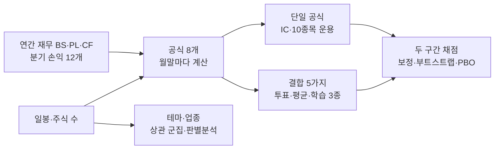

# 공식 앙상블 검증 (2020-02 ~ 2026-09)

## 3줄 요약
- **채택 후보 없음. 지금의 7지표 점수(BASE)를 그대로 둔다.** 공식 6개를 하나씩 쓰든, 투표·순위 평균·학습 모델(로지스틱·판별분석·트리)로 합치든, 두 구간 모두에서 BASE의 수익을 넘은 방식이 하나도 없었다.
- 공식들이 쓸모없는 것은 아니다. GP/A, F점수, 증자 적음, 마법공식, 버핏 품질은 **두 구간 모두 방향이 맞는 예측력**(IC)이 있었다. 하지만 BASE의 예측력(IC 0.12)이 가장 좋은 공식(0.07~0.09)보다 훨씬 크고, 공식들이 BASE와 겹쳐 더해 줄 것이 적었다. 발생액은 교과서와 **반대 방향**이었다.
- 업종은 실제로 같이 움직이는 묶음이지만, 수익률로 묶은 "데이터 테마"는 공식 업종과 거의 겹치지 않았다(ARI 0.04~0.08). 테마·업종의 지난 수익률은 다음 달을 예측하지 못했고, 오히려 약한 **반전**(오른 테마가 다음 달 덜 오름)이었다.

## 0. 사전 고정 (2026-09-23, 결과를 보기 전에 적었다. 이 절은 바꾸지 않는다)

결과를 보고 공식이나 숫자를 고치면 "과거에 맞춘 공식"이 된다. 그래서 무엇을 어떻게 비교하고 무엇을 채택할지를 **먼저** 적어 둔다.

### 구간

| 구간 | 기간 | 쓰임 |
|---|---|---|
| 선택·학습 | 2020-02 ~ 2024-12 | 공식 비교, 스태킹 모델 학습 |
| 최종 채점(표본외) | 2025-01 ~ 2026-09 | 채점만. 이 구간을 본 뒤 공식·파라미터를 고치지 않는다 |

### 공통 규칙

- 체결·비용·보유는 06 연구 엔진과 같다: 월말 종가로 순위 → 다음 거래일 시가 체결, 10종목, 1주 가격 ≤ 평가액의 10%, 수수료 0.015%, 체결 오차 매수·매도 각 0.2%, 연도별 매도세, 상장폐지 포함.
- 대상: 주가 1,000원·20일 평균 거래대금 5억·시가총액 500억 이상, 그날 거래된 종목(06과 같음). 새 공식은 **금융·보험 양식(fin_kind) 종목을 뺀다**.
- 재무는 `avail`(실제 최초 접수일, 없으면 결산+95일·분기말+50일) **이전에 공개된 것만** 쓴다. 결산이 500일보다 오래된 재무는 쓰지 않는다.
- 전년 값이 필요한 공식은 같은 회사의 바로 앞 결산(11~13개월 전)만 쓴다.

### 공식 (formulas.md 3장 숏리스트)

| 이름 | 계산 | 방향 | 역할 |
|---|---|---|---|
| BASE | 현재 7지표 백분위 합(EP, SP, ROE, OPG, OPG_Q, -VOL60, -TURN20). 06 엔진 그대로 | 높을수록 | 기준 |
| GPA | 매출총이익 ÷ 자산총계 | 높을수록 | 점수 |
| FSCORE | 피오트로스키 9신호 합(0~9). ROA>0, CFO>0, ΔROA>0, CFO/자산>ROA, 비유동부채/자산 감소, 유동비율 증가, 자본금 늘지 않음, 매출총이익률 증가, 자산회전율 증가. 값이 없는 신호는 0점 | 높을수록 | 점수 |
| NSI | ln(추정 주식 수 ÷ 전년 추정 주식 수). 추정 주식 수가 없으면 자본금 비율 | 낮을수록 | 점수 |
| AG | 자산총계 ÷ 전년 자산총계 − 1 | — | **걸러내기**: 대상 안에서 상위 20%·하위 10% 제외 |
| ACC | (지배순이익 − 영업현금흐름) ÷ 평균 자산 | 낮을수록 | 점수 |
| MAGIC | rank(영업이익 ÷ EV) + rank(GPA). EV = 시가총액 + 차입금 − 현금(빈 값은 0) | 높을수록 | 점수 |
| ZPP | 알트만 Z″ = 6.56·(유동자산−유동부채)/자산 + 3.26·이익잉여금/자산 + 6.72·영업이익/자산 + 1.05·자본/부채 | — | **걸러내기**: 대상 안에서 하위 10% 제외 |
| BUFFETT | 백분위 평균: ROE(연간) 높음, 최근 12개 분기 중 순이익 흑자 비율 높음, 12개 분기 영업이익률 표준편차 낮음(8개 분기 이상 있을 때), 부채÷자본 낮음 | 높을수록 | 점수 |

### 결합 방식

| 이름 | 규칙 |
|---|---|
| VOTE | 걸러내기(ZPP 하위 10%, AG 상위 20%·하위 10%) → 투표자 7명(BASE, GPA, FSCORE, MAGIC, BUFFETT, -NSI, -ACC)이 걸러진 대상 안에서 백분위를 매겨 **상위 20%면 1표** → 표 많은 순, 동점은 7개 백분위 평균 순 → 10종목, **업종당 최대 3종목**. 값이 없는 투표자는 표를 주지 않는다 |
| RANKAVG | 같은 걸러내기 → 7개 백분위 평균(없는 값은 0.5) 순 → 10종목(업종 제한 없음) |
| STACK_LOGIT | 같은 걸러내기 → 7개 백분위를 입력으로 "다음 달 수익률 상위 20%(1) vs 하위 20%(0)" 로지스틱. **매년 1월에 그 전 달까지 결과가 확정된 월만으로 다시 학습**. 2020년은 학습 자료가 없어 RANKAVG를 쓴다 |
| STACK_LDA | 위와 같고 모델만 선형판별분석(수축 자동) |
| STACK_GBM | 위와 같고 모델만 얕은 트리 부스팅(깊이 3, 100회, 학습률 0.05) |

시도 수 N = 단일 공식 7개(BASE 포함) + 결합 5개 = 12. 디플레이티드 샤프에 이 N을 쓴다.

### 분석

1. 단일 공식: 월별 횡단면 순위상관(IC, 다음 달 수익률), 평균 IC와 t값(뉴이-웨스트 3개월), 10분위 스프레드, 10종목 운용(연복리·최대 손실폭·연 매매·비용), 전략 80 : KODEX 200 20 혼합. 두 구간 각각
2. 중복: 공식 점수끼리 월별 순위상관 평균 행렬, 주성분(유효 공식 수), 계층 군집. IC 시계열 상관
3. 테마·업종: (a) 120일 시장조정 수익률 상관으로 종목을 묶은 "데이터 테마"와 업종의 일치도(ARI), 같은 업종 안 상관 − 업종 간 상관의 순열검정, (b) 재무 특성만으로 업종을 판별하는 LDA(5겹 교차검증, 최빈값·라벨 섞기 기준과 비교), (c) 다음 달 상위 20% vs 하위 20%를 판별하는 워크포워드 LDA·로지스틱의 정확도와 AUC, (d) 테마(데이터 테마·업종) 평균 수익률의 1·6개월 모멘텀 신호 IC
4. 과최적화 점검: 단일 공식 IC의 홀름 보정 p, t>3 표시, 디플레이티드 샤프(N=12), 선택 구간 CSCV로 과최적화 확률(PBO, 블록 8개), 기준 대비 월 초과수익의 블록 부트스트랩 95% 신뢰구간

### 세부 (역시 결과 전에 고정)

- 점수가 같은 종목(F점수처럼 정수 점수)은 종목코드 순으로 줄 세운다(봇과 같은 규칙).
- BASE는 06 엔진처럼 상위 60위 안에서만 고른다. 다른 방식은 순위 전체에서 고른다(업종 제한 때문에 60위 밖이 필요할 수 있다).
- 데이터 테마: 판단일까지 120거래일 중 100일 이상 거래된 대상 종목의 일간 수익률에서 그날 대상 종목 평균을 뺀 잔차로 상관을 구하고, 거리 1−ρ·평균 연결로 **30개 묶음**으로 자른다.
- 업종 판별 LDA: 재무 특성 12개(GPA, 매출총이익률, 영업이익률, 자산회전율, 부채÷자본, 유동비율, 현금÷자산, 설비투자÷자산, VOL60, TURN20, AG, ROE)를 그날 백분위로 바꿔 입력. 그날 대상에 30종목 이상 있는 업종만. 매년 말(2020~2025) 한 번씩 5겹 교차검증.
- 테마 모멘텀: 업종·데이터 테마 각각, 소속 종목의 지난 1개월·6개월 평균 수익률을 그 종목의 신호로 쓴다.
- 부트스트랩: 블록 길이 3개월, 5,000회. CSCV: 선택 구간 월수익을 8개 블록으로 나눠 70개 조합.

### 채택 기준

선택 구간과 표본외 **둘 다**에서 BASE보다 연복리가 높고, 최대 손실폭이 BASE보다 2%p 넘게 나쁘지 않으며, 다음 중 하나를 만족하면 "채택 후보"다: (i) 기준 대비 월 초과수익 부트스트랩 신뢰구간 하한 > 0, 또는 (ii) 단일 공식이면 홀름 보정 IC가 두 구간 모두 유의하고 같은 부호. 아니면 "기각". 전부 기각이어도 그대로 보고한다.

## 1. 단일 공식의 예측력 (월별 순위상관 IC, `ic.csv`)

IC는 "그달 점수 순위와 다음 달 수익률 순위가 얼마나 같이 가는가"다. 0이면 무관, 0.05면 약하지만 꾸준한 신호다. 10종목만 고르는 운용보다 표본이 훨씬 커서(매달 약 1,400종목) 판정이 안정적이다.

| 공식 | 선택 IC (t) | 표본외 IC (t) | 두 구간 홀름 보정 유의 | 선택 10분위 스프레드(월) |
|---|---|---|---|---|
| **BASE (현재)** | **0.122 (9.6)** | **0.131 (4.8)** | 예 | 2.64% |
| BUFFETT | 0.072 (7.3) | 0.093 (5.2) | 예 | 1.88% |
| MAGIC | 0.070 (6.9) | 0.083 (3.2) | 예 | 0.88% |
| FSCORE | 0.060 (7.5) | 0.077 (4.9) | 예 | 0.89% |
| NSI (증자 적음) | 0.039 (5.3) | 0.051 (4.2) | 예 | 0.05% |
| GPA | 0.031 (3.2) | 0.033 (1.6) | 선택만 | 0.50% |
| ACC (발생액 낮음) | **−0.020 (−3.5)** | **−0.024 (−3.8)** | 예, **반대 방향** | −0.67% |
| 참고: 자산증가율 낮음 | −0.003 (−0.4) | −0.034 (−4.0) | — | 0.06% |
| 참고: Z″ 높음 | 0.027 (3.6) | 0.042 (4.5) | — | 0.81% |

- BUFFETT의 선택 구간은 2021-04 판단부터다(분기 8개가 쌓여야 계산된다).
- 발생액은 "이익 중 현금으로 안 들어온 몫이 **큰** 회사"가 오히려 나았다. 한국 선행연구(2007, 제조업·3년 보유)와 다른 결과다. 우리 기간은 매출채권이 늘며 성장하던 회사가 오른 구간이었을 수 있다. 어느 쪽이든 쓰지 않는다.

## 2. 10종목 운용 (`results.csv`, 시작 100만원)

| 방식 | 검증 연복리 / 최대 손실폭 | 표본외 연복리 / 최대 손실폭 | 80:20 표본외 | 기준 대비 월 초과(표본외) 95% 구간 |
|---|---|---|---|---|
| **BASE (현재)** | **16.5% / −36.1%** | **35.4% / −22.8%** | 51.0% / −18.2% | — |
| GPA | −9.3% / −74.4% | −4.1% / −48.9% | 21.9% / −30.8% | −5.9 ~ +0.3% |
| FSCORE | 8.1% / −39.9% | 2.8% / −45.2% | 27.7% / −30.8% | −4.8 ~ +0.6% |
| NSI | −19.0% / −74.6% | −6.3% / −42.0% | 20.8% / −36.7% | −6.6 ~ +2.5% |
| ACC | −35.9% / −90.3% | −23.5% / −55.1% | 13.0% / −34.8% | −7.5 ~ −2.1% |
| MAGIC | −5.3% / −55.6% | 9.1% / −22.3% | 32.1% / −21.7% | −3.1 ~ −0.9% |
| BUFFETT | 1.0% / −35.5% | 13.4% / −27.1% | 32.1% / −24.4% | −3.0 ~ +0.2% |
| VOTE (투표) | 2.4% / −42.0% | 12.7% / −21.4% | 29.5% / −23.1% | −2.4 ~ −0.5% |
| RANKAVG (순위 평균) | 1.3% / −34.9% | 9.9% / −19.7% | 30.4% / −22.4% | −3.5 ~ +0.2% |
| STACK_LOGIT | 4.9% / −37.0% | 12.4% / −21.5% | 35.2% / −26.5% | −2.4 ~ −0.2% |
| STACK_LDA | 6.7% / −31.7% | 13.0% / −21.4% | 35.6% / −26.5% | −2.4 ~ −0.1% |
| STACK_GBM (트리) | 10.0% / −30.6% | 22.1% / −21.1% | 41.4% / −20.6% | −1.8 ~ +0.2% |

- **모든 방식이 두 구간 모두 BASE보다 연복리가 낮다.** 채택 기준의 첫 조건에서 전부 떨어졌다.
- 예측력(IC)이 있는 공식도 **10종목만 뽑으면 크게 진다.** IC는 전체 순위의 기울기이고, 10종목은 맨 끝의 극단값이다. 공식 하나로 극단을 고르면 특이한 회사(추정 주식 수가 튄 회사, 매출총이익률만 높은 소형 유통사 등)가 몰린다. 7지표를 합친 BASE는 한 지표의 극단값이 다른 지표에 묶여 걸러진다.
- 학습 모델은 다음 달 상위 20%와 하위 20%를 **표본외에서도 같은 정도로** 가려냈다(AUC 0.585~0.592, 정확도 56~57%, `stack_classification.csv`). 신호는 진짜다. 다만 그 신호의 대부분이 이미 BASE 안에 있다.
- 과최적화 점검: 선택 구간 12개 전략의 과최적화 확률(PBO)은 0.30, 디플레이티드 샤프는 BASE 표본외 0.74를 빼면 모두 0.6 미만이다.

## 3. 공식끼리 얼마나 겹치나 (`score_corr.csv`, `pca.csv`, `ic_corr.csv`)

| | BASE | GPA | FSCORE | NSI | ACC | MAGIC | BUFFETT |
|---|---|---|---|---|---|---|---|
| BASE | 1 | 0.29 | 0.48 | 0.17 | −0.12 | **0.61** | **0.51** |
| MAGIC | **0.61** | **0.85** | 0.47 | 0.22 | −0.11 | 1 | **0.67** |

- 7개 공식의 유효 개수는 **3.7개**다(주성분). 첫 주성분 하나가 46%를 설명한다.
- 상관 0.5 이상끼리 묶으면 GPA·MAGIC·BUFFETT가 한 묶음이다. 투표자 7명이 실제로는 약 4명분의 목소리다.
- 월별 IC가 같이 움직이는 정도는 더 높다(BASE와 MAGIC 0.84, MAGIC과 BUFFETT 0.92). **좋은 달과 나쁜 달이 같다** — 분산 효과가 작다.

## 4. 테마·업종 (`theme_vs_industry.csv`, `industry_lda.csv`, `theme_momentum_ic.csv`)

| 질문 | 결과 |
|---|---|
| 같은 업종은 실제로 같이 움직이나 | **그렇다.** 같은 업종 안 상관이 업종 간보다 0.05~0.07 높고, 업종 라벨을 섞은 300번 중 한 번도 그만큼 나오지 않았다(p=0.003, 매년) |
| 수익률로 묶은 데이터 테마 30개 = 공식 업종인가 | **아니다.** 일치도(ARI) 0.04~0.08(0이면 무관, 1이면 같음). 주가가 같이 움직이는 묶음은 업종 분류를 가로지른다 — 흔히 말하는 "테마"가 업종과 다른 실체라는 뜻 |
| 재무 특성만으로 업종을 가려낼 수 있나 (LDA) | 조금. 정확도 29~36%(최빈값 찍기 12~20%, 라벨 섞기 10~18%). 수익률 주성분으로는 33~46%. 업종은 재무보다 **주가 움직임**에서 더 잘 드러난다 |
| 테마·업종의 지난 수익률이 다음 달을 예측하나 | **아니다. 약한 반전이다.** 업종 6개월 IC −0.027(선택 t −3.1, 표본외 t −1.6), 데이터 테마 6개월 −0.025(t −2.4 / −0.6), 1개월은 둘 다 유의하지 않음. 종목 자신의 과거 수익도 반전(6개월 −0.056, t −5.6). "뜨는 테마 따라가기"는 이 기간 손해였다 |

→ 업종·테마는 수익 신호로 쓰지 않는다. 같은 업종에 몰리는 위험을 줄이는 데만 쓸 수 있다(투표 방식의 업종당 3종목 제한). 데이터 테마의 "안 − 간" 상관(0.12~0.18)이 업종보다 큰 것은 같은 자료로 묶었으니 당연한 것이라 비교 근거로 쓰지 않는다.

## 5. 사후 진단 (사전 고정 밖, 채택 판단에 쓰지 않음, `posthoc_*.csv`)

| 진단 | 결과 | 해석 |
|---|---|---|
| BASE에 걸러내기(Z″ 하위 10%, 자산증가 상위 20%·하위 10%)만 적용 | 검증 14.7% / −27.5%, 표본외 20.1% / −21.5% | 검증 구간 손실폭은 8.6%p 줄었지만 수익이 줄었고, 표본외 수익은 15%p 넘게 줄었다. 걸러내기가 결합 방식들을 끌어내린 한 원인이다 |
| 단일 공식 상위 10종목의 시가총액 중앙값 | BASE 4,543억, NSI 1,671억, GPA 2,274억, FSCORE 2,521억 | 단일 공식은 BASE보다 훨씬 작은 회사를 고른다 |

## 6. 판정

| 방식 | 판정 | 이유 |
|---|---|---|
| 단일 공식 6개 | 기각 | 두 구간 모두 BASE보다 연복리가 낮다 |
| VOTE · RANKAVG | 기각 | 같음. 기준 대비 월 초과 신뢰구간이 0 아래이거나 0을 포함 |
| STACK 3종 | 기각 | 같음. 트리(GBM)가 결합 중 가장 나았지만 BASE보다 검증 −6.5%p, 표본외 −13.3%p |

**봇은 바꾸지 않는다.** 이 결과는 "공식을 더 넣어도 이미 가진 것을 이기기 어렵다"는 것이지, 공식들이 무의미하다는 뜻은 아니다. 다음에 본다면 **BASE의 7지표 중 하나를 BUFFETT나 FSCORE로 바꾸는 것**(더하기가 아니라 교체)이 남은 후보다 — 새 실험이므로 새로 사전 고정하고 시도 수를 늘려 계산해야 한다.

## 7. 한계 (결과를 실제와 다르게 만드는 것)

| 한계 | 영향 |
|---|---|
| 재무는 정정 반영본, 2022년 이전 공개일은 가정 | 작은 미래 정보. 모든 방식에 같이 걸려 비교에는 영향이 작다 |
| 추정 주식 수(순이익 ÷ 주당이익)가 적자·소액 회사에서 튄다 | NSI의 극단값 대부분이 추정 오차일 수 있다. NSI 단독 운용의 대패는 이 탓이 크다 |
| BUFFETT는 분기 자료가 2019년부터라 2021-04 판단 전에는 없다 | 선택 구간의 첫 1년은 BUFFETT 단독이 현금으로 있었다(연복리를 낮춤). 투표에서는 표를 안 주는 것으로만 영향 |
| 이자비용·감가상각이 거의 없다 | 알트만 원식·EBITDA 계열은 영업이익으로 대신했다 |
| 기간이 6~7년, 상승장 두 번 | 다른 국면에서의 재현은 알 수 없다 |
| 스태킹 입력은 7개 백분위뿐 | 공식 원값·상호작용을 넣으면 달라질 수 있다(시도 수가 늘어난다) |

## 8. 파일

| 파일 | 내용 |
|---|---|
| `formulas.md` | 공식 정의·근거 조사 |
| `scripts/panel.py` | 월말 공식 점수·다음 달 수익률 표(연구 자료는 `~/.qbot/research-data/`, 저장소 밖) |
| `scripts/analyze.py` | IC·운용·결합·중복·과최적화 |
| `scripts/themes.py` | 테마·업종 |
| `scripts/posthoc.py` | 사후 진단 |
| `ic.csv`, `results.csv`, `stack_classification.csv`, `score_corr.csv`, `pca.csv`, `ic_corr.csv`, `score_clusters.csv`, `overfit_summary.csv` | 본 결과 |
| `theme_vs_industry.csv`, `industry_lda.csv`, `theme_momentum_ic.csv` | 테마·업종 결과 |
| `equity/*.csv` | 전략별 일별 평가액 |

실행: `DATA=~/.qbot/research-data python scripts/panel.py && python scripts/analyze.py && python scripts/themes.py` (scipy·scikit-learn 필요. 연구용 환경은 `~/.qbot/research-data/.venv`)
