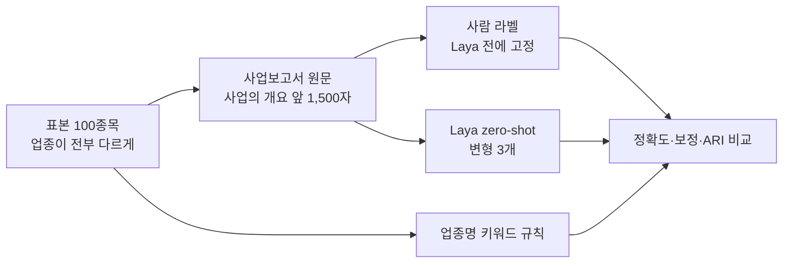

# Laya로 사업 설명 글에서 테마 뽑기 — 가능성 시험 (2026-09-23)

## 3줄 요약
- **Laya(미세조정 없음)는 100개 회사 중 30개만 맞혔다.** 업종명에 키워드 규칙을 건 방법이 64개를 맞혔다. 규칙보다 34%p 낮아 기준(+10%p 이상 나아야 함)에 한참 못 미친다. **현 단계 비채택.**
- **확신도가 믿을 수 없다.** Laya가 확신 0.8 이상이라고 한 44건의 실제 정확도는 39%였다(ECE 0.38~0.41). 20건은 확신 0.9를 넘기고도 틀렸다. 사업보고서 글에 "매출·사업부문" 같은 금융 용어가 많아서인지 22개 회사를 `금융`으로 몰았다(실제 금융은 4개).
- 덤으로 확인한 것: 사람이 붙인 사업 테마도, 업종명 규칙도 **수익률로 묶은 테마와 거의 겹치지 않았다**(ARI 0.01 안팎). 시장에서 같이 움직이는 묶음은 "무슨 사업을 하느냐"로 정해지지 않는다. 07 연구 결과(업종 vs 수익률 테마 ARI 0.04~0.08)와 같은 결론이다.

## 방법
| 항목 | 내용 |
|---|---|
| 모델 | `pip install laya` 0.3.6, 다국어 체크포인트(mmBERT-base, 3.2억 매개변수). 라우터가 한국어 글을 이 체크포인트로 보낸다("non-Latin script (hangul)"). CPU 전용 |
| 설치·속도 | 모델 내려받기 647MB, 적재 18~45초. 질문 하나당 짧은 글 0.1~0.2초, 1,500자 글 **약 1.1초**(중앙값 1,075ms, 상위 10% 1,154ms) |
| 표본 | 연구 재무 자료(`fs_ext.csv`)에서 업종이 서로 다른 100종목(시드 20260923). 목록은 `sample.csv` |
| 글 | 가장 최근 사업보고서(2026년 3월 접수) 원문 "II. 사업의 내용 → 1. 사업의 개요" 앞 1,500자. 전자공시 원문 요청 148건(3.5초 간격). 원문은 저장소 밖(`~/.qbot/research-data/laya/`)에만 둔다 |
| 정답 | 사람(연구자)이 글과 회사 이름만 보고 16개 테마 중 하나를 붙였다(업종명은 보지 않았다). 기준은 `labels.md`, 결과는 `labels_human.csv`. 사업이 섞여 판단이 갈린 30개는 `ambiguous=1` |
| Laya 질문 | `choice` 한 개. 변형 3개를 미리 정하고 전부 보고한다: V1 테마 이름 목록, V2 테마마다 짧은 설명, V3 영어 지시문. 미세조정은 하지 않았다(표본 100개로 하면 과적합) |
| 비교 기준 | 최빈값, 무작위, **업종명 키워드 규칙**(통계청 업종 이름에 키워드를 걸어 테마로 옮김, `evaluate.py`의 `RULE`) |
| 수익률 테마 | 07 연구와 같은 방식(120일 잔차 수익률 상관, 평균 연결, 30개), 2026-08-31 기준 |

## 결과

| 방법 | 정확도 (100) | 정확도 (모호 제외 70) | 상위 3개 안에 정답 | 보정 오차 ECE | 평균 확신 | 수익률 테마와 일치 ARI |
|---|---|---|---|---|---|---|
| 최빈값 (유통·소비재) | 14% | 14% | | | | 0.00 |
| 무작위 | 3% | 4% | | | | 0.02 |
| **업종명 키워드 규칙** | **64%** | **73%** | | | | 0.00 |
| Laya V1 (목록) | 30% | 33% | 53% | 0.40 | 0.67 | 0.03 |
| Laya V2 (설명) | 22% | 23% | 58% | 0.41 | 0.63 | 0.06 |
| Laya V3 (영어 지시) | 30% | 34% | 51% | 0.38 | 0.66 | 0.03 |
| 사람 라벨 | 100% | 100% | | | | 0.01 |

확신 구간별 실제 정확도(V1): 0.8~1.0 구간 44건 → 39%, 0.6~0.8 → 20%, 0.4~0.6 → 19%. 확신이 높아도 정확도가 거의 오르지 않는다(`calibration.csv`).

**틀리는 모양**: V1은 `금융` 22건, `화학·소재` 18건으로 쏠렸다. 확신 0.9를 넘기고 틀린 20건 중에는 이건홀딩스(창호·목재 → 금융 0.9998), 보해양조(주류 → 금융 0.97), 앱클론(항체 → 화학·소재 0.99), 팬오션(해운 → 에너지 0.93)이 있다.

**규칙이 틀리는 모양**: 36건. 업종명이 사업을 못 담는 경우다. ISC(반도체 테스트 소켓, 업종 "기계장비 도매"), 현대로템(방산, 업종 "철도장비 제조"), 아이텍(반도체 테스트, 업종 "기타 전문 서비스"). 여기가 글을 읽는 모델이 보탤 수 있는 자리지만, 지금 Laya는 이 경우도 대부분 틀렸다.

## 판정
**현 단계 비채택.** 사전 기준(업종명 규칙보다 정확도 +10%p 이상, 쓸 만한 보정)을 둘 다 못 넘었다. 저장소 설명대로 미세조정 없이는 거의 쓸모가 없었다.

다시 볼 조건: (1) 테마 라벨이 붙은 한국어 기업 설명 수천 건을 확보해 미세조정하거나, (2) Laya가 한국어 금융 문서에 맞춘 체크포인트를 내놓을 때. 다만 사업 테마 자체가 수익률 묶음과 겹치지 않았으므로(ARI 0.01), 테마를 **수익 신호**로 쓸 근거는 여전히 없다. 쓸모가 있다면 "같은 테마에 몰아 담지 않기" 같은 위험 관리 쪽이다.

## 한계
| 한계 | 영향 |
|---|---|
| 표본 100개, 업종을 일부러 다 다르게 뽑았다 | 실제 종목 분포(제조업이 많다)와 다르다. 정확도의 95% 구간은 대략 ±9%p |
| 정답을 한 사람이 붙였다 | 라벨 기준(예: 섬유 → 유통·소비재, 교육 → 기타)이 모델과 규칙에 유리하거나 불리할 수 있다. 모호한 30개를 빼도 결론은 같았다(규칙 73% vs Laya 23~34%) |
| 키워드 규칙은 라벨 목록을 알고 만들었다 | 규칙 쪽에 조금 유리하다. 차이(34%p)가 커서 결론은 바뀌지 않는다 |
| 글 앞 1,500자만 썼다 | 앞부분이 업계 일반론인 회사(예: 제지, 섬유)는 주력 사업이 늦게 나온다. 모델 입력 한도(1,024토큰)와도 맞물린다 |
| 사전학습 자료의 미래 정보 | 이번 과제는 현재 사업 분류라 영향이 작다. 과거 시점 분류에 쓰면 문제가 된다 |

## 파일
| 파일 | 내용 |
|---|---|
| `sample.csv` | 표본 100종목(코드, 이름, 업종명, 수익률 테마, 사업보고서 접수번호) |
| `labels.md`, `labels_human.csv` | 사람 라벨 기준과 라벨 |
| `laya_predictions.csv` | 변형별 Laya 예측과 16개 확률 |
| `laya_meta.json` | 모델, 라우팅, 적재 시간, 지연 |
| `keyword_rule.csv` | 업종명 규칙 결과 |
| `results.csv`, `calibration.csv` | 위 표 |
| `scripts/` | `sample.py` → `fetch_text.py` → `run_laya.py` → `evaluate.py` |
