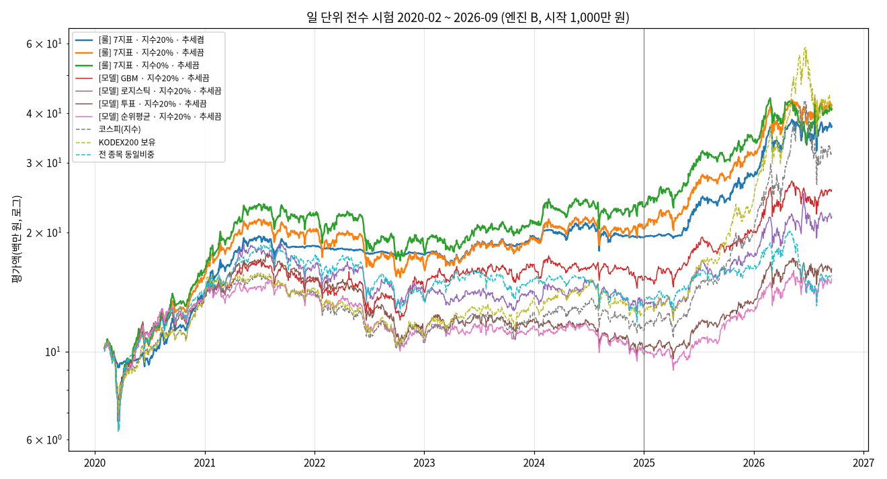
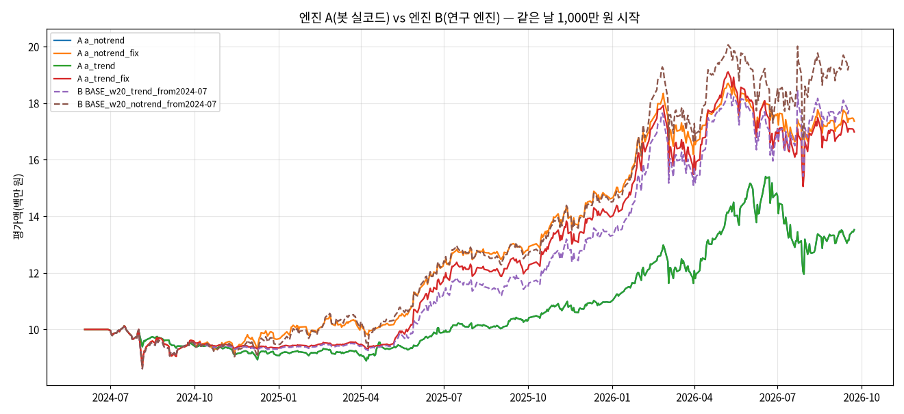

# 일 단위 전수 시험: 룰 기반 vs 모델 기반, 그리고 봇 실코드 검증 (2020-02 ~ 2026-09)

## 3줄 요약
- **룰 기반(현재 7지표)이 모델 기반(로지스틱·판별분석·GBM 스태킹, 투표, 순위평균)보다 두 구간 모두에서 나았다.** 지수 20%·추세 끔 기준 연복리 2020-24년 15.6% 대 모델 최고 8.7%(GBM), 2025-26년 54.3% 대 36.9%. 모델 중 어느 것도 한 구간에서라도 룰을 이기지 못했다.
- **봇 실코드는 전략을 거의 정확히 옮긴다.** 같은 날 같은 돈으로 시작한 연구 엔진과 월별 종목이 평균 9.0/10 같고, 추세 필터로 현금이 된 7개월(2024-09~2025-03)이 정확히 일치했다. 남은 차이는 봇 DB의 재무 수집 누락으로 설명된다.
- **그 대신 봇 버그 3개를 찾았다.** 가장 큰 것: 매수 단계가 "대조 → 매도 체결 확인" 순서라, 장 시작 전 매도가 체결된 계좌를 불일치로 보고 **주문을 멈춘다**. 그대로면 첫 매도가 생기는 달(2026-11 교체)부터 봇이 멈춘다.

## 방법
| 항목 | 내용 |
|---|---|
| 엔진 A (봇 실코드) | 거래일마다 봇의 스케줄 작업(`Jobs`)을 실제 시각 순서로 부른다: 08:40 매도 → 09:05 매수 → 15:40 미체결 취소 → 20:10 저녁(대조·평가액) → 20:40 월말 판단. 판단·주문·관문·대조·평가액·손실 한도 모두 봇 코드 그대로. 바꾼 것: ① 그날 그 시각에 고정한 시계 ② 가짜 증권사 ③ 저녁 수집 생략(과거 봉·공시는 백업 사본 DB에 이미 있다) ④ 체결 확인 대기 0초. 운영 DB가 아니라 2026-09-25 백업 사본을 썼다 |
| 엔진 A 구간 | **2024-06 ~ 2026-09**. 봇 DB는 공시가 2023년부터라, 성장률 지표(연간 OPG는 두 해, 분기 OPG_Q는 전년 같은 분기)가 2024-06 전에는 거의 비어 있다(2023년 월말에는 7지표가 다 있는 종목이 1~7개). 그 전 판단은 0~1종목만 고른다 |
| 엔진 B (연구 엔진) | `06-daily-signals`·`07-formula-ensemble` 엔진·순위표를 그대로 쓰고, 봇의 지수 20% 규칙(월말 교체일에 ±5%p 벗어나면 맞춤)과 추세 필터(코스피 월말 종가 ≤ 10개월 평균이면 종목 부분 현금)를 더했다. 2020-02 ~ 2026-09-17 |
| 체결 | 월말 판단 → 다음 거래일 **시가**. 체결오차 ±0.2%, 수수료 0.015%, 매도세 연도별(2020 0.25% … 2025 0.15%, 2026 0.20%). 10종목, 종목당 예산 = 평가액 × (1 − 지수비중) / 10 |
| 룰 기반 | 7지표(EP·SP·ROE·OPG·OPG_Q·낮은 VOL60·낮은 TURN20) 백분위 합, 상위 60 안에서 예산 이하 10종목 |
| 모델 기반 | 07의 스태킹(로지스틱·LDA·GBM, **매년 1월 그 전 해까지로만 재학습**, 2020년은 순위평균), 투표(7명, 업종당 3), 순위평균 |
| 시작 자금 | 1,000만 원 |
| 지표 | 연복리·누적, 연변동성, 샤프(무위험수익률 0 가정), 최대 손실폭·기간, 최악의 달, 월 승률(현금인 달은 0이라 "진 달"로 셈), 코스피 대비 초과, 정보비율, 연회전율(매수+매도의 절반 ÷ 평균 평가액), 연비용률. 구간 지표는 한 번의 연속 운용을 잘라 계산했다 |

## 결과 1. 룰 기반 vs 모델 기반 (엔진 B)

지수 20% · 추세 끔 (봇 기본 구성에서 추세만 뺀 것). 전체 표는 `metrics.csv`, 연도별은 `metrics_yearly.csv`.

| 전략 | 2020-24 연복리 / MDD | 2025-26 연복리 / MDD | 전체 샤프 | 연회전율 |
|---|---|---|---|---|
| **[룰] 7지표** | **15.6% / -37.4%** | **54.3% / -16.3%** | **1.08** | 4.7배 |
| [룰] 7지표 + 추세 켬 (봇 현재 설정) | 14.4% / **-15.5%** | 47.8% / -16.7% | **1.20** | 3.5배 |
| [모델] GBM 스태킹 | 8.7% / -36.4% | 36.9% / -17.5% | 0.75 | 4.6배 |
| [모델] 판별분석(LDA) 스태킹 | 6.3% / -36.4% | 36.6% / -23.0% | 0.65 | 4.1배 |
| [모델] 로지스틱 스태킹 | 5.4% / -36.4% | 36.2% / -22.9% | 0.62 | 4.0배 |
| [모델] 투표 | 0.0% / -44.3% | 32.2% / -14.3% | 0.44 | 3.1배 |
| [모델] 순위평균 | -0.6% / -37.6% | 29.9% / -17.1% | 0.40 | 2.8배 |
| 기준: 코스피 | 2.6% / -35.0% | 86.4% / -38.6% | 0.78 | — |
| 기준: KODEX200 보유 | 4.5% / -34.3% | 110.1% / -40.8% | 0.88 | — |
| 기준: 전 종목 동일비중 | 5.6% / -40.3% | 11.5% / -35.3% | 0.42 | — |

- 추세 필터를 켜도, 지수를 0%로 해도 순서가 같다. 같은 구성(지수 비중·추세)끼리 비교하면 두 구간 모두 룰 > 모델이다.
- 추세 필터는 2020-24년 최대 손실폭을 -37~38% → -15~16%로 줄이고 수익은 1~2%p 내줬다. 2025-26년에는 수익을 6~8%p 내줬다(06 연구와 같은 결론).
- 2025-26년은 대형주 상승장이라 코스피·KODEX200이 훨씬 높았다. 이 전략의 목표(PRD 비목표: 코스피 초과는 목표가 아니다)대로 **전 종목 동일비중은 두 구간 모두 크게 이겼다.**

## 결과 2. 봇 실코드(엔진 A) vs 연구 엔진(B), 같은 날 1,000만 원 시작 (2024-07 ~ 2026-09)

| 실행 | 누적 | 연복리 | MDD | 샤프 | 비고 |
|---|---|---|---|---|---|
| **A 봇 그대로** (추세 켬/끔 같음) | 31.5% | 13.6% | -22.4% | 0.73 | 2024-08-01부터 주문이 멈춰 2년간 4종목 + 현금 560만 원으로 방치(버그 1) |
| **A 봇 + 버그 1 우회** · 추세 켬 | 71.1% | 28.5% | -21.2% | 1.19 | 대조 563일 전부 ok, 오류 알림 0. 현금 부족 거부 2건(버그 2) |
| A 봇 + 버그 1 우회 · 추세 끔 | 74.6% | 29.7% | -15.7% | 1.33 | 대조 전부 ok. 현금 부족 거부 4건 |
| B 연구 · 추세 켬 | 78.1% | 31.0% | -16.4% | 1.21 | |
| B 연구 · 추세 끔 | 93.8% | 36.3% | -16.7% | 1.30 | |

### 교차 검증 (`crosscheck_*.csv`, `crosscheck_summary_*.json`)
| 항목 | 추세 켬 | 추세 끔 |
|---|---|---|
| 월별 목표 종목 일치 (종목을 든 달 평균) | **9.0 / 10** (20개월, 완전 일치 8개월) | **9.0 / 10** (27개월, 완전 일치 6개월) |
| 추세 필터로 현금인 달 | 7개월, **A와 B가 정확히 같음** (2024-09 ~ 2025-03) | — |
| 일 수익률 상관 | 0.978 | 0.943 |
| 추적오차 | 연 5.3% | 연 9.6% |
| 끝 평가액 | A 1,710만 / B 1,774만 (-3.6%) | A 1,746만 / B 1,931만 (-9.6%) |

어긋난 종목 40개(추세 켬)를 7개 지표로 나란히 놓고 원인을 셌다.
| 원인 | 종목 수 | 설명 |
|---|---|---|
| 재무 지표만 다름 | 14 | 같은 가격, 다른 재무. 아래 "봇 DB 재무 누락"이 대부분 |
| 재무·가격 둘 다 다름 | 8 | |
| 가격 지표만 다름 | 0 | 봇(증권사 수정주가)과 연구(포털 시세)의 가격은 사실상 같다 |
| 7개 지표 값이 같음 | 18 | 순위 경계(10~11위)와 예산 필터 차이. 평가액이 조금 달라 종목당 예산이 달라진다 |
| 그중 **봇 쪽 재무가 비어 있음** | 13 | 예: 057050(현대홈쇼핑)은 봇 종목표에 아예 없다(그 사이 상장폐지·코드 변경 — 알려진 한계). 317400·136490은 아래 버그 3 |

**판정: 봇 코드는 전략을 정확히 옮겼다.** 선정 로직·추세 필터·지수 비중·대조·평가액이 연구 엔진과 맞는다. 남은 차이는 설명 가능한 입력 차이(재무 수집 누락, 종목표의 폐지 종목)이고 로직 차이는 없었다. 단, 아래 버그 1을 고치지 않으면 봇은 둘째 달에 멈춘다.

## 발견한 버그 (앱 코드는 고치지 않았다)

| # | 심각도 | 내용 | 영향 | 제안 |
|---|---|---|---|---|
| 1 | **치명** | `TradingService.execute(phase="buy")`가 `reconcile()`을 `confirm_open_orders()`보다 **먼저** 부른다. 08:40 동시호가 매도는 09:00에 체결되는데, 09:05에 대조가 먼저 돌면 계좌는 0주, 기록은 보유 중 → "불일치" → `orders_blocked`. 이후 매일 "주문이 멈춰 있다" | 시험에서 2024-08-01(첫 매도가 생긴 날)부터 2년간 주문 0건, 수익 71% → 31%. 실운용이면 **2026-11 교체일**(첫 매도)에 멈춘다(10-01은 매도가 없어 통과) | buy 단계에서 체결 확인을 대조보다 먼저. 또는 대조가 `sent` 상태 주문을 감안 |
| 2 | 높음 | 매수 수량 = `min(예산, 현금) // 현재가`. 현금이 묶이는 마지막 종목에서 **수수료·체결오차 여유가 없어** 필요 금액이 현금보다 1% 남짓 많다 → 증권사 거부(40240000) | 26개월에 2~4건. 거부는 **주문 오류로 세어 실전 관문(오류 0건)을 영영 못 넘는다**. 실제 증권사는 시장가 주문가능금액을 상한가 기준으로 잡아 더 자주 거부될 수 있다 | 현금이 한도일 때 (1 + 수수료 + 여유)로 나눠 수량 계산, 또는 시장가 주문가능수량 조회 |
| 3 | 중간 | 봇 DB 재무 수집 누락: ① **원본 사업보고서 없이 정정([기재정정])만 있는 종목**이 결산기마다 400~580개(2022.12: 432, 2023.12: 420, 2024.12: 581, 2025.12: 407) — 그 회사들의 새 재무는 정정 공시일(몇 달 뒤)부터만 쓰인다 ② 값이 전부 빈 연간 재무 행 5건(예: 136490 2024.12) | 약 20% 종목의 재무가 몇 달 늦다(정보 신선도 효과를 잃는다, PRD R2). 교차 검증 차이의 대부분 | 공시 목록 수집에서 원본이 빠지는 경로 확인(정정 공시가 원본을 대체하는지), 빈 행은 재시도 |
| 참고 | 낮음 | 봇 DB로 판단할 수 있는 것은 2024-06부터. 공시 적재가 2023년부터라 성장률 지표가 그 전엔 비어 있다 | 관문의 재현 비교·연 1회 재점검(R13)이 그 전 기간을 못 본다 | 2019~2022 재무 적재(CODE-001 미결과 같다) |

## 한계 (결과를 실제보다 좋게 만드는 방향)
| 한계 | 영향 |
|---|---|
| 시가 체결 가정(체결오차 0.2% 고정) | 소형주는 실제 오차가 더 클 수 있다. 봇의 09:05 매수는 시가보다 몇 분 늦다 |
| 연구 엔진 재무는 정정 반영본, 2022년 이전 공개일은 가정(결산+95일, 분기말+50일) | 작은 미래 정보가 남아 있다. 봇(엔진 A)은 실제 접수일만 쓴다 |
| 시가총액을 현재 주식 수로 근사(두 엔진 모두) | 증자한 회사의 과거 EP·SP·TURN20이 부정확 |
| 생존편향 잔여: 연구 엔진은 폐지 종목 일부(자료 부족 90개)가 빠졌고, 봇 종목표에는 폐지 종목이 없다 | 폐지 직전 종목을 고를 기회가 빠져 수익이 약간 높게 나올 수 있다 |
| 가짜 증권사는 상장지수펀드 매도에도 매도세를 물렸다(실제는 면제). 봇 장부도 같은 세율로 적는다 | 지수 조정 매도가 드물어 영향은 작다 |
| 모델은 매년 한 번 재학습, 특성은 07의 공식 백분위 7개 | 다른 특성·주기의 모델은 시험하지 않았다 |
| 2025-26년은 대형주 상승장 한 번 | 다른 국면에서의 순위는 보장되지 않는다 |

## 파일
| 파일 | 내용 |
|---|---|
| `scripts/bot_sim.py` | 엔진 A 하네스(가짜 시계·가짜 증권사, `FIX=1`은 버그 1 우회) |
| `scripts/research_sim.py` | 엔진 B(07 순위표 + 지수·추세 규칙) |
| `scripts/crosscheck.py` | A·B 월별 종목·지표·평가액 비교 |
| `scripts/report.py` | 지표·그래프 |
| `metrics.csv`, `metrics_yearly.csv`, `metrics_engineA.csv` | 지표 |
| `equity/*.csv`, `picks/*.csv` | 엔진 B 일별 평가액·월별 목표 종목 |
| `crosscheck_picks_*.csv`, `crosscheck_factors_*.csv`, `crosscheck_summary_*.json` | 교차 검증 |
| 저장소 밖 `~/.qbot/research-data/fulltest/a_*` | 엔진 A 실행별 사본 DB·평가액·주문·대조·알림 |
