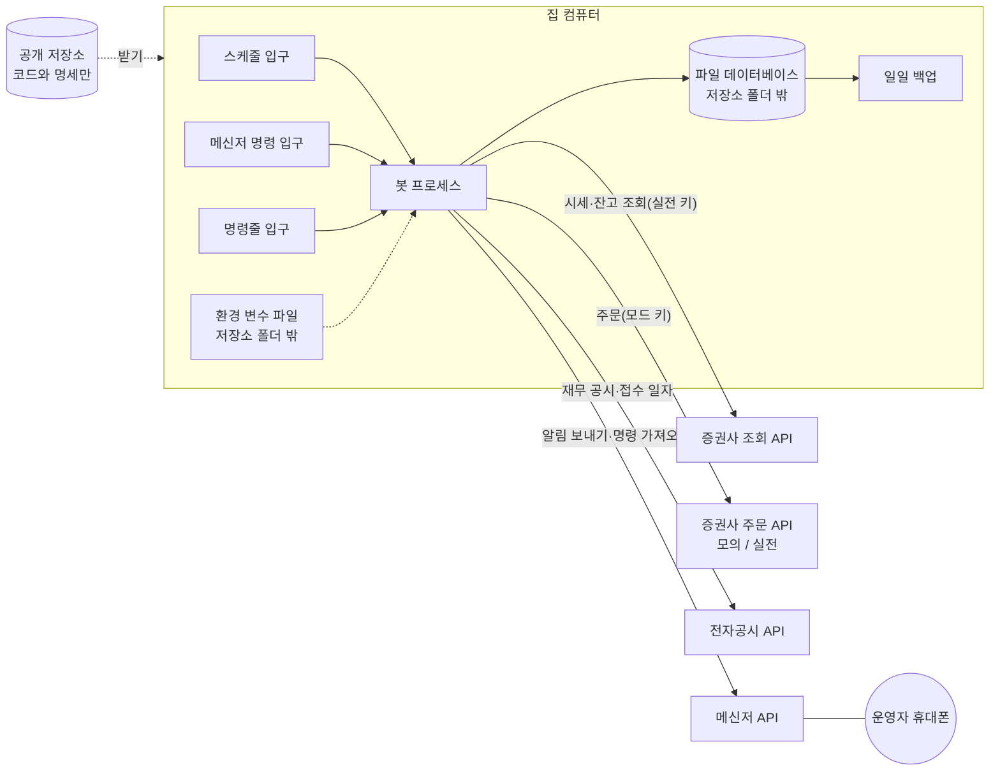

# 인프라 아키텍처

## 0. 이 문서가 다루는 것

봇이 어디서 돌고, 무엇과 통신하고, 데이터와 비밀값이 어디에 있는지를 정한다. 코드의 클래스와 테이블은 도메인 문서가 정한다.

이 프로젝트의 인프라는 두 조건이 거의 전부를 정한다. 집 컴퓨터 한 대에서 돈다는 것과, 저장소가 공개라는 것이다.

2026-09-22에 실제로 돌려 보고 확인된 수치와 제약, 2026-09-23 모의 계좌 실주문에서 확인된 모의투자의 제약을 반영했다.

## 1. 제약

#### C1 집 컴퓨터 한 대에서 돌고, 항상 켜져 있다고 가정하지 않는다

출처: [[QBOT-PRD-001#N5]], [[QBOT-PRD-001#N3]], [[QBOT-RFQ-001#Q2]]

#### C2 그래픽카드, 언어모델, 유료 서비스를 쓰지 않는다

출처: [[QBOT-PRD-001#N1]]

#### C3 상주 프로세스 하나와 파일 데이터베이스 하나로 끝낸다

출처: [[QBOT-PRD-001#N5]]

스케줄과 메신저 입구가 한 프로세스 안에서 돌고 같은 데이터베이스 세션을 쓴다. 스케줄은 별도 스레드이므로 **자물쇠 하나로 순서를 지킨다** — SQLAlchemy 세션도 SQLite 연결도 스레드 안전하지 않다.

상주 프로세스는 **모드마다 한 대만** 돈다. 시작할 때 `~/.qbot/qbot-{모드}.lock`에 파일 잠금을 걸고, 잠금을 못 잡으면 시작을 거부한다. 두 대가 뜨면 스케줄이 두 번 돌아 같은 주문이 두 번 나간다(멱등 키가 막더라도 두 프로세스가 같은 키를 동시에 쓰려 한다). 2026-09-23 재시작 중 실제로 두 대가 떴다.

#### C4 밖에서 봇으로 들어오는 접속은 없다. 봇이 밖으로 나가는 호출만 있다

출처: [[QBOT-PRD-001#N4]], [[QBOT-UC-001#UC-H1]]

#### C5 비밀값과 실제 계좌의 데이터는 저장소 폴더 밖에 둔다

출처: [[QBOT-PRD-001#N4]]

#### C6 모의와 실전의 차이는 증권사 접속 설정 한 묶음뿐이다

출처: [[QBOT-PRD-001#R7]]

다만 **조회와 주문은 접속 정보가 다르다**. 조회는 실전 키(초당 한도가 높다), 주문은 모드에 따른 키다. 그래서 클라이언트와 어댑터가 각각 둘이다. 거래 ID도 모의·실전이 다르므로 모드가 틀리면 주문이 나가는 게 아니라 거부된다.

모의투자 서버는 실전과 **돌려주는 정보가 다르다**(5장). 그 차이는 주문 어댑터 안에서 메운다. 서비스 코드는 모드를 모른다.

#### C7 모든 시각은 한국 시간으로 저장하고, 날짜 계산은 거래일 달력을 따른다

출처: [[QBOT-PRD-001#R5]], [[QBOT-UC-001#UC-A1]]

초 단위 시각으로 사건의 앞뒤를 가리려 하지 않는다. 같은 초에 일어난 일이 실제로 있다(대조와 체결). 순서가 중요한 곳은 증가하는 번호(체결 id)를 쓴다.

#### C8 주문을 보내는 호출은 자동으로 다시 보내지 않는다

출처: [[QBOT-UC-001#UC-S7]], [[QBOT-UC-001#UC-S3]]

증권사 응답을 셋으로 가른다. 접속 실패·타임아웃은 **도달 여부를 모른다**(상태 unknown 유지, 재시작 때 확인). 200이면서 오류 코드가 일시 오류(초당 한도 등)면 확실히 미체결이라 되돌린다. 그 밖의 오류 코드는 거부다.

#### C9 증권사 호출 한도 안에서 돈다

출처: [[QBOT-UC-001#UC-S7]]

| 대상 | 한도 | 봇이 쓰는 값 |
|---|---|---|
| 한국투자증권 실전 | 초당 20건 | 15건 |
| 한국투자증권 모의 | 초당 1건 | 0.9건 |
| 전자공시 | 하루 2만 건. **초당 제한은 문서에 없지만 실재한다** | 초당 2건 |

한도는 클라이언트가 아니라 **앱 키마다** 걸린다. 조회용·주문용 클라이언트가 같은 키를 쓰면 간격을 같이 세야 한다.

전자공시는 간격 없이 몰아 부르면 IP를 차단한다(API도 일괄 다운로드도 연결이 리셋된다). 2026-09-22 적재 중 실제로 당했고, 한 시간쯤 뒤에 풀렸다. 끊긴 뒤 바로 다시 부르면 차단이 길어지므로 5·15·45·135초로 늘려 쉰다.

#### C10 시세와 재무는 추가만 한다. 이미 저장한 행을 고치거나 지우지 않는다

출처: [[QBOT-PRD-001#R2]], [[QBOT-PRD-001#R3]], [[QBOT-UC-001#UC-S1]]

#### C11 입구는 셋이고(스케줄, 메신저 명령, 명령줄) 셋 다 같은 쓰기 경로를 탄다

출처: [[QBOT-UC-001#UC-A3]], [[QBOT-UC-001#UC-H1]], [[QBOT-UC-001#UC-H4]]

#### C12 운영 경로에는 공식 API만 쓴다. 비공식 출처는 과거 데이터 적재의 보조로만 쓴다

출처: [[QBOT-PRD-001#N3]]

검증 때는 포털의 비공식 시세 주소와 금융감독원 일괄 파일을 썼다. 비공식 주소는 예고 없이 막히거나 바뀐다. 실제 돈이 걸린 매일의 흐름을 거기에 걸 수 없다. 금감원 일괄 재무 파일에는 **접수번호가 없어** 시점 고정에도 쓸 수 없다.

#### C13 봇이 꺼진 동안에도 계좌가 위험하지 않도록, 증권사에 걸어 둔 미체결 주문을 장 마감 뒤까지 남기지 않는다

출처: [[QBOT-PRD-001#N3]], [[QBOT-UC-001#UC-A4]]

#### C14 데이터베이스는 한 번에 한 쪽만 쓴다

적재(몇 시간~며칠)와 봇이 같은 파일을 쓴다. SQLite WAL에서 **읽다가 쓰기로 올라가면 `busy_timeout`이 듣지 않고 즉시 "database is locked"가 난다**(SQLITE_BUSY_SNAPSHOT). 그래서 `BEGIN IMMEDIATE`로 처음부터 쓰기 잠금을 잡고 기다린다. 대신 긴 작업은 **단위마다 커밋해** 잠금을 오래 쥐지 않는다(공시 하나마다, 종목 하나마다). 이것을 안 지키면 적재가 도는 동안 봇의 모든 명령이 실패한다.

## 2. 구성도

메신저 명령도 봇이 메신저 서버에 물어서 가져온다. 집 공유기에 포트를 열지 않는다([[#C4]]).

## 3. 기술 스택

| 영역 | 선택 | 이유 |
|---|---|---|
| 언어 | 파이썬 3.12 | 검증 코드가 파이썬이다. 종목 선정 코드를 그대로 옮긴다 |
| 패키지 관리 | uv | 잠금 파일로 같은 환경을 다시 만든다 |
| 계산 | pandas, numpy | 검증 때와 같은 라이브러리여야 같은 결과가 나온다 |
| 데이터베이스 | SQLite (WAL + BEGIN IMMEDIATE + busy_timeout 60초) | 파일 하나, 설치할 서버 없음 ([[#C3]], [[#C14]]) |
| 데이터베이스 접근 | SQLAlchemy + Alembic | 테이블 변경 이력을 코드로 남긴다 |
| 외부 호출 | httpx | 시간 초과와 재시도를 한곳에서 다룬다 |
| 스케줄 | APScheduler (실행기 1개) | 프로세스 안에서 돈다. 작업끼리 겹치지 않게 한 줄로 |
| 설정 | pydantic-settings | 환경 변수를 형식 검사와 함께 읽는다. 빠진 값이 있으면 시작을 거부한다 |
| 메신저 | 텔레그램 봇 API | 무료, 가져오기 방식 지원, 보낸 사람 식별 가능 |
| 입력 검사 | jsonschema | 도구 인자를 스키마로 검증. 날짜는 `format`만으로는 걸러지지 않아 `pattern`도 함께 |
| 테스트 | pytest | 시점 위반 테스트와 선정 일치 테스트를 여기서 돌린다 |
| 비밀값 검사 | 커밋 전 훅(내장 패턴) | 공개 저장소에 키가 올라가는 것을 막는다 ([[#C5]]) |
| 검사·형식 | ruff (line-length 120) | alembic 생성 파일은 대상에서 제외 |

웹 프레임워크는 쓰지 않는다. HTTP 입구가 없기 때문이다.

## 4. 내부 구조

입구가 셋이고 셋이 같은 쓰기 경로를 탄다([[#C11]]). 그래서 입구를 도메인 밖에 둔다. 확정된 폴더 구조는 클래스 명세가 정한다.

| 자리 | 역할 |
|---|---|
| `backend/app/entry/schedule/jobs.py` | 시각에 따라 유스케이스를 부른다 |
| `backend/app/entry/telegram/poller.py` | 운영자 명령을 받아 유스케이스를 부른다 |
| `backend/app/entry/cli/main.py` | 설치, 적재, 재현, 상주 실행을 부른다 |
| `backend/app/entry/tools.py` | 도구 이름·스키마·연결표. 메신저와 명령줄이 같은 표를 쓴다 |
| `backend/app/domains/` | marketdata, decision, trading, risk, reporting, ops |
| `backend/app/infra/` | 증권사, 전자공시, 메신저 클라이언트 |
| `backend/app/core/` | 설정, 데이터베이스 세션, 시계, 기준일, 오류 |

시계는 `core`에 하나만 둔다. 코드 어디서도 현재 시각을 직접 읽지 않고 이 시계에게 묻는다.

## 5. 인증과 접근

| 대상 | 방식 | 보관 | 비고 |
|---|---|---|---|
| 증권사 조회 | 실전 앱 키·시크릿 → 접속 토큰 | 환경 변수 파일 | 실전 키가 없으면 모의 키로 떨어진다. **휴장일 조회는 모의 키에서 안 된다**("모의투자 TR이 아닙니다") |
| 증권사 주문(모의) | 모의 앱 키·시크릿·계좌 8자리 | 환경 변수 파일 | 거래 ID: 매수 VTTC0802U, 매도 VTTC0801U, 취소 VTTC0803U, 체결조회 VTTC8001R, 잔고 VTTC8434R |
| 증권사 주문(실전) | 실전 앱 키·시크릿·계좌 8자리 | 환경 변수 파일 | 거래 ID: TTTC0802U / TTTC0801U / TTTC0803U / TTTC8001R / TTTC8434R. 관문 통과 전에는 넣지 않는다 |
| 전자공시 | 인증 키 | 환경 변수 파일 | 무료 발급 |
| 메신저 | 봇 토큰 + 허용된 대화 번호 하나 | 환경 변수 파일 | 허용된 번호가 아닌 명령은 기록만 하고 버린다 |
| 데이터베이스 | 운영체제 파일 권한 | 저장소 폴더 밖 | 계정 주인만 읽고 쓴다 |

- 토큰은 24시간짜리다. 파일에 캐시하고 무효 응답을 받으면 버린다
- 주문 전송은 해시키 헤더를 같이 보낸다. 그 호출도 같은 초당 한도를 쓴다
- **모의투자는 장중(09:00~15:30)에만 주문을 받는다.** 장 종료 뒤에는 `40580000 모의투자 장종료`
- 알림과 기록에 계좌번호와 키를 그대로 쓰지 않는다. 뒤 네 자리만 남긴다
- 실전 모드는 설정 파일의 값 하나로 켜지지 않는다. 데이터베이스에 관문 통과 기록이 있어야 한다

### 5.1 모의투자가 실전과 다른 점 (2026-09-23 실주문으로 확인)

| 항목 | 실전 | 모의 | 봇의 대응 |
|---|---|---|---|
| 주문별 체결 내역 (`inquire-daily-ccld` output1) | 온다 | **늘 빈다.** 합계(output2)만 온다 | 주문 어댑터가 **잔고 변화로 체결을 재구성**한다. 매수가는 매입원가 증가분 ÷ 체결 수량, 매도가는 그날 매도 평균가 |
| 정정취소가능주문조회 (VTTC8036R) | 된다 | **막혀 있다** | 쓰지 않는다. 취소 대상은 체결조회로 찾는다 |
| 장 시작 전(08:30~09:00) 동시호가 주문 | 접수 즉시 조회된다 | **09시 전까지 조회되지 않는다**(접수는 된다) | 08:40 매도는 체결을 기다리지 않고, 09:05 작업이 확인한다 |

재구성의 한계: 매도 평균가는 그날 판 **모든 종목의 평균**이라 종목별 값은 섞인다. 수량 가중 평균이므로 Σ(수량 × 가격)은 정확하고, 그래서 예수금 대조는 어긋나지 않는다. 종목별 손익은 모의에서 근사값이다. 재구성용 "보내기 전 잔고"는 프로세스 메모리에만 있으므로, **주문을 보낸 뒤 체결 확인 전에 봇이 재시작되면 그 주문의 체결은 저녁 대조가 잡는다**(계좌 기준).

실전에서는 주문별 내역이 오므로 재구성하지 않는다. 모의 운용 석 달이 이 경로로 돌기 때문에, 실전 첫 달은 **주문별 내역 경로가 처음 쓰이는 달**이다.

## 6. 데이터가 사는 곳

| 데이터 | 위치 | 저장소에 올리나 | 백업 |
|---|---|---|---|
| 코드, 명세, 검증 자료 | 공개 저장소 | 올린다 | 저장소 자체 |
| 운용 설정 (자금, 한도, 비중) | 환경 변수 파일 | 올리지 않는다 | 수동 |
| 비밀값 | 환경 변수 파일 | 올리지 않는다 | 수동. 비밀번호 관리자 |
| 시세, 재무 | 데이터베이스 | 올리지 않는다 | 일일. 잃어도 다시 받을 수 있다(며칠 걸린다) |
| 판단, 주문, 체결, 평가액, 상태 | 데이터베이스 | 올리지 않는다 | 일일. **잃으면 복구할 수 없다** |
| 알림 기록, 실행 로그 | 데이터베이스와 로그 파일 | 올리지 않는다 | 일일 |

- 데이터 폴더는 홈 아래 `~/.qbot/`이다. 모의용과 실전용 데이터베이스 파일을 따로 둔다. **실전으로 넘어갈 때 관문 기록을 실전 파일에도 심어야 한다** — 안 그러면 빈 파일을 열고 "관문 없음"으로 거부된다
- 백업은 `VACUUM INTO`로 만든다. WAL이라 파일 복사는 반쪽이 될 수 있고, SQLite 백업 API는 적재가 쓰는 동안 복사를 계속 처음부터 다시 시작한다. `VACUUM INTO`는 읽기 스냅숏 하나로 끝난다. 최근 30일치를 남긴다(2026-09-22 기준 한 벌 757MB)
- 상장폐지된 종목의 시세와 재무를 지우지 않는다([[#C10]])

## 7. 외부 변경 감지

봇 밖에서 일어나 봇의 데이터를 틀리게 만드는 일들이다.

| 변경 | 영향 | 대응 |
|---|---|---|
| 액면분할, 무상증자, 감자 | 그 종목의 과거 주가가 통째로 달라진다 | 수정주가를 받는다. **끝난 날**의 저장 종가가 새 응답과 다르면 새 판으로 과거를 다시 받아 추가한다. 옛 판은 남긴다. 오늘 봉은 비교에 쓰지 않는다(장중 현재가와 확정 종가가 달라 전 종목을 오판한 사고가 있었다) |
| 정정 공시 | 재무 수치가 바뀐다 | 새 행으로 추가한다. 접수 일자가 기준일 이후면 읽히지 않는다 |
| 임시 휴장, 개장 시각 변경 | 스케줄이 어긋난다 | 거래일 달력을 증권사 API로 확인한다(한 달 앞까지 미리 받아 둔다) |
| 종목 코드 변경, 합병, 이전상장 | 같은 회사가 다른 종목으로 보인다 | 종목 마스터 파일을 매일 받아 변경을 기록한다 |
| 관리종목·투자경고 지정과 해제 | 매수 후보가 달라진다 | 같은 마스터 파일에 들어 있다. 날짜와 함께 저장한다 |
| 증권사 API의 주소·응답 형식 변경 | 호출이 실패한다 | 오류 응답을 "자료 없음"으로 삼키지 않는다. 마스터 파일이 비정상이면 대량 폐지로 처리하지 않는다 |
| 운영자가 앱에서 직접 매매 | 기록과 계좌가 어긋난다 | 계좌 대조 ([[QBOT-UC-001#UC-S4]]) |

## 8. 배치와 운영

### 8.1 스케줄 (한국 시간, 거래일 기준)

| 시각 | 작업 | 유스케이스 |
|---|---|---|
| 부팅 직후 | 보냈는지 모르는 주문을 증권사 내역과 맞춘다 | [[QBOT-UC-001#UC-A4]] |
| 08:20 | 대기 중인 판단이 있으면 알린다 (사람이 막을 시간) | [[QBOT-UC-001#UC-A3]] |
| 08:40 | 장 시작 전 동시호가에 **매도만** 건다. 체결은 기다리지 않는다 | [[QBOT-UC-001#UC-A3]] |
| 09:05 | 매도 체결 확인 → 그 돈으로 매수. 보류 매도도 다시 시도 | [[QBOT-UC-001#UC-A3]] |
| 15:40 | 남은 미체결 주문 취소 ([[#C13]]) | [[QBOT-UC-001#UC-A3]] |
| 18:30 | 시세·공시 수집, 계좌 대조, 평가액, 손실 한도, 일일 요약 | [[QBOT-UC-001#UC-A1]], [[QBOT-UC-001#UC-A5]] |
| 18:50 (월말만) | 월말 판단 | [[QBOT-UC-001#UC-A2]] |
| 19:00 (월 첫 거래일만) | 월간 성과 보고 | [[QBOT-UC-001#UC-A6]] |
| 19:30 | 데이터베이스 백업 | — |
| 매시 정각 | 생존 신호 **기록**. 메시지는 09시에 하루 한 번 | [[QBOT-UC-001#UC-S5]] |
| 상시 | 메신저 명령 가져오기 | [[QBOT-UC-001#UC-H1]] |

검증은 "다음 거래일 시가 체결"을 가정했다. 장 시작 전 동시호가 주문이 그 가정에 가장 가깝다. 08:40에 낸 주문은 09시 동시호가에 체결되므로 **그때까지 기다리면 안 된다** — 제한 시간에 걸려 취소된다. 그래서 매도와 매수를 두 작업으로 나눴다. 매수는 시가보다 몇 분 늦은 가격에 체결되고, 그 차이가 체결 오차에 들어간다.

생존 신호를 시간마다 메시지로 보내면 하루 24통이라 정작 중요한 알림이 묻힌다. 기록은 매시, 메시지는 하루 한 번이다.

작업 하나가 실패해도 다음 작업은 돈다. 실패는 알림으로 알리고 세션을 되돌린다.

### 8.2 집 컴퓨터 설정

| 항목 | 설정 |
|---|---|
| 자동 시작 | systemd 사용자 유닛(`~/.config/systemd/user/qbot.service`). `qbot install --register-autostart`가 만든다. 로그인 없이도 돌게 하려면 `loginctl enable-linger`. systemd가 없으면 윈도우 작업 스케줄러에 등록한다 |
| 한 대만 | 파일 잠금([[#C3]]). 멈출 때는 `tools/qstop.sh`, 상태는 `tools/qstat.sh` |
| 절전 | 끈다 |
| 운영체제 자동 업데이트 재부팅 | 사용 시간을 08시~20시로 잡아 그 사이에 재부팅되지 않게 한다 |
| 시계 | 인터넷 시간 동기화를 켠다 |
| 정전·인터넷 끊김 | 막지 않는다. [[#C13]]과 재시작 후 이어 하기로 견딘다 |

### 8.3 배포

운영자가 저장소를 받아 의존성을 맞추고 봇을 다시 시작한다. 배포 전에 시점 위반 테스트와 선정 일치 테스트가 통과해야 한다. 월말 판단일과 그 다음 거래일에는 배포하지 않는다.

## 9. 미결사항

- [x] 증권사 확정 → 한국투자증권
- [x] 증권사 호출 한도 실제 수치 → [[#C9]] 표
- [x] 전 종목 일봉을 매일 받는 것이 한도 안에서 되는지 → 된다. 3,500종목을 초당 15건이면 4분. 종목 목록·상태·주식 수는 마스터 파일 1회로 끝난다
- [x] 과거 데이터 적재 출처 → 시세는 증권사 API(2019~), 재무는 전자공시 API(2023~)
- [x] 전자공시 한도와 접수 시각 → 하루 2만 건, 초당 제한 있음(문서에 없음), **접수 일자만 주고 시각은 주지 않는다**
- [x] WSL2에서 돌릴지 → WSL2 + systemd 사용자 유닛
- [ ] 백업을 둘 곳. 지금은 같은 컴퓨터의 `~/.qbot/backup/`뿐이다. 다른 드라이브나 비공개 클라우드에도 둘지
- [x] 장 시작 전 주문을 시장가로 낼지 지정가로 낼지 → 시장가. 검증 가정(시가 체결)에 가장 가깝다
- [x] 검증 자료를 공개 저장소에 올릴지 → 올린다(`docs/research/`)
- [x] 모의투자가 주문별 체결을 주는지 → 주지 않는다. 잔고 변화로 재구성한다(5.1)
