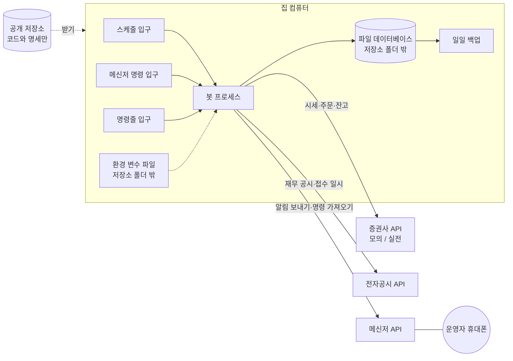

# 인프라 아키텍처

## 0. 이 문서가 다루는 것

봇이 어디서 돌고, 무엇과 통신하고, 데이터와 비밀값이 어디에 있는지를 정한다. 코드의 클래스와 테이블은 도메인 문서가 정한다.

이 프로젝트의 인프라는 두 조건이 거의 전부를 정한다. 집 컴퓨터 한 대에서 돈다는 것과, 저장소가 공개라는 것이다.

## 1. 제약

#### C1 집 컴퓨터 한 대에서 돌고, 항상 켜져 있다고 가정하지 않는다

출처: [[QBOT-PRD-001#N5]], [[QBOT-PRD-001#N3]], [[QBOT-RFQ-001#Q2]]

#### C2 그래픽카드, 언어모델, 유료 서비스를 쓰지 않는다

출처: [[QBOT-PRD-001#N1]]

#### C3 상주 프로세스 하나와 파일 데이터베이스 하나로 끝낸다

출처: [[QBOT-PRD-001#N5]]

#### C4 밖에서 봇으로 들어오는 접속은 없다. 봇이 밖으로 나가는 호출만 있다

출처: [[QBOT-PRD-001#N4]], [[QBOT-UC-001#UC-H1]]

#### C5 비밀값과 실제 계좌의 데이터는 저장소 폴더 밖에 둔다

출처: [[QBOT-PRD-001#N4]]

#### C6 모의와 실전의 차이는 증권사 접속 설정 한 묶음뿐이다

출처: [[QBOT-PRD-001#R7]]

#### C7 모든 시각은 한국 시간으로 저장하고, 날짜 계산은 거래일 달력을 따른다

출처: [[QBOT-PRD-001#R5]], [[QBOT-UC-001#UC-A1]]

#### C8 주문을 보내는 호출은 자동으로 다시 보내지 않는다

출처: [[QBOT-UC-001#UC-S7]], [[QBOT-UC-001#UC-S3]]

#### C9 증권사 호출 한도 안에서 돈다. 모의 계좌의 한도가 실전보다 낮다

출처: [[QBOT-UC-001#UC-S7]]

#### C10 시세와 재무는 추가만 한다. 이미 저장한 행을 고치거나 지우지 않는다

출처: [[QBOT-PRD-001#R2]], [[QBOT-PRD-001#R3]], [[QBOT-UC-001#UC-S1]]

#### C11 입구는 셋이고(스케줄, 메신저 명령, 명령줄) 셋 다 같은 쓰기 경로를 탄다

출처: [[QBOT-UC-001#UC-A3]], [[QBOT-UC-001#UC-H1]], [[QBOT-UC-001#UC-H4]]

#### C12 운영 경로에는 공식 API만 쓴다. 비공식 출처는 과거 데이터 적재의 보조로만 쓴다

출처: [[QBOT-PRD-001#N3]]

검증 때는 포털의 비공식 시세 주소와 금융감독원 일괄 파일을 썼다. 비공식 주소는 예고 없이 막히거나 바뀐다. 실제 돈이 걸린 매일의 흐름을 거기에 걸 수 없다.

#### C13 봇이 꺼진 동안에도 계좌가 위험하지 않도록, 증권사에 걸어 둔 미체결 주문을 장 마감 뒤까지 남기지 않는다

출처: [[QBOT-PRD-001#N3]], [[QBOT-UC-001#UC-A4]]

## 2. 구성도

메신저 명령도 봇이 메신저 서버에 물어서 가져온다. 집 공유기에 포트를 열지 않는다([[#C4]]).

## 3. 기술 스택

| 영역 | 선택 | 이유 |
|---|---|---|
| 언어 | 파이썬 3.12 | 검증 코드가 파이썬이다. 종목 선정 코드를 그대로 옮긴다 |
| 패키지 관리 | uv | 잠금 파일로 같은 환경을 다시 만든다 |
| 계산 | pandas, numpy | 검증 때와 같은 라이브러리여야 같은 결과가 나온다 |
| 데이터베이스 | SQLite (WAL 모드) | 파일 하나, 설치할 서버 없음 ([[#C3]]) |
| 데이터베이스 접근 | SQLAlchemy + Alembic | 테이블 변경 이력을 코드로 남긴다 |
| 외부 호출 | httpx | 시간 초과와 재시도를 한곳에서 다룬다 |
| 스케줄 | APScheduler | 프로세스 안에서 돈다. 놓친 작업을 다시 잡는다 |
| 설정 | pydantic-settings | 환경 변수를 형식 검사와 함께 읽는다. 빠진 값이 있으면 시작을 거부한다 |
| 메신저 | 텔레그램 봇 API | 무료, 가져오기 방식 지원, 보낸 사람 식별 가능 |
| 테스트 | pytest | 시점 위반 테스트와 선정 일치 테스트를 여기서 돌린다 |
| 비밀값 검사 | gitleaks (커밋 전 훅) | 공개 저장소에 키가 올라가는 것을 막는다 ([[#C5]]) |
| 검사·형식 | ruff | — |

웹 프레임워크는 쓰지 않는다. HTTP 입구가 없기 때문이다.

## 4. 내부 구조

입구가 셋이고 셋이 같은 쓰기 경로를 탄다([[#C11]]). 그래서 입구를 도메인 밖에 둔다. 확정된 폴더 구조는 클래스 명세가 정한다. 여기서는 자리만 적는다.

| 자리 | 역할 |
|---|---|
| `backend/app/entry/schedule/` | 시각에 따라 유스케이스를 부른다 |
| `backend/app/entry/telegram/` | 운영자 명령을 받아 유스케이스를 부른다 |
| `backend/app/entry/cli/` | 설치, 적재, 과거 날짜 재현을 부른다 |
| `backend/app/domains/` | 유스케이스의 패키지가 도메인 후보다. 수집, 판단, 주문, 위험 관리, 보고, 운영 |
| `backend/app/infra/` | 증권사, 전자공시, 메신저 클라이언트 |
| `backend/app/core/` | 설정, 데이터베이스 세션, 시계, 거래일 달력 |

화면이 없으므로 `frontend/`는 만들지 않는다.

시계는 `core`에 하나만 둔다. 코드 어디서도 현재 시각을 직접 읽지 않고 이 시계에게 묻는다. 과거 날짜 재현([[QBOT-UC-001#UC-H4]])과 테스트에서 시계를 바꿔 끼울 수 있어야 하기 때문이다.

## 5. 인증과 접근

| 대상 | 방식 | 보관 | 비고 |
|---|---|---|---|
| 증권사 모의 | 앱 키, 앱 비밀, 계좌번호 → 접속 토큰 | 환경 변수 파일 | 토큰은 하루 단위로 만료된다. 봇이 새로 받는다 |
| 증권사 실전 | 위와 같음, 별도 키 | 환경 변수 파일 | 관문 통과 전에는 넣지 않는다 ([[QBOT-UC-001#UC-H2]]) |
| 전자공시 | 인증 키 | 환경 변수 파일 | 무료 발급 |
| 메신저 | 봇 토큰 + 허용된 대화 번호 하나 | 환경 변수 파일 | 허용된 번호가 아닌 명령은 버린다 ([[QBOT-UC-001#UC-H1]]) |
| 데이터베이스 | 운영체제 파일 권한 | 저장소 폴더 밖 | 계정 주인만 읽고 쓴다 |

- 환경 변수 파일은 저장소 폴더 밖에 둔다. 저장소에는 이름만 적힌 예시 파일을 둔다
- 알림과 기록에 계좌번호와 키를 그대로 쓰지 않는다. 뒤 네 자리만 남긴다
- 실전 모드는 설정 파일의 값 하나로 켜지지 않는다. 데이터베이스에 관문 통과 기록이 있어야 한다. 기록에는 집계 수치와 승인 일시가 들어간다

## 6. 데이터가 사는 곳

| 데이터 | 위치 | 저장소에 올리나 | 백업 |
|---|---|---|---|
| 코드, 명세, 설정 예시 | 공개 저장소 | 올린다 | 저장소 자체 |
| 전략 설정 (지표 목록, 필터, 종목 수) | 저장소의 설정 파일 | 올린다 | 저장소 자체 |
| 운용 설정 (자금, 한도, 비중) | 환경 변수 파일 | 올리지 않는다 | 수동 |
| 비밀값 | 환경 변수 파일 | 올리지 않는다 | 수동. 비밀번호 관리자 |
| 시세, 재무 | 데이터베이스 | 올리지 않는다 | 일일. 잃어도 다시 받을 수 있다 |
| 판단, 주문, 체결, 평가액, 상태 | 데이터베이스 | 올리지 않는다 | 일일. **잃으면 복구할 수 없다** |
| 알림 기록, 실행 로그 | 데이터베이스와 로그 파일 | 올리지 않는다 | 일일 |
| 검증 자료 (스크립트, 결과 표) | 아직 개인 폴더 | 미결 | — |

- 데이터 폴더는 홈 아래 `~/.qbot/`로 둔다. 모의용과 실전용 데이터베이스 파일을 따로 둔다. 모의 기록이 실전 기록에 섞이지 않게 한다
- 백업은 장 마감 뒤 수집이 끝나면 데이터베이스 파일을 다른 드라이브로 복사한다. 최근 30일치를 남긴다
- 상장폐지된 종목의 시세와 재무를 지우지 않는다([[#C10]]). 연 1회 재점검([[QBOT-UC-001#UC-H3]])이 폐지 종목을 포함한 데이터로 돌아야 하기 때문이다

## 7. 외부 변경 감지

봇 밖에서 일어나 봇의 데이터를 틀리게 만드는 일들이다.

| 변경 | 영향 | 대응 |
|---|---|---|
| 액면분할, 무상증자, 감자 | 그 종목의 과거 주가가 통째로 달라진다. 변동성과 수익률 계산이 틀린다 | 증권사의 수정주가를 받는다. 저녁 수집 때 어제 종가가 저장값과 다르면 그 종목의 과거를 새 판으로 다시 받아 추가한다. 옛 판은 남긴다 |
| 정정 공시 | 재무 수치가 바뀐다 | 새 행으로 추가한다. 접수 일시가 기준 일시보다 늦으면 읽히지 않는다 |
| 임시 휴장, 개장 시각 변경 | 스케줄이 어긋난다 | 거래일 달력을 증권사 API로 매일 확인한다 |
| 종목 코드 변경, 합병, 이전상장 | 같은 회사가 다른 종목으로 보인다 | 종목 기본 정보를 매일 받아 변경을 기록한다 |
| 관리종목·투자경고 지정과 해제 | 매수 후보가 달라진다 | 종목 상태를 매일 받아 날짜와 함께 저장한다 |
| 증권사 API의 주소·응답 형식 변경 | 호출이 실패한다 | 응답 형식을 검사해서 다르면 주문을 멈추고 알린다 |
| 운영자가 앱에서 직접 매매 | 기록과 계좌가 어긋난다 | 계좌 대조 ([[QBOT-UC-001#UC-S4]]) |

## 8. 배치와 운영

### 8.1 스케줄 (한국 시간, 거래일 기준)

| 시각 | 작업 | 유스케이스 |
|---|---|---|
| 부팅 직후 | 상태 확인 후 이어 하기 | [[QBOT-UC-001#UC-A4]] |
| 08:20 | 대기 중인 판단이 있으면 주문 준비 | [[QBOT-UC-001#UC-A3]] |
| 08:40 | 장 시작 전 동시호가에 매도 주문 | [[QBOT-UC-001#UC-A3]] |
| 09:05 | 매도 체결 확인, 매수 주문 | [[QBOT-UC-001#UC-A3]] |
| 15:40 | 남은 미체결 주문 취소 ([[#C13]]) | [[QBOT-UC-001#UC-A3]] |
| 18:30 | 시세·공시 수집, 계좌 대조, 평가액, 손실 한도, 일일 요약 | [[QBOT-UC-001#UC-A1]], [[QBOT-UC-001#UC-A5]] |
| 18:50 (월말만) | 월말 판단 | [[QBOT-UC-001#UC-A2]] |
| 19:00 (월 첫 거래일만) | 월간 성과 보고 | [[QBOT-UC-001#UC-A6]] |
| 19:30 | 데이터베이스 백업 | — |
| 매시 정각 | 생존 신호 | [[QBOT-UC-001#UC-S5]] |
| 상시 | 메신저 명령 가져오기 | [[QBOT-UC-001#UC-H1]] |

검증은 "다음 거래일 시가 체결"을 가정했다. 장 시작 전 동시호가에 내는 주문이 그 가정에 가장 가깝다. 매도를 시가에 먼저 체결시키고, 대금을 확인한 뒤 매수를 낸다. 그래서 매수는 시가보다 몇 분 늦은 가격에 체결된다. 이 차이가 체결 오차에 들어간다.

수집을 18시 30분에 두는 이유는 공시가 장 마감 뒤에도 저녁까지 접수되기 때문이다.

### 8.2 집 컴퓨터 설정

| 항목 | 설정 |
|---|---|
| 자동 시작 | 부팅 때 봇이 뜬다. 방식은 미결사항 |
| 절전 | 끈다 |
| 운영체제 자동 업데이트 재부팅 | 사용 시간을 08시~20시로 잡아 그 사이에 재부팅되지 않게 한다 |
| 시계 | 인터넷 시간 동기화를 켠다 |
| 정전·인터넷 끊김 | 막지 않는다. [[#C13]]과 재시작 후 이어 하기로 견딘다 |

### 8.3 배포

운영자가 저장소를 받아 의존성을 맞추고 봇을 다시 시작한다. 배포 전에 시점 위반 테스트와 선정 일치 테스트가 통과해야 한다. 월말 판단일과 그 다음 거래일에는 배포하지 않는다.

## 9. 미결사항

- [ ] 증권사 확정. 제안은 한국투자증권. 계좌 개설과 API 신청이 필요하다
- [ ] 증권사 호출 한도의 실제 수치. 공식 저장소에는 "모의 계좌는 한도가 낮다"고만 적혀 있다. 전 종목 일봉 수집에 걸리는 시간이 이 값으로 정해진다
- [ ] 전 종목 일봉을 증권사 API로 매일 받는 것이 한도 안에서 되는지. 안 되면 대상 필터를 통과할 만한 종목으로 좁힌다
- [ ] 과거 데이터 적재 출처. 제안은 시세는 증권사 API, 재무는 전자공시 API. 상장폐지 종목의 과거 시세는 검증 때 받아 둔 파일로 채운다
- [ ] 전자공시 API의 하루 호출 한도와, 접수 일시가 분 단위까지 나오는지
- [ ] 봇을 WSL2 리눅스에서 돌릴지 윈도우에서 바로 돌릴지. WSL2는 윈도우가 부팅돼도 누가 깨우기 전에는 뜨지 않는다. 제안은 윈도우 작업 스케줄러가 부팅 때 WSL2와 봇을 깨우는 방식이고, 안 되면 윈도우 파이썬으로 옮긴다
- [ ] 백업을 둘 곳. 같은 컴퓨터의 다른 드라이브만으로 충분한지, 비공개 클라우드에도 둘지
- [ ] 장 시작 전 주문을 시장가로 낼지 지정가로 낼지. 시장가는 검증 가정에 가깝고, 거래가 적은 종목에서 불리한 가격에 체결될 수 있다
- [ ] 검증 자료를 공개 저장소에 올릴지 ([[QBOT-PRD-001]] 미결사항과 같다)
