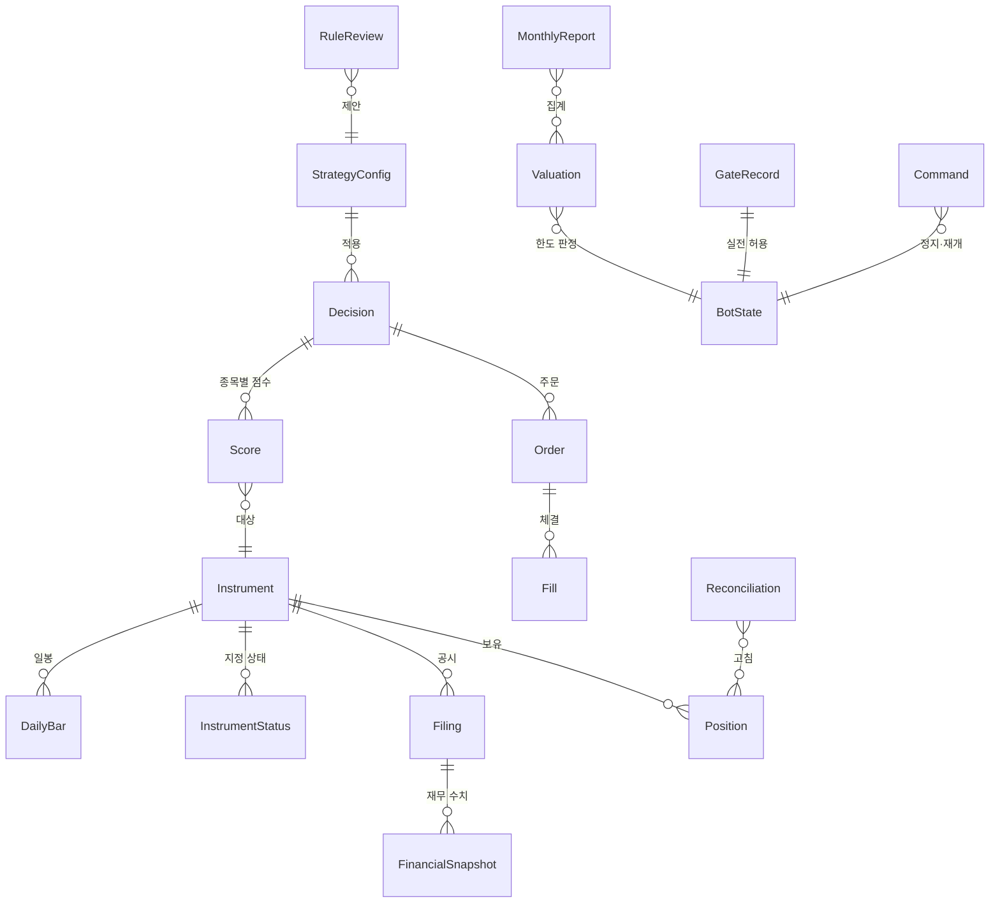

# 도메인 모델

## 0. 이 문서가 다루는 것

봇이 다루는 개념과 그 사이의 관계, 그리고 도메인 경계를 정한다. 클래스와 테이블은 뒤의 클래스 명세와 ERD가 정한다. 개념 영문명이 곧 클래스명이고, 테이블은 그 소문자다.

## 1. 개념 식별

유스케이스의 "패키지"를 도메인 경계의 출발점으로 삼았다. 각 유스케이스가 읽고 쓰는 것을 뽑아 개념으로 묶었다.

| 도메인 | 개념 | 출처 |
|---|---|---|
| 시장 데이터 | Instrument, InstrumentStatus, DailyBar, Filing, FinancialSnapshot, TradingCalendar, IndexLevel | [[QBOT-UC-001#UC-A1]], [[QBOT-UC-001#UC-S1]] |
| 판단 | StrategyConfig, Decision, Score, RuleReview | [[QBOT-UC-001#UC-A2]], [[QBOT-UC-001#UC-S2]], [[QBOT-UC-001#UC-H3]] |
| 매매 | Order, Fill, Position, Reconciliation | [[QBOT-UC-001#UC-A3]], [[QBOT-UC-001#UC-S3]], [[QBOT-UC-001#UC-S4]] |
| 위험 관리 | BotState, Valuation, GateRecord | [[QBOT-UC-001#UC-A5]], [[QBOT-UC-001#UC-S6]], [[QBOT-UC-001#UC-H2]] |
| 보고 | MonthlyReport | [[QBOT-UC-001#UC-A6]] |
| 운영 | Alert, Command | [[QBOT-UC-001#UC-S5]], [[QBOT-UC-001#UC-H1]] |

개념으로 두지 않은 것: 증권사·전자공시·메신저는 외부 시스템이라 인프라 클라이언트다. 스케줄은 입구다. 지표 7개는 개념이 아니라 Score의 속성이다.

## 2. 개념 모델

## 3. 개념별 정리

### 3.1 시장 데이터

#### Instrument 종목

- 속성: 종목 코드, 이름, 시장(코스피·코스닥), 종류(보통주·우선주·상장지수펀드), 상장일, 상장폐지일, 상장 주식 수
- 관계: DailyBar, InstrumentStatus, Filing, Score, Position의 대상
- 판정 근거: 상장폐지된 종목도 남긴다([[QBOT-PRD-001#R1]], [[QBOT-INFRA-001#C10]]). 종목 코드 변경·합병은 새 Instrument로 두고 이전 코드를 속성으로 잇는다([[QBOT-INFRA-001]] 7장). 상장 주식 수는 시가총액 계산에 쓰이며 변경 이력을 날짜와 함께 둔다

#### InstrumentStatus 종목 지정 상태

- 속성: 종목, 상태(관리종목·투자경고·투자위험·거래정지·정리매매), 시작일, 종료일
- 관계: Instrument에 속한다
- 판정 근거: 매수 후보 제외와 보유 종목 매도 판단에 날짜 기준으로 쓰인다([[QBOT-PRD-001#R15]]). 과거 재현에서 "그날 지정돼 있었는가"를 답해야 하므로 기간으로 저장한다

#### DailyBar 일봉

- 속성: 종목, 거래일, 시가, 고가, 저가, 종가, 거래량, 거래대금, 거래 여부, 판 번호, 수집 일시
- 관계: Instrument에 속한다
- 판정 근거: 추가만 하고 고치지 않는다([[QBOT-INFRA-001#C10]]). 액면분할 같은 수정주가 사건이 나면 그 종목의 과거를 새 판 번호로 다시 넣는다([[QBOT-INFRA-001]] 7장). 조회는 항상 최신 판을 읽되 과거 재현에서는 그 시점의 판을 읽는다

#### Filing 공시

- 속성: 공시 번호, 종목, 보고서 종류(사업·반기·분기 보고서, 잠정실적, 정정), 접수 일자, 정정 대상 공시 번호, 제목, 수집 일시
- 관계: Instrument에 속한다. FinancialSnapshot을 가진다
- 판정 근거: 시점 고정 조회의 기준이 접수 일자다([[QBOT-PRD-001#R2]], [[QBOT-PRD-001#R3]]). 정정 공시는 원본을 두고 새 Filing으로 들어온다. 제목은 돌발 공시 키워드 규칙에 쓰인다([[QBOT-PRD-001#R15]])

#### FinancialSnapshot 재무 수치

- 속성: 공시, 결산 기간 종료일, 기간 종류(연간·분기), 연결 여부, 매출, 영업이익, 순이익, 지배주주 순이익, 자본, 지배주주 자본, 주당순이익
- 관계: Filing에 속한다. 같은 종목·같은 결산 기간의 스냅샷이 정정으로 여럿 있을 수 있다
- 판정 근거: 시점 고정 조회는 접수 일자가 기준일보다 앞선 것 중 가장 늦게 접수된 스냅샷 하나를 결산 기간마다 고른다([[QBOT-UC-001#UC-S1]]). 분기 영업이익 성장 지표에 분기 수치가 필요하다([[QBOT-PRD-001#R4]])

#### TradingCalendar 거래일

- 속성: 날짜, 거래일 여부, 장 시작·마감 시각, 월말 거래일 여부
- 판정 근거: 스케줄과 "다음 거래일" 계산의 기준([[QBOT-INFRA-001#C7]]). 증권사 API로 매일 갱신한다

#### IndexLevel 지수

- 속성: 지수 이름(코스피·코스피200), 날짜, 종가
- 판정 근거: 하락장 현금 전환 규칙과 성과 보고의 비교 기준([[QBOT-PRD-001#R5]], [[QBOT-PRD-001#R12]])

### 3.2 판단

#### StrategyConfig 전략 설정

- 속성: 설정 번호, 지표 목록(이름, 방향), 대상 필터(최저 주가, 최저 거래대금, 최저 시가총액), 보유 종목 수, 하락장 현금 전환 여부, 지수 비중, 적용 시작일, 승인 명령
- 관계: Decision이 참조한다. RuleReview가 새 설정을 제안한다
- 판정 근거: 설정은 판단 기록에 남아야 한다([[QBOT-PRD-001#N2]]). 바뀌면 새 번호로 추가하고 옛것은 남긴다([[QBOT-PRD-001#R13]])

#### Decision 판단

- 속성: 판단 번호, 기준일, 모드(모의·실전), 설정 번호, 코드 버전, 현금 전환 발동 여부, 지수 조정 필요 여부, 상태(대기·실행 중·일부 완료·완료·재현), 생성 일시
- 관계: StrategyConfig를 참조한다. Score와 Order를 가진다
- 판정 근거: 주문 전에 저장된다([[QBOT-PRD-001#R5]]). 상태로 재시작 후 이어 하기를 판단한다([[QBOT-UC-001#UC-A4]]). 과거 재현은 "재현" 상태로 따로 저장해 실제 판단과 섞이지 않게 한다([[QBOT-UC-001#UC-H4]])

#### Score 종목 점수

- 속성: 판단, 종목, 지표값 7개, 지표별 백분위 7개, 합산 점수, 순위, 선정 여부, 건너뛴 이유(주가 초과·지정 종목·거래정지)
- 관계: Decision에 속하고 Instrument를 가리킨다
- 판정 근거: 상위 60개를 저장한다([[QBOT-PRD-001#R5]]). 왜 이 종목이 뽑히고 저 종목이 빠졌는지 되짚을 수 있어야 한다([[QBOT-UC-001#UC-H4]])

#### RuleReview 규칙 재점검

- 속성: 재점검 번호, 기준일, 후보 지표별 월 수익차와 t값, 채택 목록, 현재 설정과의 차이, 운영자 결정, 결정 일시
- 관계: StrategyConfig를 제안한다
- 판정 근거: 규칙이 사람 모르게 바뀌지 않는다([[QBOT-PRD-001#R13]], [[QBOT-UC-001#UC-H3]])

### 3.3 매매

#### Order 주문

- 속성: 고유 키(판단 번호·종목·방향), 판단, 종목, 방향(매수·매도), 수량, 주문 종류(시장가·지정가), 지정가, 상태(보낼 예정·보냈는지 모름·보냄·체결·일부 체결·취소·거부·보류), 증권사 주문 번호, 재시도 횟수, 거부 사유, 생성·전송·종료 일시
- 관계: Decision에 속한다. Fill을 가진다
- 판정 근거: 고유 키로 같은 주문이 두 번 나가지 않는다([[QBOT-UC-001#UC-S3]]). "보냈는지 모름"은 전송 직후 프로세스가 죽었을 때의 상태이고 재시작 때 증권사 내역으로 확정한다([[QBOT-UC-001#UC-A4]]). "보류"는 거래정지 종목이다([[QBOT-UC-001#UC-A3]])

#### Fill 체결

- 속성: 주문, 체결 수량, 체결 가격, 수수료, 세금, 체결 일시, 증권사 체결 번호
- 관계: Order에 속한다
- 판정 근거: 매매마다 비용과 손익을 남긴다([[QBOT-PRD-001#R10]]). 한 주문이 여러 번 나눠 체결될 수 있다

#### Position 보유

- 속성: 종목, 수량, 평균 매입가, 최초 매수일, 최근 갱신 일시, 갱신 출처(체결·대조 조정)
- 관계: Instrument를 가리킨다. Fill이 쌓여 만들어지고 Reconciliation이 고칠 수 있다
- 판정 근거: 계좌 대조의 봇 쪽 기준([[QBOT-UC-001#UC-S4]]). 지수 상장지수펀드도 Position이다([[QBOT-PRD-001#R14]])

#### Reconciliation 계좌 대조

- 속성: 대조 번호, 일시, 모드, 종목별 차이(봇 수량, 계좌 수량), 현금 차이, 결과(일치·불일치), 처리(미처리·계좌 기준으로 고침), 사유, 처리 명령
- 관계: Position을 고친다
- 판정 근거: 불일치면 주문이 멈추고, 운영자 명령으로만 풀린다([[QBOT-UC-001#UC-H6]])

### 3.4 위험 관리

#### BotState 봇 상태

- 속성: 모드(모의·실전), 정지 여부, 매수 중단 여부, 주문 멈춤 여부, 고점 평가액, 고점 재설정 일시, 원금 누계, 실전 전환 일시, 실전 첫 달 투입 상한, 최근 생존 신호 일시. 행은 모드마다 하나다
- 관계: GateRecord가 실전 모드를 허용한다. Command가 바꾼다. Valuation이 한도 판정에 쓴다
- 판정 근거: 주문 허용 판정이 읽는 것이 전부 여기 있다([[QBOT-UC-001#UC-S6]]). 재시작해도 유지된다([[QBOT-PRD-001#R9]])

#### Valuation 일별 평가액

- 속성: 날짜, 모드, 현금, 주식 평가액, 지수 부분 평가액, 총 평가액, 그날의 입출금, 고점 대비 손실률, 원금 대비 누적 손익률
- 관계: BotState의 고점을 갱신한다. MonthlyReport가 집계한다
- 판정 근거: 손실 한도 감시의 입력([[QBOT-UC-001#UC-A5]]). 입출금을 손익에서 뺀다

#### GateRecord 관문 기록

- 속성: 점검 일시, 모의 운용 기간, 교체 횟수, 주문 오류 건수, 선정 일치율, 월 수익 차이, 판정(통과·미달), 승인 명령, 승인 일시, 투입 자금, 첫 달 투입 비율
- 관계: BotState의 실전 모드를 허용한다
- 판정 근거: 통과 기록이 없으면 실전 주문이 나가지 않는다([[QBOT-PRD-001#R8]], [[QBOT-UC-001#UC-H2]])

### 3.5 보고

#### MonthlyReport 월간 보고

- 속성: 대상 월, 모드, 월 수익률, 누적 수익률, 고점 대비 손실, 원금 대비 누적 손익, 비용 합계, 코스피 수익률, 전 종목 동일 비중 수익률, 모의 계산 수익률, 체결 오차, 지표별 12개월 효과, 전략 부분·지수 부분 수익률, 생성 일시
- 관계: Valuation, Fill, Score를 집계한다
- 판정 근거: [[QBOT-PRD-001#R12]]. 계산할 수 없는 항목은 비워 두고 이유를 적는다([[QBOT-UC-001#UC-A6]])

### 3.6 운영

#### Alert 알림

- 속성: 일시, 모드, 종류(주문·체결·오류·한도·요약·생존·재시작), 내용, 전송 결과, 밀린 알림 여부
- 판정 근거: 보낸 내용이 기록에 남는다([[QBOT-UC-001#UC-S5]]). 전송 실패는 매매를 막지 않는다

#### Command 운영자 명령

- 속성: 일시, 보낸 사람 식별자, 허용 여부, 명령(정지·재개·맞춤·관문 점검·승인·재점검 승인·재현), 인자, 처리 결과
- 관계: BotState, Reconciliation, GateRecord, StrategyConfig를 바꾼다
- 판정 근거: 운영자가 아닌 명령은 무시하되 기록한다([[QBOT-UC-001#UC-H1]]). 상태를 바꾼 명령이 무엇인지 되짚을 수 있어야 한다

## 4. 경계

| 도메인 | 폴더 후보 | 쓰는 것 | 읽기만 하는 것 |
|---|---|---|---|
| 시장 데이터 marketdata | `domains/marketdata/` | Instrument, InstrumentStatus, DailyBar, Filing, FinancialSnapshot, TradingCalendar, IndexLevel | — |
| 판단 decision | `domains/decision/` | StrategyConfig, Decision, Score, RuleReview | 시장 데이터 전부, Position, Valuation |
| 매매 trading | `domains/trading/` | Order, Fill, Position, Reconciliation | Decision, Score, BotState, TradingCalendar |
| 위험 관리 risk | `domains/risk/` | BotState, Valuation, GateRecord | Position, Fill, Decision, Order |
| 보고 reporting | `domains/reporting/` | MonthlyReport | Valuation, Fill, Score, IndexLevel, DailyBar |
| 운영 ops | `domains/ops/` | Alert, Command | BotState |

- 도메인 사이의 쓰기는 서비스 호출로만 한다. 다른 도메인의 테이블에 직접 쓰지 않는다
- 주문 허용 판정([[QBOT-UC-001#UC-S6]])은 위험 관리 도메인의 서비스이고, 매매 도메인이 주문마다 부른다. 매매 도메인이 BotState를 직접 읽어 판정하지 않는다
- 시점 고정 조회([[QBOT-UC-001#UC-S1]])는 시장 데이터 도메인의 서비스이고, 기준일이 없는 조회 함수를 공개하지 않는다
- 외부 시스템 클라이언트(증권사, 전자공시, 메신저)는 `infra/`에 두고, 도메인은 포트를 통해 부른다. 실제로 외부 호출이 있는 도메인은 시장 데이터, 매매, 운영 셋이다

## 5. 미결사항

- [ ] DailyBar의 판 번호를 종목 단위로 둘지 전체 단위로 둘지. 제안은 종목 단위
- [ ] 지수 상장지수펀드를 Instrument 종류로 구분할지 별도 개념으로 둘지. 제안은 Instrument 종류
- [ ] 잠정실적 공시의 수치를 FinancialSnapshot에 같은 구조로 넣을지. 제안은 같은 구조에 기간 종류 "잠정"을 추가
