# 클래스 명세

## 0. 이 문서가 다루는 것

도메인 모델의 개념을 어느 폴더의 어느 클래스가 맡는지 정한다. 테이블은 ERD가 정한다. 클래스마다 헤딩과 작은 다이어그램을 두고, 전체 그림은 뷰가 모아 그린다.

2026-09-22 구현(A~F) 뒤 실제 구조로 맞췄다.

## 1. 폴더 구조

규약의 기본형에서 벗어난 곳은 둘이다. 입구가 셋(스케줄, 메신저, 명령줄)이고 셋이 같은 쓰기 경로를 타므로 라우터를 도메인 밖 `entry/`에 뒀다([[QBOT-INFRA-001#C11]]). HTTP가 없으므로 `router.py`와 `schemas.py`는 도메인 안에 없고, 도구 입력 스키마는 `entry/tools.py`에 모아 둔다([[QBOT-API-001]]).

```
backend/
├── pyproject.toml · alembic.ini · alembic/
├── app/
│   ├── main.py                  조립. 설정 읽기, DB, 클라이언트, 서비스, 입구 셋 기동
│   ├── core/
│   │   ├── settings.py          환경 변수 → Settings (조회용·주문용·실전 접속을 따로 준다)
│   │   ├── db.py                엔진·세션. WAL + BEGIN IMMEDIATE + busy_timeout
│   │   ├── clock.py             Clock. 현재 시각의 유일한 출처
│   │   ├── pit.py               PointInTime 값 객체
│   │   ├── errors.py            도메인 오류 타입
│   │   └── models_registry.py   모든 ORM을 한곳에서 등록(도메인 간 외래 키)
│   ├── entry/
│   │   ├── tools.py             도구 이름·JSON 스키마·서비스 연결표 (API 문서와 1:1)
│   │   ├── schedule/jobs.py     APScheduler 작업 → 서비스 호출
│   │   ├── telegram/poller.py   메신저 가져오기 → 인가 → 확인 코드 → tools 실행
│   │   └── cli/main.py          명령줄 → tools 실행
│   ├── domains/
│   │   ├── marketdata/  service.py · crud.py · models.py · ports.py · collect.py · adapters/
│   │   ├── decision/    service.py · crud.py · models.py · scoring.py
│   │   ├── trading/     service.py · crud.py · models.py · ports.py · adapters/
│   │   ├── risk/        service.py · crud.py · models.py · gate.py
│   │   ├── reporting/   service.py · crud.py · models.py
│   │   └── ops/         service.py · crud.py · models.py · ports.py · adapters/
│   ├── infra/
│   │   ├── kis_client.py        증권사 REST. 토큰, 앱 키별 한도, 조회 재시도 / 주문 무재시도
│   │   ├── dart_client.py       전자공시. 초당 간격과 긴 재시도
│   │   └── telegram_client.py   메신저 호출
│   └── shared/orm.py            공통 컬럼(id, created_at)
└── tests/                       app/ 구조를 거울처럼
```

- 호출 방향은 `entry → service → crud` 한 방향이다. 서비스가 다른 도메인의 서비스를 부를 수는 있어도 다른 도메인의 crud를 부르지 않는다. 그래서 도메인을 넘는 읽기는 **주입한 함수**로 받는다(`plan_fn`, `price_fn`, `state_fn`, `halted_codes_fn` 등)
- `scoring.py`는 순수 함수 모음이다. DB도 시계도 모른다([[QBOT-PRD-001#N2]])
- `gate.py`가 `service.py`와 나뉜 이유: 실전 전환은 위험 관리의 일이지만 다른 데이터베이스 파일까지 다루는 별개의 흐름이다
- `ports.py`는 외부 호출이 실제로 있는 네 자리(marketdata 조회, trading 주문, ops 알림)에만 있다

## 2. 엔티티

도메인 모델의 개념 21개는 각 도메인의 `models.py`에 ORM 클래스로 1:1 대응한다. 여기서는 그 외에 코드에만 있는 클래스를 식별한다.

| 클래스 | 자리 | 왜 필요한가 |
|---|---|---|
| Settings | core | 환경 변수의 형식 검사. 빠지면 시작 거부 |
| Clock | core | 현재 시각의 유일한 출처. 재현·테스트에서 바꿔 끼움 |
| PointInTime | core | 시점 고정 조회의 기준일. 이 타입 없이는 조회 함수를 부를 수 없다 |
| MarketDataService, Collector | marketdata | 수집, 시점 고정 조회, 적재 |
| BrokerPort, FilingPort | marketdata | 증권사 **조회**·전자공시 인터페이스 |
| DecisionService, Scorer | decision | 월말 판단, 점수 계산, 재현, 재점검 |
| TradingService, OrderExecutor | trading | 판단 실행, 주문 하나 보내기, 계좌 대조 |
| OrderBrokerPort | trading | 증권사 **주문** 인터페이스 |
| RiskService, OrderGate, ValuationRecorder, LiveGate | risk | 주문 허용 판정, 정지, 손실 한도, 실전 관문 |
| ReportingService | reporting | 일일 요약, 월간 보고 |
| OpsService, NotifierPort | ops | 알림, 명령 기록, 상태 조회 |

## 3. 의존 관계

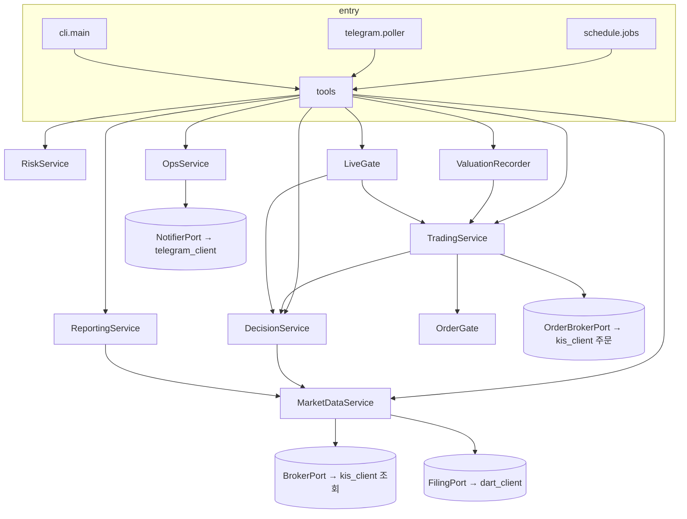

RiskService와 TradingService는 서로 부른다. 순환을 피하려고 **읽기는 주입한 함수로** 받는다: TradingService는 `state_fn`으로 봇 상태를 읽고, ValuationRecorder는 `balance_fn`으로 계좌를 읽는다.

스케줄은 별도 스레드에서 돈다. 메신저 입구와 **같은 세션**을 쓰므로 자물쇠 하나로 순서를 지키고, 스케줄 실행기는 1개다([[QBOT-INFRA-001#C3]]).

## 4. 설계 클래스

### 4.1 core

#### PointInTime 기준일

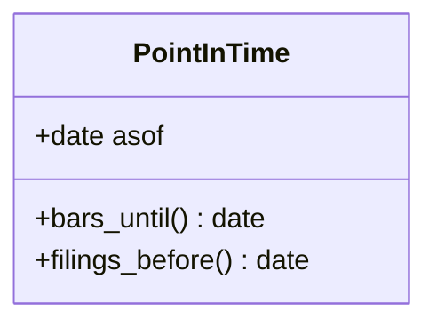

- 값 객체. `bars_until()`은 기준일 당일까지, `filings_before()`는 기준일 전날까지를 돌려준다([[QBOT-PRD-001#R3]])
- 시장 데이터 조회 함수는 모두 이 타입을 첫 인자로 받는다. `date`를 직접 받는 조회 함수는 없다. 이것이 "기준일 없이 읽는 경로가 없다"를 타입으로 보장하는 방법이다

#### Clock 시계

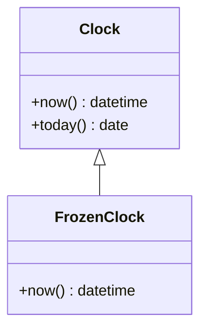

- 운영에서는 시스템 시계, 재현과 테스트에서는 고정 시계를 끼운다. 도메인 코드는 `datetime.now()`를 직접 부르지 않는다. 어떤 시간대를 받아도 한국 시간으로 바꿔 돌려준다

### 4.2 marketdata

#### MarketDataService 시장 데이터 서비스

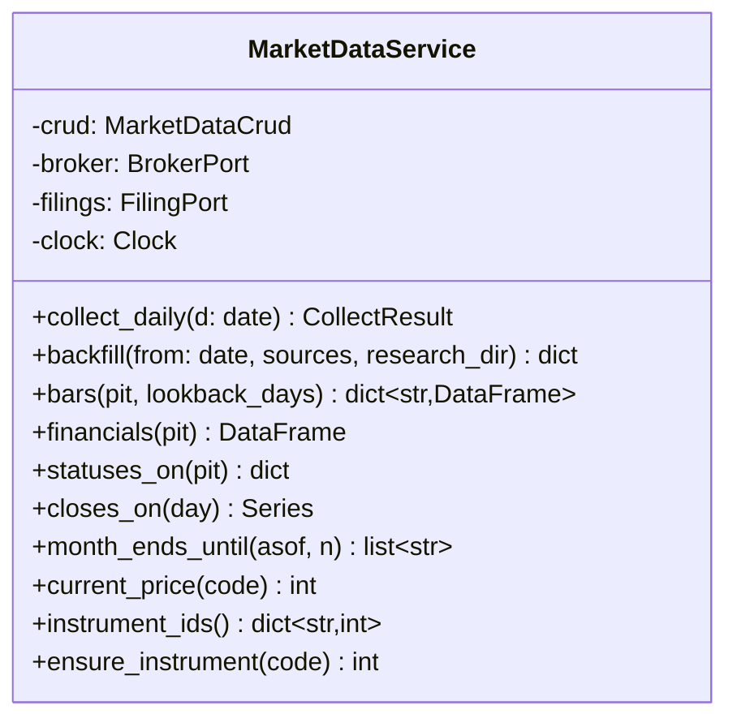

- `collect_daily`: 일봉, 종목 상태, 공시, 거래일, 지수를 받아 추가한다. 어제 종가가 저장값과 다르면 수정주가 사건으로 보고 새 판 번호로 다시 받는다
- `current_price`: 매수 수량 계산용. 증권사가 0이나 오류를 주면 마지막 종가로 갈음한다
- `ensure_instrument`: 계좌에만 있고 종목표에 없는 종목을 최소 정보로 만든다. 대조를 정리하려면 자리가 필요하다
- 외부 호출은 포트를 통해서만 한다

#### BrokerPort 증권사 조회 포트

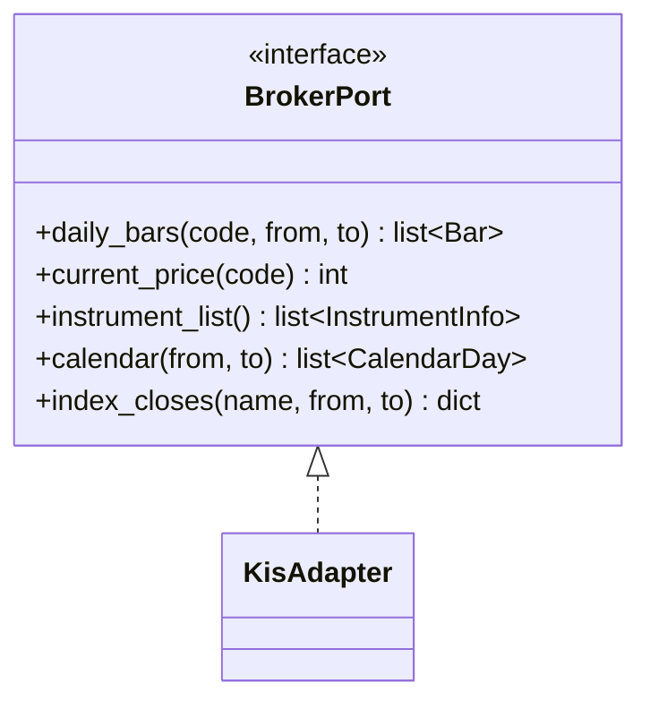

- **조회 전용이다.** 주문은 [[#OrderBrokerPort]]가 맡는다. 접속 정보가 다르기 때문이다 — 조회는 실전 키(초당 한도가 높다), 주문은 모드에 따른 키. 6장 미결 "조회용과 주문용을 나눌지"는 나누는 것으로 정했다
- 종목 목록·지정 상태·상장주식수는 마스터 파일 한 번으로 다 온다. 종목별 호출이 필요 없다

#### FilingPort 전자공시 포트

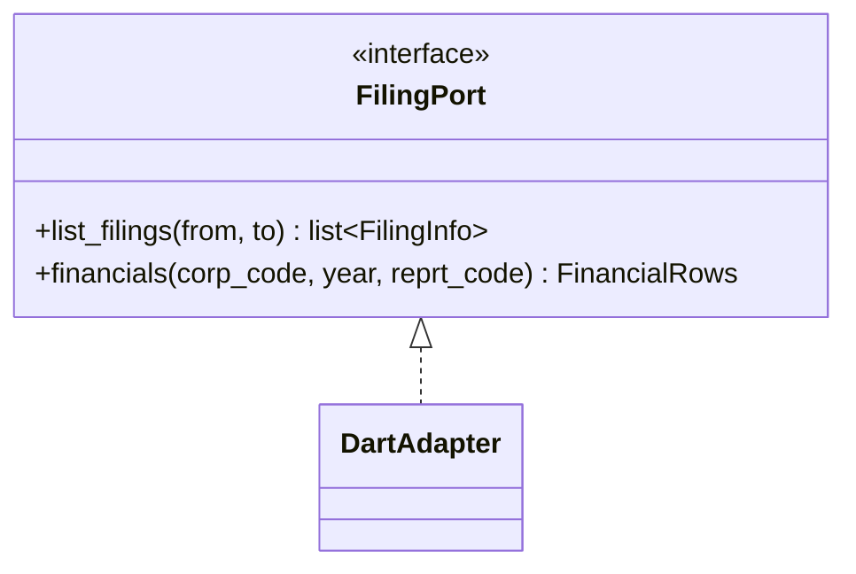

### 4.3 decision

#### Scorer 점수 계산기

`decision/scoring.py`의 순수 함수 모음(`compute_factors`, `apply_universe`, `score`, `select`). 입력 DataFrame과 설정만으로 지표 7개, 백분위, 합산 점수, 순위를 만든다. 검증 저장소의 선정 스크립트와 같은 입력으로 같은 출력을 내는 테스트가 붙는다.

#### DecisionService 판단 서비스

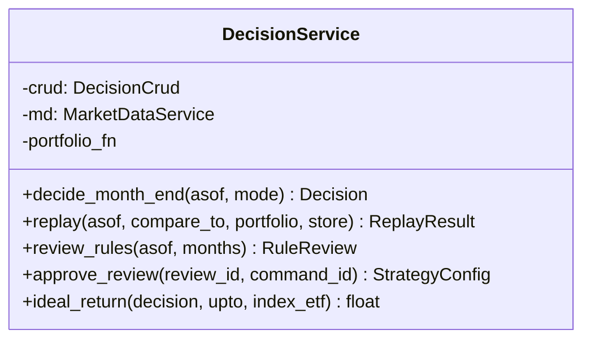

- `decide_month_end`: PointInTime을 만들고 universe·bars·financials·statuses를 읽어 점수를 내고, 현금 전환과 지수 비중을 적용해 Decision과 Score를 "대기"로 저장한다
- `replay`: 같은 절차를 과거 기준일로 돌리되 상태를 "재현"으로 저장하고 알림·주문을 내지 않는다. 자금은 **그날 판단의 예산**을 되살린다
- `ideal_return`: 체결 오차가 없다고 볼 때의 수익률. 종목 부분과 지수 부분을 비중대로 섞는다. 실전 관문이 실제 계좌와의 차이를 본다

### 4.4 trading

#### OrderBrokerPort 증권사 주문 포트

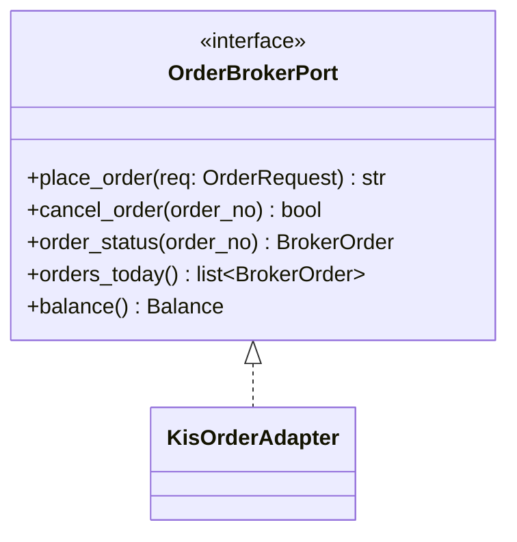

- 모드에 따른 키와 거래 ID를 쓴다. 모의 접속에 실전 거래 ID를 보내면 거부되고 그 반대도 거부되므로, 모드가 틀리면 주문이 나가는 게 아니라 실패한다

#### OrderExecutor 주문 실행기

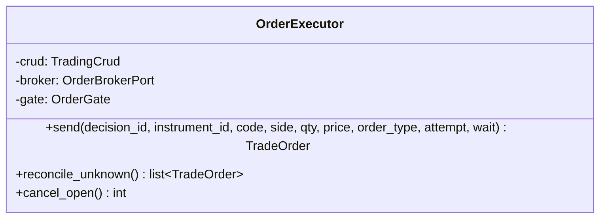

- `send`: 멱등 키 확인 → 관문 판정 → "보낼 예정" → **"보냈는지 모름"으로 커밋** → 전송 → "보냄" → 체결 확인. 전송 호출은 재시도하지 않는다([[QBOT-INFRA-001#C8]])
- `wait=False`면 체결을 기다리지 않는다. 장 시작 전 동시호가 주문용
- `reconcile_unknown`: 재시작 때 "보냈는지 모름" 주문을 그날 증권사 내역과 맞춰 확정한다

#### TradingService 매매 서비스

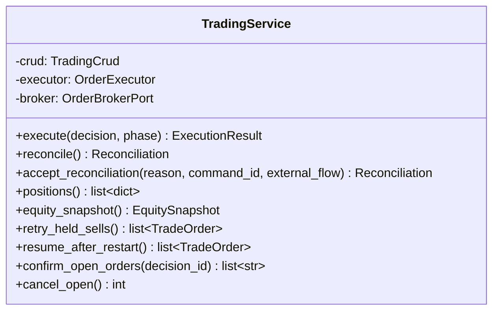

- `execute`: 상태 확인 → 대조 → 매도 → **잔고 재조회** → 매수 → 지수 조정. `phase`로 매도(08:40)와 매수(09:05)를 나눠 부른다
- `equity_snapshot`은 OrderGate가 읽는 값이다. 계좌 조회 한 번으로 현금·보유·평가액을 채운다

### 4.5 risk

#### OrderGate 주문 허용 판정

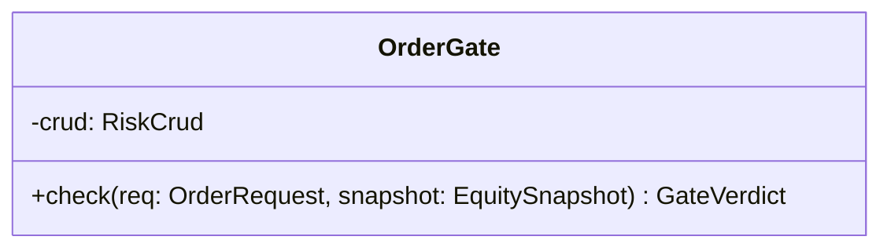

- 정지, 주문 멈춤, 실전 관문 기록, 매수 중단, 평가액 없음, 종목 비중 상한, 하루 주문 총액, 실전 첫 달 상한을 이 순서로 본다. 판정할 수 없으면 거부다. **상태 행이 없으면 만들지 않고 거부한다**

#### ValuationRecorder 일별 평가액

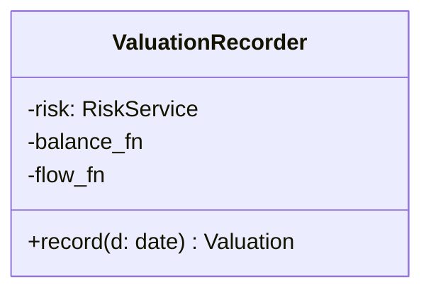

- 입출금만큼 고점·원금 기준선을 같이 옮긴다. 외부 유입은 사람이 대조에서 밝힌 금액만 센다. 같은 날 두 번 돌려도 두 번 더하지 않는다

#### LiveGate 실전 전환 관문

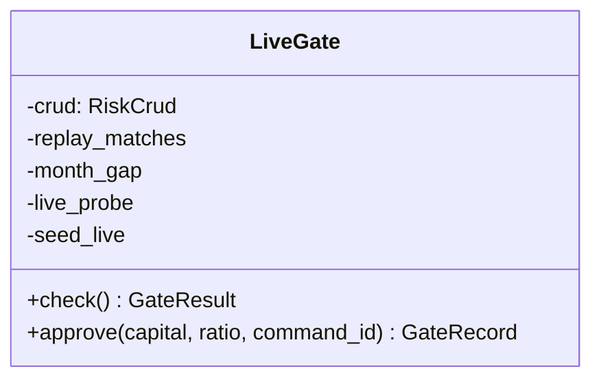

- 다섯 조건을 집계해 GateRecord로 남긴다. 못 잰 조건은 통과가 아니라 미달이다
- `approve`는 실전 데이터베이스를 만들고 기록을 옮겨 심는다. 돌고 있는 모의 상태는 건드리지 않는다

#### RiskService 위험 관리 서비스

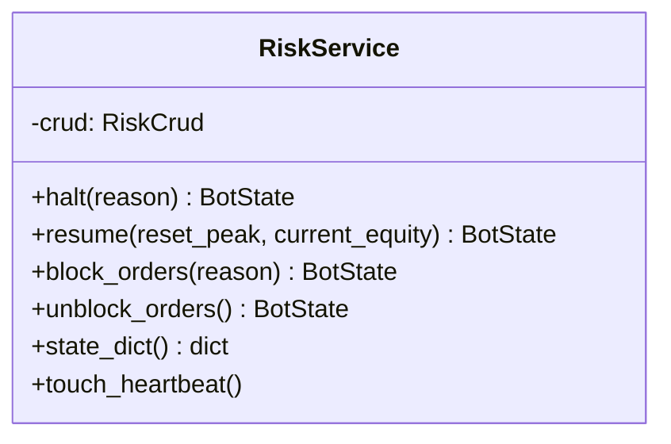

### 4.6 reporting

#### ReportingService 보고 서비스

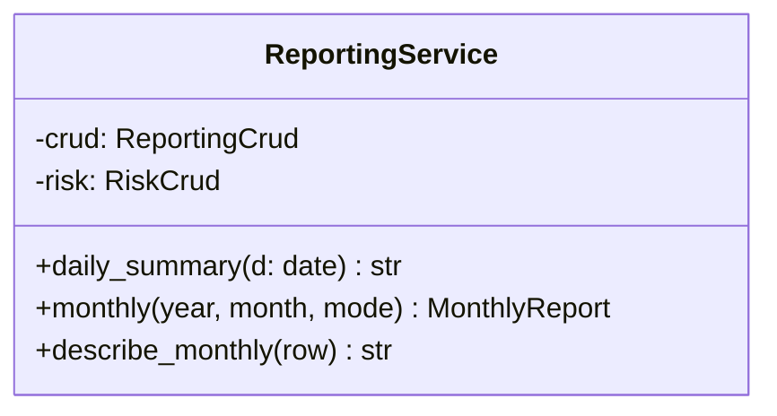

- `monthly`: 평가액 기록으로 수익률을 내고 코스피와 견준다. 시작값은 **지난달 마지막 평가액**이고 입출금은 분모에서 뺀다
- 지표별 효과는 월간 보고에서 계산하지 않는다. 월말마다 36개월치를 다시 계산하면 너무 느리다. 연 1회 재점검(`review_rules`)이 맡는다

### 4.7 ops

#### OpsService 운영 서비스

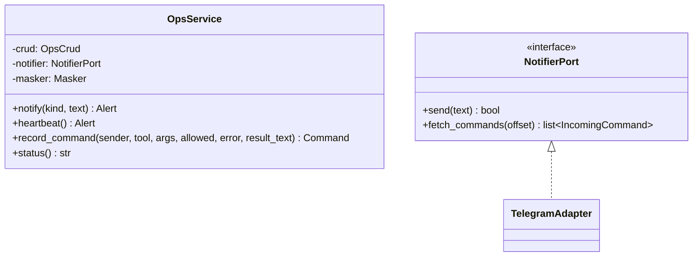

- `notify`: 모드 접두어를 붙이고 계좌번호·키를 가린다. 전송에 실패하면 기록만 남기고, 다음에 성공했을 때 **새 알림 뒤에 최근 10건만** 몰아 보낸다

### 4.8 entry

#### ToolRegistry 도구 등록표

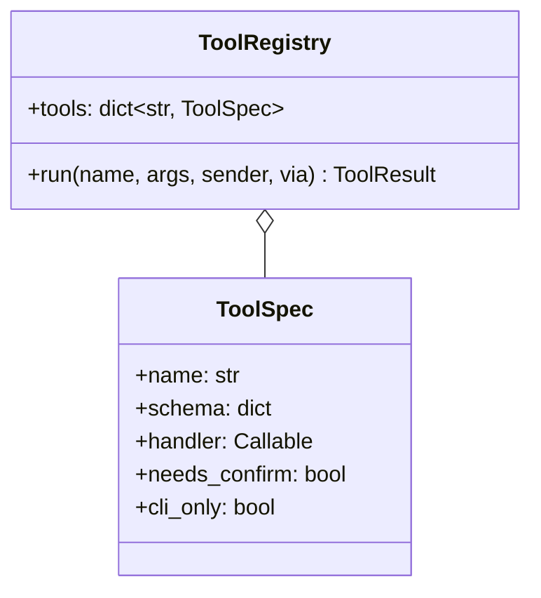

- 도구 목록은 [[QBOT-API-001]]의 도구와 1:1이다. 메신저와 명령줄이 같은 등록표를 부른다
- `run`은 인가 → 존재 → cli 전용 → 스키마 검증 → `confirm` 확인 → Command 기록 → 서비스 호출 순서다. 스키마 검증을 confirm보다 먼저 두어야 잘못된 인자를 확인 코드 입력 전에 알려 줄 수 있다

## 5. 경계

| 도메인 | 서비스 | 부르는 다른 도메인 | 외부 포트 |
|---|---|---|---|
| marketdata | MarketDataService | — | BrokerPort(조회), FilingPort |
| decision | DecisionService | marketdata(읽기) | — |
| trading | TradingService, OrderExecutor | risk(판정), ops(알림) — 모두 주입한 함수로 | OrderBrokerPort |
| risk | RiskService, OrderGate, ValuationRecorder, LiveGate | trading(읽기), decision(읽기) — 주입 | — |
| reporting | ReportingService | marketdata, risk, trading (읽기, 주입) | — |
| ops | OpsService | risk(읽기, 주입) | NotifierPort |

## 6. 미결사항

- [x] Scorer의 입력을 DataFrame으로 둘지 → DataFrame. 검증 코드와 같은 형태여야 일치 테스트가 된다
- [x] BrokerPort를 조회용과 주문용으로 나눌지 → **나눈다.** 접속 정보(키·거래 ID)가 달라 구현체가 둘이다
- [x] 메신저 confirm 코드의 유효 시간 → 5분
