# 클래스 명세

## 0. 이 문서가 다루는 것

도메인 모델의 개념을 어느 폴더의 어느 클래스가 맡는지 정한다. 테이블은 ERD가 정한다. 클래스마다 헤딩과 작은 다이어그램을 두고, 전체 그림은 뷰가 모아 그린다.

## 1. 폴더 구조

규약의 기본형에서 벗어난 곳은 둘이다. 입구가 셋(스케줄, 메신저, 명령줄)이고 셋이 같은 쓰기 경로를 타므로 라우터를 도메인 밖 `entry/`에 뒀다([[QBOT-INFRA-001#C11]]). HTTP가 없으므로 `router.py`와 `schemas.py`는 도메인 안에 없고, 도구 입력 스키마는 `entry/tools.py`에 모아 둔다([[QBOT-API-001]]).

```
backend/
├── pyproject.toml · alembic.ini · alembic/
├── app/
│   ├── main.py                  조립. 설정 읽기, DB, 클라이언트, 서비스, 입구 셋 기동
│   ├── core/
│   │   ├── settings.py          환경 변수 → Settings (pydantic-settings)
│   │   ├── db.py                SQLAlchemy 엔진·세션
│   │   ├── clock.py             Clock. 현재 시각의 유일한 출처
│   │   ├── pit.py               PointInTime 값 객체
│   │   └── errors.py            도메인 오류 타입
│   ├── entry/
│   │   ├── tools.py             도구 이름·JSON 스키마·서비스 연결표 (API 문서와 1:1)
│   │   ├── schedule/jobs.py     APScheduler 작업 → 서비스 호출
│   │   ├── telegram/poller.py   메신저 가져오기 → 인가 → tools 실행
│   │   └── cli/main.py          명령줄 → tools 실행
│   ├── domains/
│   │   ├── marketdata/  service.py · crud.py · models.py · ports.py · adapters/
│   │   ├── decision/    service.py · crud.py · models.py · scoring.py
│   │   ├── trading/     service.py · crud.py · models.py · ports.py · adapters/
│   │   ├── risk/        service.py · crud.py · models.py
│   │   ├── reporting/   service.py · crud.py · models.py
│   │   └── ops/         service.py · crud.py · models.py · ports.py · adapters/
│   ├── infra/
│   │   ├── kis_client.py        증권사 REST 호출. 토큰, 한도, 재시도
│   │   ├── dart_client.py       전자공시 호출
│   │   └── telegram_client.py   메신저 호출
│   └── shared/
│       ├── calendar.py          거래일 계산 (TradingCalendar 위에서)
│       └── money.py             원 단위 정수 계산
└── tests/                       app/ 구조를 거울처럼
```

- 호출 방향은 `entry → service → crud` 한 방향이다. 서비스가 다른 도메인의 서비스를 부를 수는 있어도 다른 도메인의 crud를 부르지 않는다
- `scoring.py`는 순수 함수 모음이다. DB도 시계도 모른다. 검증 코드의 선정 로직을 여기로 옮기고, 검증 스크립트와 같은 테스트 데이터로 결과가 같은지 확인한다([[QBOT-PRD-001#N2]])
- `ports.py`는 외부 호출이 실제로 있는 세 도메인에만 있다. `infra/`의 클라이언트가 어댑터에서 쓰인다

## 2. 엔티티

도메인 모델의 개념 20개는 각 도메인의 `models.py`에 ORM 클래스로 1:1 대응한다. 이름은 [[QBOT-DOM-001]]의 개념 영문명 그대로다. 여기서는 그 외에 코드에만 있는 클래스를 식별한다.

| 클래스 | 자리 | 왜 필요한가 |
|---|---|---|
| Settings | core | 환경 변수의 형식 검사. 빠지면 시작 거부 |
| Clock | core | 현재 시각의 유일한 출처. 재현·테스트에서 바꿔 끼움 |
| PointInTime | core | 시점 고정 조회의 기준일. 이 타입 없이는 조회 함수를 부를 수 없다 |
| MarketDataService | marketdata | 수집, 시점 고정 조회, 적재 |
| BrokerPort, FilingPort | marketdata·trading | 증권사·전자공시 인터페이스 |
| DecisionService, Scorer | decision | 월말 판단, 점수 계산, 재현, 재점검 |
| TradingService, OrderExecutor | trading | 판단 실행, 주문 하나 보내기, 계좌 대조 |
| RiskService, OrderGate | risk | 주문 허용 판정, 손실 한도, 관문 |
| ReportingService | reporting | 월간 보고 |
| OpsService, NotifierPort | ops | 알림, 명령 기록, 상태 조회, 설치 점검 |

## 3. 의존 관계

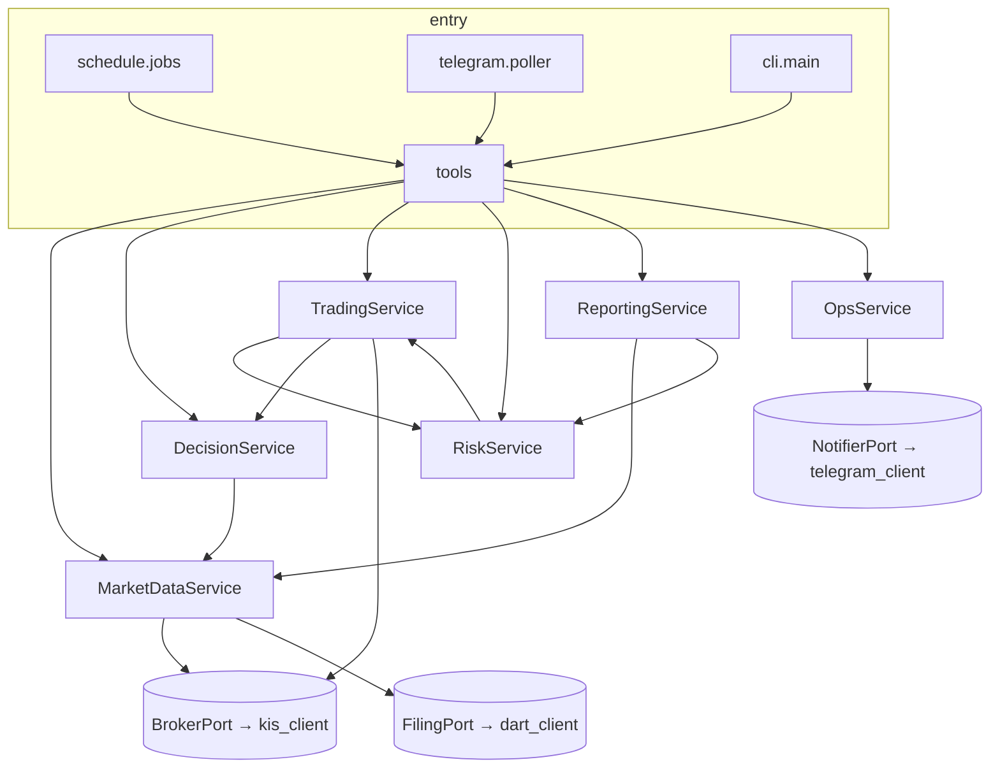

RiskService와 TradingService는 서로 부른다. RiskService가 손실 한도 계산에 보유 평가액을 읽고, TradingService가 주문마다 OrderGate를 부른다. 순환을 피하려고 RiskService는 TradingService의 **읽기 함수만** 쓰고, 쓰기는 TradingService → RiskService 한 방향이다.

## 4. 설계 클래스

### 4.1 core

#### PointInTime 기준일

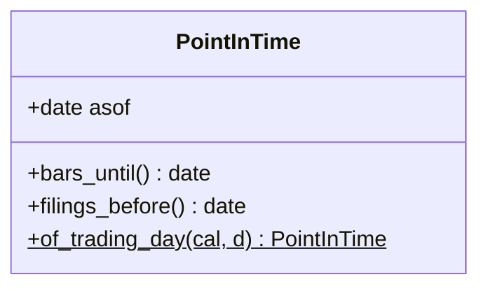

- 값 객체. `bars_until()`은 기준일 당일까지, `filings_before()`는 기준일 전날까지를 돌려준다([[QBOT-PRD-001#R3]])
- 시장 데이터 조회 함수는 모두 이 타입을 첫 인자로 받는다. `date`를 직접 받는 조회 함수는 없다. 이것이 "기준일 없이 읽는 경로가 없다"를 타입으로 보장하는 방법이다

#### Clock 시계

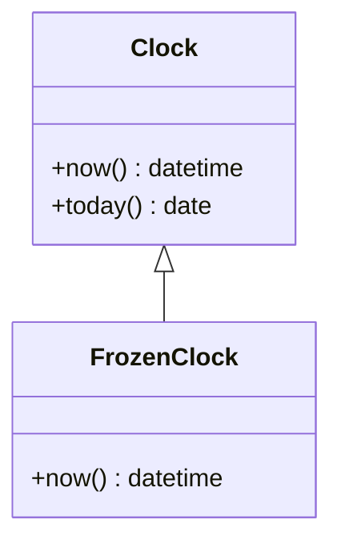

- 운영에서는 시스템 시계, 재현과 테스트에서는 고정 시계를 끼운다. 도메인 코드는 `datetime.now()`를 직접 부르지 않는다

### 4.2 marketdata

#### MarketDataService 시장 데이터 서비스

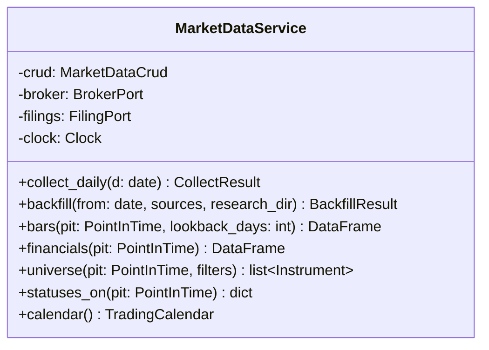

- `collect_daily`: 일봉, 종목 상태, 공시, 거래일, 지수를 받아 추가한다. 어제 종가가 저장값과 다르면 수정주가 사건으로 보고 그 종목의 과거를 새 판 번호로 다시 받는다([[QBOT-INFRA-001]] 7장)
- `financials(pit)`: 접수 일자가 `pit.filings_before()` 이하인 Filing의 스냅샷 중 종목·결산 기간마다 가장 늦은 것을 고른다([[QBOT-UC-001#UC-S1]])
- `bars(pit, n)`: 각 종목의 최신 판 번호 중 `pit.bars_until()` 이하 거래일의 일봉 n개
- 외부 호출은 포트를 통해서만 한다

#### BrokerPort 증권사 포트

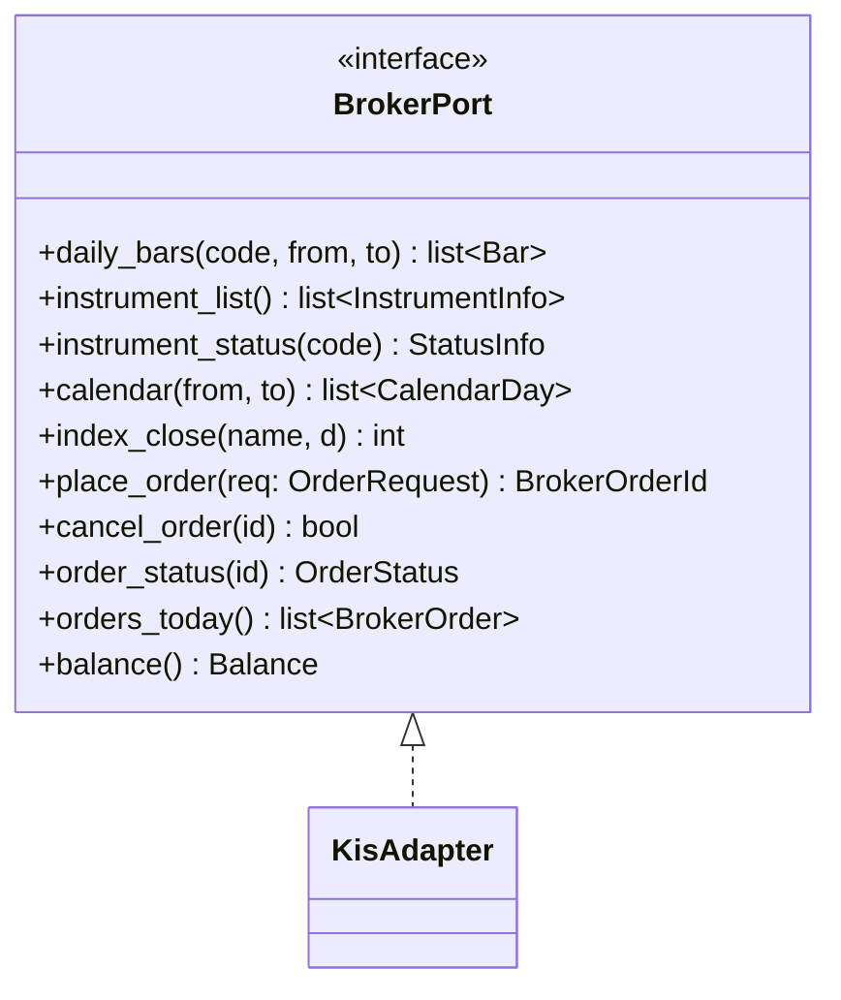

- 하나의 인터페이스를 시장 데이터와 매매가 같이 쓴다. 파일은 `marketdata/ports.py`에 두고 `trading/ports.py`가 재수출한다
- KisAdapter는 `infra/kis_client.py`를 감싼다. 모의·실전은 Settings의 접속 주소와 계좌만 다르다([[QBOT-INFRA-001#C6]])

#### FilingPort 전자공시 포트

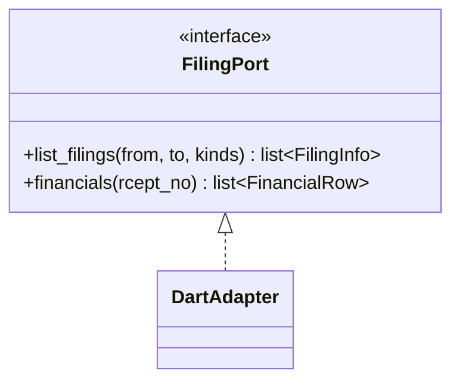

### 4.3 decision

#### Scorer 점수 계산기

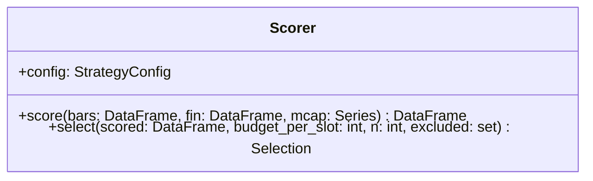

- 순수 함수. 입력 DataFrame과 설정만으로 지표 7개, 백분위, 합산 점수, 순위를 만든다([[QBOT-UC-001#UC-S2]])
- `select`는 점수 순서대로 내려가며 제외 종목과 1주 가격 초과 종목을 건너뛰어 n개를 고른다. 건너뛴 이유를 함께 돌려준다
- 검증 저장소의 선정 스크립트와 같은 입력으로 같은 출력을 내는 테스트가 붙는다

#### DecisionService 판단 서비스

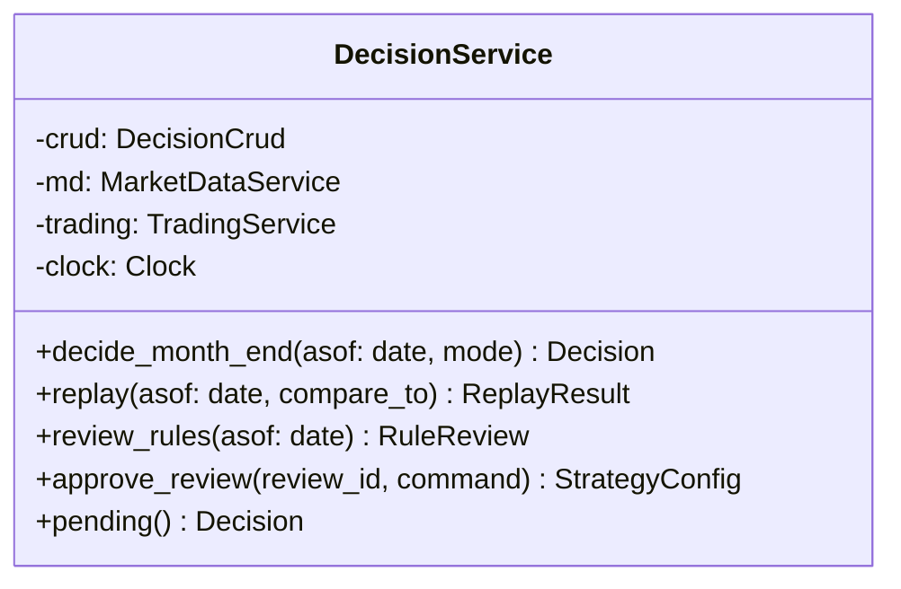

- `decide_month_end`: PointInTime을 만들고, universe·bars·financials·statuses를 읽고, Scorer로 점수를 내고, 현금 전환 규칙과 지수 비중을 적용해 Decision과 Score를 "대기"로 저장한다([[QBOT-UC-001#UC-A2]])
- `replay`: 같은 절차를 FrozenClock과 과거 PointInTime으로 돌리되 상태를 "재현"으로 저장하고 알림·주문을 내지 않는다
- `review_rules`: 후보 지표 전체의 월 수익차와 t값을 계산한다. 검증 저장소의 지표 검증 스크립트와 같은 계산이다

### 4.4 trading

#### OrderExecutor 주문 실행기

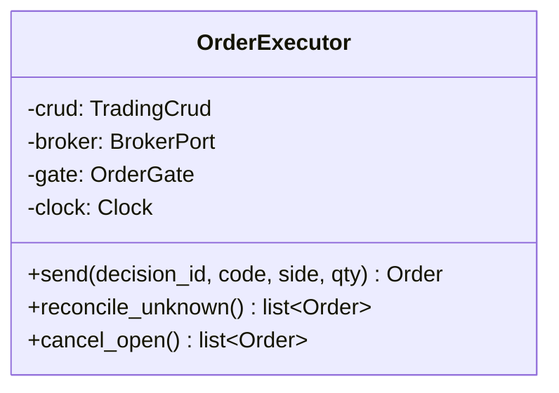

- `send`: 고유 키 생성 → 기존 주문 확인 → OrderGate 판정 → "보낼 예정" 저장 → 전송 → "보냈는지 모름" → 주문 번호 저장 → "보냄" → 체결 확인([[QBOT-UC-001#UC-S3]]). 전송 호출은 재시도하지 않는다([[QBOT-INFRA-001#C8]])
- `reconcile_unknown`: 재시작 때 "보냈는지 모름" 주문을 증권사 오늘 주문 내역과 맞춰 확정한다([[QBOT-UC-001#UC-A4]])

#### TradingService 매매 서비스

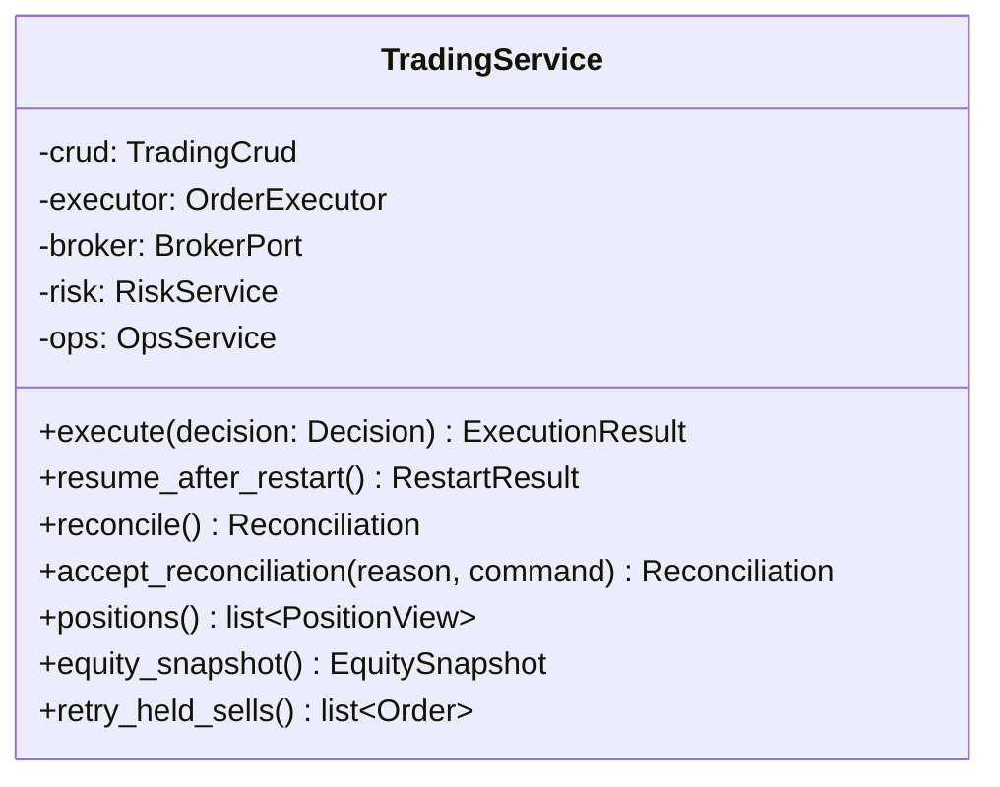

- `execute`: 계좌 대조 → 매도 목록 → "실행 중" → 매도 전송 → 체결 확인 → 예산 계산 → 매수 전송 → 기록·알림 → "완료"([[QBOT-UC-001#UC-A3]]). 거래정지 종목은 "보류"로 남기고 `retry_held_sells`가 매일 다시 시도한다
- `equity_snapshot`은 RiskService가 읽는 함수다. 쓰기는 하지 않는다

### 4.5 risk

#### OrderGate 주문 허용 판정

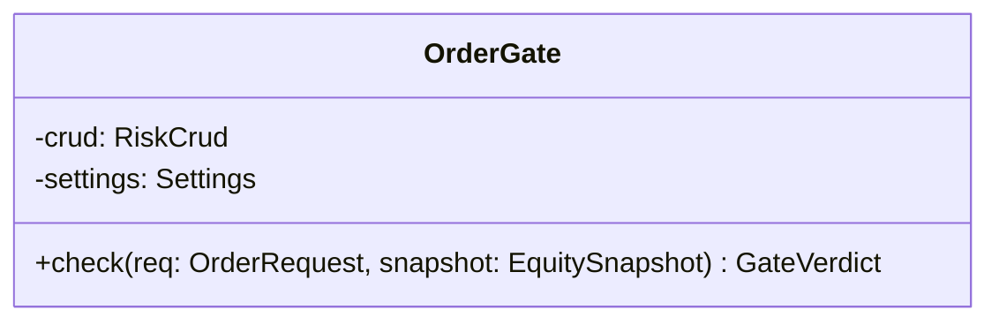

- 정지, 주문 멈춤, 실전 관문 기록, 매수 중단, 종목 비중 상한, 하루 주문 총액, 실전 첫 달 상한을 이 순서로 본다([[QBOT-UC-001#UC-S6]]). 판정할 수 없으면 거부다

#### RiskService 위험 관리 서비스

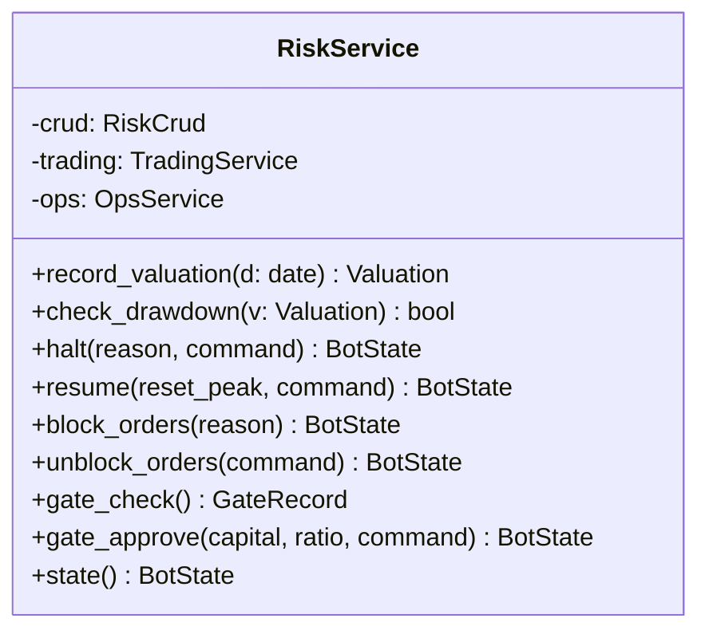

- `record_valuation`: 현금, 주식, 지수 부분을 나눠 저장하고 그날 입출금을 빼서 고점을 갱신한다([[QBOT-UC-001#UC-A5]])
- `gate_approve`: 실전 접속 시험이 성공해야 모드를 바꾼다([[QBOT-UC-001#UC-H2]])

### 4.6 reporting

#### ReportingService 보고 서비스

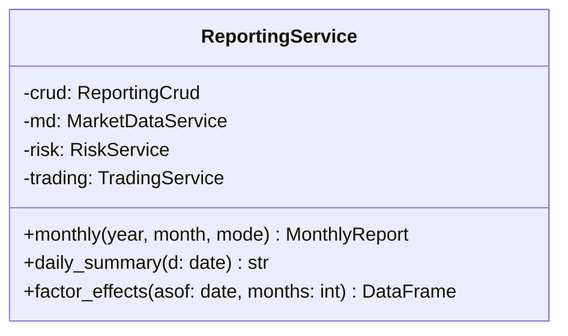

- `monthly`: 코스피, 전 종목 동일 비중, 체결 오차 없는 모의 계산값을 같이 계산한다([[QBOT-UC-001#UC-A6]]). 모의 계산값은 DecisionService의 재현 절차를 재사용한다

### 4.7 ops

#### OpsService 운영 서비스

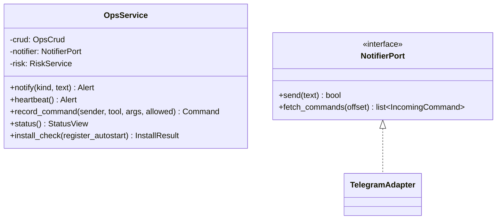

- `notify`: 모드 접두어를 붙이고, 계좌번호·키를 가리고, 실패하면 기록만 남기고 다음에 몰아 보낸다([[QBOT-UC-001#UC-S5]])

### 4.8 entry

#### ToolRegistry 도구 등록표

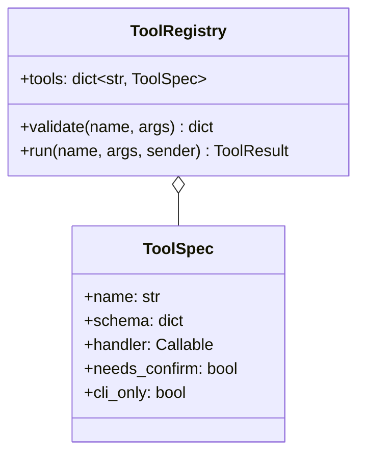

- 도구 목록은 [[QBOT-API-001]]의 도구와 1:1이다. 메신저와 명령줄이 같은 등록표를 부른다
- `run`은 인가 확인 → 스키마 검증 → `confirm` 확인 → Command 기록 → 서비스 호출 순서다

## 5. 경계

| 도메인 | 서비스 | 부르는 다른 도메인 | 외부 포트 |
|---|---|---|---|
| marketdata | MarketDataService | — | BrokerPort, FilingPort |
| decision | DecisionService | marketdata(읽기), trading(읽기) | — |
| trading | TradingService, OrderExecutor | risk(판정·쓰기), decision(읽기), ops(알림) | BrokerPort |
| risk | RiskService, OrderGate | trading(읽기), ops(알림) | — |
| reporting | ReportingService | marketdata, risk, trading, decision (모두 읽기) | — |
| ops | OpsService | risk(읽기) | NotifierPort |

## 6. 미결사항

- [ ] Scorer의 입력을 DataFrame으로 둘지 자체 타입으로 둘지. 제안은 DataFrame. 검증 코드와 같은 형태여야 일치 테스트가 쉽다
- [ ] BrokerPort 하나를 두 도메인이 공유하는 대신 조회용과 주문용으로 나눌지. 제안은 하나. 구현체가 하나뿐이다
- [ ] 메신저 confirm 코드의 유효 시간. 제안은 5분
