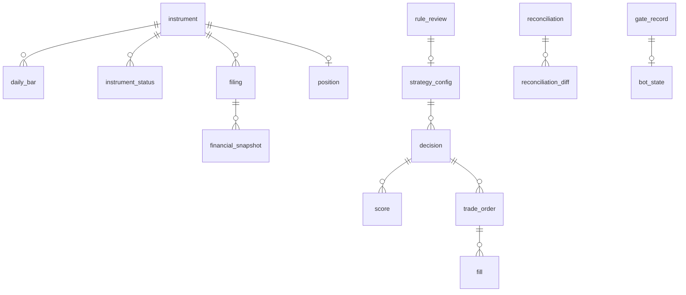

# ERD · 데이터 사전

## 0. 이 문서가 다루는 것

SQLite 파일 하나에 들어가는 테이블과 컬럼, 키, 인덱스를 정한다. 테이블 이름은 개념 영문명의 소문자 스네이크 표기다. 모의와 실전은 파일이 다르다([[QBOT-INFRA-001]] 6장). 그래서 `mode` 컬럼은 기록을 읽을 때 헷갈리지 않기 위한 것이지 분리 키가 아니다.

공통 규칙: 기본 키는 `id INTEGER`. 시각은 ISO 8601 문자열(한국 시간). 금액은 원 단위 정수. 날짜는 `YYYY-MM-DD` 문자열. `created_at`은 모든 테이블에 있고 표에서는 생략한다.

## 1. 개념 식별

[[QBOT-DOM-001]]의 개념 21개가 테이블 21개다. 추가 테이블은 `reconciliation_diff` 하나다. StrategyConfig의 지표 목록은 JSON 컬럼으로 두고 별도 테이블로 풀지 않는다. 지표 7개가 행으로 필요한 조회가 없기 때문이다.

## 2. 개념 모델

`reconciliation_diff`는 Reconciliation의 "종목별 차이" 속성을 행으로 푼 것이다. 개념은 하나지만 테이블은 둘이다.

## 3. DD (테이블별 데이터 사전)

### 3.1 시장 데이터

#### instrument 종목

| 컬럼 | 형 | 제약 | 뜻 |
|---|---|---|---|
| code | TEXT | UNIQUE NOT NULL | 6자리 종목 코드 |
| name | TEXT | NOT NULL | |
| market | TEXT | NOT NULL | KOSPI, KOSDAQ, UNKNOWN |
| kind | TEXT | NOT NULL | common, preferred, etf, unknown |
| listed_on | TEXT | | |
| delisted_on | TEXT | | NULL이면 상장 중 |
| prev_code | TEXT | | 코드 변경 전 코드 |
| shares_outstanding | INTEGER | | 최근 상장 주식 수 |
| shares_asof | TEXT | | 그 주식 수의 기준일 |

`kind = unknown`은 계좌에만 있고 종목표에 없던 종목이다(대조를 정리하려면 자리가 필요하다). 종목 선정 대상은 `common`뿐이라 매수 후보가 되지는 않는다.

#### instrument_status 종목 지정 상태

| 컬럼 | 형 | 제약 | 뜻 |
|---|---|---|---|
| instrument_id | INTEGER | FK NOT NULL | |
| status | TEXT | NOT NULL | managed, caution, warning, danger, halted, liquidation |
| starts_on | TEXT | NOT NULL | |
| ends_on | TEXT | | NULL이면 진행 중 |

#### daily_bar 일봉

| 컬럼 | 형 | 제약 | 뜻 |
|---|---|---|---|
| instrument_id | INTEGER | FK NOT NULL | |
| trade_date | TEXT | NOT NULL | |
| series_no | INTEGER | NOT NULL DEFAULT 1 | 수정주가 판 번호. 종목 단위 |
| open, high, low, close | INTEGER | NOT NULL | |
| volume | INTEGER | NOT NULL | |
| amount | INTEGER | | 거래대금 |
| traded | INTEGER | NOT NULL | 0/1. 거래 여부 |
| collected_at | TEXT | NOT NULL | |

판 번호가 올라가도 옛 행은 지우지 않는다([[QBOT-INFRA-001#C10]]). 어느 판을 쓸지는 **판 번호가 큰 것**으로 고른다. 수집 시각으로 고르면 과거를 한꺼번에 적재한 행은 시각이 모두 같아 기준이 없다.

#### filing 공시

| 컬럼 | 형 | 제약 | 뜻 |
|---|---|---|---|
| rcept_no | TEXT | UNIQUE NOT NULL | 공시 번호 14자리 |
| instrument_id | INTEGER | FK NOT NULL | |
| report_kind | TEXT | NOT NULL | annual, half, quarter, prelim, correction, other |
| rcept_date | TEXT | NOT NULL | 접수 **일자**. 전자공시 API는 시각을 주지 않는다 |
| corrects_rcept_no | TEXT | | 정정 대상 |
| title | TEXT | NOT NULL | 키워드 규칙용 |
| collected_at | TEXT | NOT NULL | |

#### financial_snapshot 재무 수치

| 컬럼 | 형 | 제약 | 뜻 |
|---|---|---|---|
| filing_id | INTEGER | FK NOT NULL | |
| instrument_id | INTEGER | FK NOT NULL | 조회 편의를 위한 중복 |
| period_end | TEXT | NOT NULL | 결산 기간 종료일 |
| period_kind | TEXT | NOT NULL | annual, quarter, cum3q, prelim |
| consolidated | INTEGER | NOT NULL | 0/1 |
| revenue, operating_income, net_income, net_income_owner | INTEGER | | |
| equity, equity_owner | INTEGER | | |
| eps | INTEGER | | |

`cum3q`는 4분기를 유도하려고 남기는 3분기 누적값이다(4분기 = 연간 - 3분기 누적). 유도할 때 연결·별도를 섞으면 안 된다.

#### trading_calendar 거래일

| 컬럼 | 형 | 제약 | 뜻 |
|---|---|---|---|
| date | TEXT | UNIQUE NOT NULL | |
| is_trading_day | INTEGER | NOT NULL | |
| open_at, close_at | TEXT | | |
| is_month_end | INTEGER | NOT NULL | 그 달 마지막 거래일 |

달의 마지막 날까지 받아 본 달만 `is_month_end`를 정한다. 중간까지만 받은 달에 표시하면 엉뚱한 날이 월말이 되어 그 달 판단이 하루 일찍 돈다.

#### index_level 지수

| 컬럼 | 형 | 제약 | 뜻 |
|---|---|---|---|
| index_name | TEXT | NOT NULL | KOSPI, KOSPI200 |
| date | TEXT | NOT NULL | |
| close | REAL | NOT NULL | |

### 3.2 판단

#### strategy_config 전략 설정

| 컬럼 | 형 | 제약 | 뜻 |
|---|---|---|---|
| factors_json | TEXT | NOT NULL | {name: direction} |
| min_price, min_amount20, min_mcap | INTEGER | NOT NULL | 대상 필터 |
| n_holdings | INTEGER | NOT NULL | |
| trend_filter | INTEGER | NOT NULL | 0/1 |
| index_weight | REAL | NOT NULL | 0~1 |
| effective_from | TEXT | NOT NULL | |
| approved_by_command_id | INTEGER | FK | 첫 설정은 NULL |
| source_review_id | INTEGER | FK | |

지수 부분에 쓸 종목 코드 칸이 없다. 지금은 코드 상수(069500 KODEX 200)다. 칸을 더할지는 6장 미결.

#### decision 판단

| 컬럼 | 형 | 제약 | 뜻 |
|---|---|---|---|
| asof | TEXT | NOT NULL | 기준일 |
| mode | TEXT | NOT NULL | paper, live |
| strategy_config_id | INTEGER | FK NOT NULL | |
| code_version | TEXT | NOT NULL | git 커밋 |
| cash_switch | INTEGER | NOT NULL | 현금 전환 발동 |
| index_rebalance | INTEGER | NOT NULL | 지수 조정 필요 |
| status | TEXT | NOT NULL | pending, running, partial, done, replay |
| budget_per_slot | INTEGER | | 판단 시 종목당 예산. 재현이 그때 자금을 되살릴 때 쓴다 |

`status = replay`인 행은 실제 운용이 아니다. 기간·횟수 집계(실전 관문)에서 빼야 한다.

#### score 종목 점수

| 컬럼 | 형 | 제약 | 뜻 |
|---|---|---|---|
| decision_id | INTEGER | FK NOT NULL | |
| instrument_id | INTEGER | FK NOT NULL | |
| factors_json | TEXT | NOT NULL | 지표값 7개 |
| pct_json | TEXT | NOT NULL | 백분위 7개 |
| total | REAL | NOT NULL | |
| rank | INTEGER | NOT NULL | |
| selected | INTEGER | NOT NULL | |
| skip_reason | TEXT | | price, status |

상위 60개 **그리고 선정·건너뛴 행 전부**를 저장한다. 소자본에서는 1주 가격 때문에 60위 밖까지 내려가는데, 그 행이 빠지면 판단 기록에 뽑힌 종목이 없다.

#### rule_review 규칙 재점검

| 컬럼 | 형 | 제약 | 뜻 |
|---|---|---|---|
| asof | TEXT | NOT NULL | |
| results_json | TEXT | NOT NULL | 후보별 {months, mean, t, in_use} |
| adopted_json | TEXT | NOT NULL | 채택 목록 |
| diff_json | TEXT | NOT NULL | 현재 설정과의 차이 |
| decision | TEXT | | approved, rejected, NULL |
| decided_by_command_id | INTEGER | FK | |
| decided_at | TEXT | | |

### 3.3 매매

#### trade_order 주문

개념 Order. `order`가 SQLite 예약어라 테이블 이름은 `trade_order`다.

| 컬럼 | 형 | 제약 | 뜻 |
|---|---|---|---|
| idem_key | TEXT | UNIQUE NOT NULL | `decision_id:code:side` (+ 재시도면 `#n`). 같은 판단에서 남은 수량을 다시 팔려면 번호가 필요하다 |
| decision_id | INTEGER | FK NOT NULL | |
| instrument_id | INTEGER | FK NOT NULL | |
| side | TEXT | NOT NULL | buy, sell |
| qty | INTEGER | NOT NULL | |
| order_type | TEXT | NOT NULL | market, limit |
| limit_price | INTEGER | | 지정가일 때만. 시장가의 예상 체결가를 담는 칸은 없다(6장 미결) |
| status | TEXT | NOT NULL | planned, unknown, sent, filled, partial, cancelled, rejected, held |
| broker_order_no | TEXT | | 증권사 주문번호. **날마다 새로 매겨진다** |
| retry_count | INTEGER | NOT NULL DEFAULT 0 | |
| reject_reason | TEXT | | 관문 사유(halted·concentration 등)거나 증권사 메시지. 관문 사유는 실전 관문의 "주문 오류" 집계에서 뺀다 |
| sent_at, closed_at | TEXT | | |

`rejected`는 최종 상태가 아니다. 거부는 그때의 상태 때문이므로 다시 부르면 다시 판정한다.

#### fill 체결

| 컬럼 | 형 | 제약 | 뜻 |
|---|---|---|---|
| order_id | INTEGER | FK NOT NULL | |
| qty | INTEGER | NOT NULL | |
| price | INTEGER | NOT NULL | 그 구간의 값. 누적 평균가가 아니다 |
| fee | INTEGER | NOT NULL | 추정값(증권사 응답에 없다) |
| tax | INTEGER | NOT NULL | 매도만. 추정값 |
| filled_at | TEXT | NOT NULL | |
| broker_fill_no | TEXT | NOT NULL | `{증권사주문번호}:{누적수량}`. 증권사가 체결 번호를 안 주므로 실행기가 합성한다 |

증권사는 누적 체결과 누적 평균가만 준다. 그래서 늘어난 수량과 그 구간 금액만 행으로 넣고, 키는 누적 수량으로 잡는다. 같은 응답을 두 번 봐도 같은 키라 중복되지 않는다. **NULL을 허용하면 안 된다** — SQLite는 NULL이 여럿 있어도 UNIQUE 위반으로 보지 않아 중복 체결이 들어온다.

#### position 보유

| 컬럼 | 형 | 제약 | 뜻 |
|---|---|---|---|
| instrument_id | INTEGER | FK UNIQUE NOT NULL | |
| qty | INTEGER | NOT NULL | |
| avg_cost | INTEGER | NOT NULL | |
| first_bought_on | TEXT | | |
| updated_at | TEXT | NOT NULL | |
| updated_by | TEXT | NOT NULL | bot, reconcile |

수량 0이 되면 **행을 지우지 않고 qty=0으로 둔다**. 지우면 "한 번도 산 적 없음"과 "전부 팔았음"이 같아져 매수일을 잃는다. 이력은 fill과 reconciliation_diff에 있다.

#### reconciliation 계좌 대조

| 컬럼 | 형 | 제약 | 뜻 |
|---|---|---|---|
| checked_at | TEXT | NOT NULL | |
| mode | TEXT | NOT NULL | |
| bot_cash, broker_cash | INTEGER | NOT NULL | |
| result | TEXT | NOT NULL | ok, mismatch |
| last_fill_id | INTEGER | NOT NULL | 이 시점까지 반영한 체결. 다음 대조는 이 뒤의 체결만 더해 예수금을 설명한다 |
| external_flow | INTEGER | NOT NULL | 사람이 "이만큼은 입출금"이라고 밝힌 금액. 원금·고점 기준선은 이것만 따라 움직인다 |
| resolution | TEXT | | accepted, NULL(미해결·일치) |
| reason | TEXT | | |
| resolved_by_command_id | INTEGER | FK | |
| resolved_at | TEXT | | |

`last_fill_id`가 시각이 아닌 이유: 같은 초에 일어난 대조와 체결의 앞뒤를 시각으로는 가릴 수 없다. 그러면 체결 하나가 예수금 설명에서 빠지거나 두 번 세어져 멀쩡한 계좌가 불일치로 잡힌다.

`external_flow`가 `broker_cash - bot_cash`와 다른 이유: 차액에는 진짜 입출금뿐 아니라 우리가 놓친 매매·수수료도 섞여 있다. 후자까지 기준선을 옮기면 **그 손실이 손실 한도에서 사라진다**. 그래서 사람이 밝힌 금액만 적는다(기본 0).

다음 대조의 기준은 **마지막으로 맞은(ok·accepted) 행**이다. 불일치 행을 기준으로 삼으면 그 행의 `broker_cash`가 "지금 계좌"라서, 사람이 아무것도 안 했는데 다음 대조가 저절로 ok가 된다.

#### reconciliation_diff 대조 차이

| 컬럼 | 형 | 제약 | 뜻 |
|---|---|---|---|
| reconciliation_id | INTEGER | FK NOT NULL | |
| instrument_id | INTEGER | FK NOT NULL | |
| bot_qty, broker_qty | INTEGER | NOT NULL | |

### 3.4 위험 관리

#### bot_state 봇 상태

행이 하나뿐인 테이블. `id = 1`로 고정한다.

| 컬럼 | 형 | 제약 | 뜻 |
|---|---|---|---|
| mode | TEXT | NOT NULL | paper, live |
| halted | INTEGER | NOT NULL | |
| buy_suspended | INTEGER | NOT NULL | 손실 한도 |
| orders_blocked | INTEGER | NOT NULL | 계좌 불일치. 사유 칸은 없어서 `status`가 최근 불일치 대조를 대신 보여 준다 |
| peak_equity | INTEGER | NOT NULL | 손실 한도의 기준선. 입출금이 있으면 그만큼 같이 옮긴다 |
| peak_reset_at | TEXT | | |
| principal | INTEGER | NOT NULL | 원금. 사람이 밝힌 입출금만 더한다 |
| live_since | TEXT | | |
| gate_record_id | INTEGER | FK | 통과·승인된 관문. **이 값이 없으면 실전 모드로 시작하지 않는다** |
| first_month_cap | INTEGER | | 실전 첫 달 매수 상한 |
| last_heartbeat_at | TEXT | | |
| updated_at | TEXT | NOT NULL | |

관문은 이 행이 없으면 만들지 않고 거부한다. 관문이 상태를 만들어 버리면 "상태가 없다"를 영영 잡을 수 없다.

#### valuation 일별 평가액

| 컬럼 | 형 | 제약 | 뜻 |
|---|---|---|---|
| date | TEXT | UNIQUE NOT NULL | |
| mode | TEXT | NOT NULL | |
| cash | INTEGER | NOT NULL | |
| stock_value | INTEGER | NOT NULL | 전략 부분 |
| index_value | INTEGER | NOT NULL | 지수 부분 |
| total | INTEGER | NOT NULL | |
| external_flow | INTEGER | NOT NULL | 그날 반영한 입출금. 같은 날 다시 기록해도 두 번 더하지 않게 하는 기준이기도 하다 |
| drawdown | REAL | NOT NULL | 고점 대비 |
| pnl_vs_principal | REAL | NOT NULL | 원금 대비 |

#### gate_record 관문 기록

| 컬럼 | 형 | 제약 | 뜻 |
|---|---|---|---|
| checked_at | TEXT | NOT NULL | |
| paper_days | INTEGER | NOT NULL | 첫 **실제** 판단부터 오늘까지. 재현(replay) 행은 세지 않는다 |
| rebalances | INTEGER | NOT NULL | 완료·부분 완료된 월말 판단 수 |
| order_errors | INTEGER | NOT NULL | 평가 구간(직전 90일) 안의 증권사 오류. 관문이 막은 주문은 세지 않는다 |
| selection_match | REAL | NOT NULL | 0~1. **-1은 "못 쟀음"** (비교할 판단이 없다) |
| return_gap | REAL | NOT NULL | 월 수익 차이의 최댓값. **-1은 "못 쟀음"** |
| verdict | TEXT | NOT NULL | pass, fail |
| approved_by_command_id | INTEGER | FK | |
| approved_at | TEXT | | |
| capital | INTEGER | | |
| first_month_ratio | REAL | | |

승인하면 이 행을 **실전 데이터베이스에도 복사**한다. 모의와 실전은 파일이 다르므로(INFRA 6장) 모의 쪽에만 남기면 실전으로 시작할 때 통과 기록을 못 찾아 거부된다.

### 3.5 보고

#### monthly_report 월간 보고

| 컬럼 | 형 | 제약 | 뜻 |
|---|---|---|---|
| year_month | TEXT | NOT NULL | YYYY-MM |
| mode | TEXT | NOT NULL | |
| metrics_json | TEXT | NOT NULL | 수익률·낙폭·비용·코스피 대비 |
| factor_effects_json | TEXT | NOT NULL | 지표별 효과. 월간 보고에서는 비워 둔다(연 1회 재점검이 계산한다) |
| notes | TEXT | | 계산 못 한 항목과 이유 |

### 3.6 운영

#### alert 알림

| 컬럼 | 형 | 제약 | 뜻 |
|---|---|---|---|
| sent_at | TEXT | NOT NULL | |
| mode | TEXT | NOT NULL | |
| kind | TEXT | NOT NULL | order, fill, error, limit, summary, heartbeat, keyword, report |
| text | TEXT | NOT NULL | 가린 뒤의 내용 |
| delivered | INTEGER | NOT NULL | |
| deferred | INTEGER | NOT NULL | 밀렸다가 보냄 |

#### command 운영자 명령

| 컬럼 | 형 | 제약 | 뜻 |
|---|---|---|---|
| received_at | TEXT | NOT NULL | |
| sender | TEXT | NOT NULL | 대화 번호 또는 cli |
| allowed | INTEGER | NOT NULL | 인가 실패도 남긴다 |
| tool | TEXT | NOT NULL | |
| args_json | TEXT | NOT NULL | |
| result | TEXT | | ok 또는 에러 코드 |
| result_text | TEXT | | 사람이 받은 답 |

## 4. 인덱스

| 테이블 | 인덱스·제약 | 왜 |
|---|---|---|
| instrument | UNIQUE(code) | 코드로 찾는다 |
| instrument_status | (instrument_id, starts_on, ends_on) | "그날 지정돼 있었는가"를 한 번에 |
| daily_bar | UNIQUE(instrument_id, series_no, trade_date) | 같은 판의 같은 날은 하나 |
| daily_bar | (trade_date) | 전 종목 하루치 조회 |
| filing | UNIQUE(rcept_no) | 공시 번호 |
| filing | (instrument_id, rcept_date) | 시점 고정 조회의 핵심 ([[QBOT-PRD-001#R3]]) |
| financial_snapshot | UNIQUE(filing_id, period_end, period_kind, consolidated) | 같은 공시의 같은 기간은 하나 |
| financial_snapshot | (instrument_id, period_end) | 결산 기간별 최신 스냅샷 |
| trading_calendar | UNIQUE(date) | |
| index_level | UNIQUE(index_name, date) | |
| decision | UNIQUE(asof, mode) WHERE status != 'replay' | 같은 날의 실제 판단은 하나. 재현은 여럿 가능 |
| decision | (status) | 대기·실행 중 판단 찾기 |
| score | UNIQUE(decision_id, instrument_id) | |
| trade_order | UNIQUE(idem_key) | 멱등성을 DB가 보장 ([[QBOT-UC-001#UC-S3]]) |
| trade_order | (status), (decision_id) | 미확정 주문, 판단별 주문 |
| fill | UNIQUE(order_id, broker_fill_no) | 같은 체결을 두 번 세지 않음. broker_fill_no는 NOT NULL이어야 뜻이 있다 |
| position | UNIQUE(instrument_id) | |
| valuation | UNIQUE(date) | |
| monthly_report | UNIQUE(year_month, mode) | |
| command | (received_at) | 최근 명령 |

## 5. 경계

- 도메인 폴더의 `models.py`가 자기 테이블만 정의한다. 다른 도메인의 테이블을 외래 키로 가리키는 것은 허용하되(예: decision → strategy_config, trade_order → decision), 그 테이블에 쓰는 것은 그 도메인의 서비스만 한다
- `bot_state`는 risk 도메인 소유다. OrderGate가 읽고, RiskService만 쓴다
- **지우는 테이블은 없다.** 전부 추가하거나 고치기만 한다
- SQLite는 `BEGIN IMMEDIATE` + `busy_timeout`으로 연다. WAL에서 읽다가 쓰기로 올라가면 busy_timeout이 듣지 않아, 적재가 도는 동안 봇의 모든 쓰기가 즉시 실패한다. 긴 작업은 단위마다 커밋해 잠금을 오래 쥐지 않는다

## 6. 미결사항

- [x] SQLite의 부분 UNIQUE(WHERE 조건)를 Alembic으로 만들 때 방언 차이 → `sqlite_where`로 만들어졌다
- [x] `score`를 60개만 저장할지 → 상위 60 + 선정·건너뛴 행 전부
- [ ] `strategy_config`에 지수 ETF 종목 코드 칸을 더할지. 지금은 코드 상수(069500)
- [ ] `trade_order`에 주문 시 예상 체결가 칸을 더할지. 없어서 하루 주문 총액을 체결 금액 합으로만 계산한다(미체결 주문 금액은 세지 못한다)
- [ ] `bot_state`에 주문 멈춤 사유 칸을 더할지. 지금은 `status`가 최근 불일치 대조를 대신 보여 준다
- [ ] 백업에서 `alert`와 `command`를 제외할지. 제안은 포함. 작다
