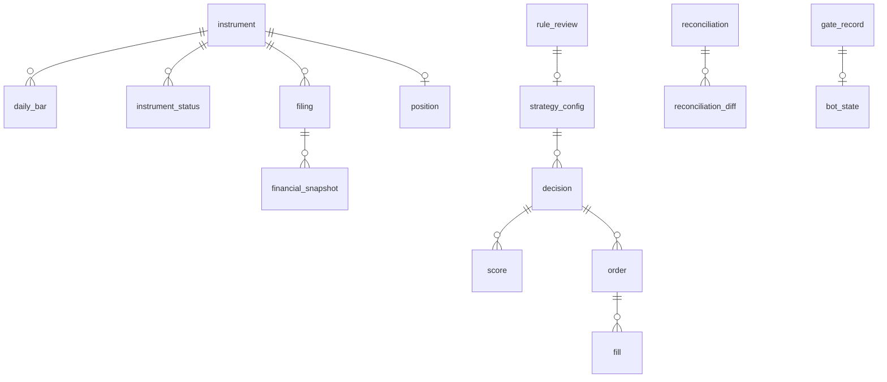

# ERD · 데이터 사전

## 0. 이 문서가 다루는 것

SQLite 파일 하나에 들어가는 테이블과 컬럼, 키, 인덱스를 정한다. 테이블 이름은 개념 영문명의 소문자 스네이크 표기다. 모의와 실전은 파일이 다르다([[QBOT-INFRA-001]] 6장). 그래서 `mode` 컬럼은 기록을 읽을 때 헷갈리지 않기 위한 것이지 분리 키가 아니다.

공통 규칙: 기본 키는 `id INTEGER`. 시각은 ISO 8601 문자열(한국 시간). 금액은 원 단위 정수. 날짜는 `YYYY-MM-DD` 문자열. `created_at`은 모든 테이블에 있고 표에서는 생략한다.

## 1. 개념 식별

[[QBOT-DOM-001]]의 개념 20개가 테이블 20개다. 추가 테이블은 없다. StrategyConfig의 지표 목록은 JSON 컬럼으로 두고 별도 테이블로 풀지 않는다. 지표 7개가 행으로 필요한 조회가 없기 때문이다.

## 2. 개념 모델

`reconciliation_diff`는 Reconciliation의 "종목별 차이" 속성을 행으로 푼 것이다. 개념은 하나지만 테이블은 둘이다.

## 3. 개념별 정리

### 3.1 시장 데이터

#### instrument 종목

| 컬럼 | 형 | 제약 | 뜻 |
|---|---|---|---|
| code | TEXT | UNIQUE NOT NULL | 6자리 종목 코드 |
| name | TEXT | NOT NULL | |
| market | TEXT | NOT NULL | KOSPI, KOSDAQ |
| kind | TEXT | NOT NULL | common, preferred, etf |
| listed_on | TEXT | | |
| delisted_on | TEXT | | NULL이면 상장 중 |
| prev_code | TEXT | | 코드 변경 전 코드 |
| shares_outstanding | INTEGER | | 최근 상장 주식 수 |
| shares_asof | TEXT | | 그 주식 수의 기준일 |

#### instrument_status 종목 지정 상태

| 컬럼 | 형 | 제약 | 뜻 |
|---|---|---|---|
| instrument_id | INTEGER | FK NOT NULL | |
| status | TEXT | NOT NULL | managed, caution, warning, danger, halted, liquidation |
| starts_on | TEXT | NOT NULL | |
| ends_on | TEXT | | NULL이면 진행 중 |

인덱스: (instrument_id, starts_on, ends_on). "그날 지정돼 있었는가"를 한 번에 찾는다.

#### daily_bar 일봉

| 컬럼 | 형 | 제약 | 뜻 |
|---|---|---|---|
| instrument_id | INTEGER | FK NOT NULL | |
| trade_date | TEXT | NOT NULL | |
| series_no | INTEGER | NOT NULL DEFAULT 1 | 수정주가 판 번호. 종목 단위 |
| open, high, low, close | INTEGER | NOT NULL | |
| volume | INTEGER | NOT NULL | |
| amount | INTEGER | | 거래대금 |
| traded | INTEGER | NOT NULL | 0/1. 거래 여부 |
| collected_at | TEXT | NOT NULL | |

제약: UNIQUE (instrument_id, series_no, trade_date). 인덱스: (trade_date). 판 번호가 올라가도 옛 행은 지우지 않는다([[QBOT-INFRA-001#C10]]).

#### filing 공시

| 컬럼 | 형 | 제약 | 뜻 |
|---|---|---|---|
| rcept_no | TEXT | UNIQUE NOT NULL | 공시 번호 14자리 |
| instrument_id | INTEGER | FK NOT NULL | |
| report_kind | TEXT | NOT NULL | annual, half, quarter, prelim, correction, other |
| rcept_date | TEXT | NOT NULL | 접수 일자 |
| corrects_rcept_no | TEXT | | 정정 대상 |
| title | TEXT | NOT NULL | 키워드 규칙용 |
| collected_at | TEXT | NOT NULL | |

인덱스: (instrument_id, rcept_date). 시점 고정 조회의 핵심 인덱스([[QBOT-PRD-001#R3]]).

#### financial_snapshot 재무 수치

| 컬럼 | 형 | 제약 | 뜻 |
|---|---|---|---|
| filing_id | INTEGER | FK NOT NULL | |
| instrument_id | INTEGER | FK NOT NULL | 조회 편의를 위한 중복 |
| period_end | TEXT | NOT NULL | 결산 기간 종료일 |
| period_kind | TEXT | NOT NULL | annual, quarter, prelim |
| consolidated | INTEGER | NOT NULL | 0/1 |
| revenue, operating_income, net_income, net_income_owner | INTEGER | | |
| equity, equity_owner | INTEGER | | |
| eps | INTEGER | | |

제약: UNIQUE (filing_id, period_end, period_kind, consolidated). 인덱스: (instrument_id, period_end).

#### trading_calendar 거래일

| 컬럼 | 형 | 제약 | 뜻 |
|---|---|---|---|
| date | TEXT | UNIQUE NOT NULL | |
| is_trading_day | INTEGER | NOT NULL | |
| open_at, close_at | TEXT | | |
| is_month_end | INTEGER | NOT NULL | 그 달 마지막 거래일 |

#### index_level 지수

| 컬럼 | 형 | 제약 | 뜻 |
|---|---|---|---|
| index_name | TEXT | NOT NULL | KOSPI, KOSPI200 |
| date | TEXT | NOT NULL | |
| close | REAL | NOT NULL | |

제약: UNIQUE (index_name, date).

### 3.2 판단

#### strategy_config 전략 설정

| 컬럼 | 형 | 제약 | 뜻 |
|---|---|---|---|
| factors_json | TEXT | NOT NULL | [{name, direction}] |
| min_price, min_amount20, min_mcap | INTEGER | NOT NULL | 대상 필터 |
| n_holdings | INTEGER | NOT NULL | |
| trend_filter | INTEGER | NOT NULL | 0/1 |
| index_weight | REAL | NOT NULL | 0~1 |
| effective_from | TEXT | NOT NULL | |
| approved_by_command_id | INTEGER | FK | 첫 설정은 NULL |
| source_review_id | INTEGER | FK | |

#### decision 판단

| 컬럼 | 형 | 제약 | 뜻 |
|---|---|---|---|
| asof | TEXT | NOT NULL | 기준일 |
| mode | TEXT | NOT NULL | paper, live |
| strategy_config_id | INTEGER | FK NOT NULL | |
| code_version | TEXT | NOT NULL | git 커밋 |
| cash_switch | INTEGER | NOT NULL | 현금 전환 발동 |
| index_rebalance | INTEGER | NOT NULL | 지수 조정 필요 |
| status | TEXT | NOT NULL | pending, running, partial, done, replay |
| budget_per_slot | INTEGER | | 판단 시 종목당 예산 |

제약: UNIQUE (asof, mode, status) WHERE status != 'replay'. 같은 날의 실제 판단은 하나다.

#### score 종목 점수

| 컬럼 | 형 | 제약 | 뜻 |
|---|---|---|---|
| decision_id | INTEGER | FK NOT NULL | |
| instrument_id | INTEGER | FK NOT NULL | |
| factors_json | TEXT | NOT NULL | 지표값 7개 |
| pct_json | TEXT | NOT NULL | 백분위 7개 |
| total | REAL | NOT NULL | |
| rank | INTEGER | NOT NULL | |
| selected | INTEGER | NOT NULL | |
| skip_reason | TEXT | | price, status, halted |

제약: UNIQUE (decision_id, instrument_id). 상위 60개만 저장한다.

#### rule_review 규칙 재점검

| 컬럼 | 형 | 제약 | 뜻 |
|---|---|---|---|
| asof | TEXT | NOT NULL | |
| results_json | TEXT | NOT NULL | 후보별 {name, spread, t} |
| adopted_json | TEXT | NOT NULL | 채택 목록 |
| diff_json | TEXT | NOT NULL | 현재 설정과의 차이 |
| decision | TEXT | | approved, rejected, NULL |
| decided_by_command_id | INTEGER | FK | |
| decided_at | TEXT | | |

### 3.3 매매

#### order 주문

SQLite 예약어라 실제 테이블 이름은 `trade_order`다.

| 컬럼 | 형 | 제약 | 뜻 |
|---|---|---|---|
| idem_key | TEXT | UNIQUE NOT NULL | decision_id:code:side |
| decision_id | INTEGER | FK NOT NULL | |
| instrument_id | INTEGER | FK NOT NULL | |
| side | TEXT | NOT NULL | buy, sell |
| qty | INTEGER | NOT NULL | |
| order_type | TEXT | NOT NULL | market, limit |
| limit_price | INTEGER | | |
| status | TEXT | NOT NULL | planned, unknown, sent, filled, partial, cancelled, rejected, held |
| broker_order_no | TEXT | | |
| retry_count | INTEGER | NOT NULL DEFAULT 0 | |
| reject_reason | TEXT | | |
| sent_at, closed_at | TEXT | | |

UNIQUE(idem_key)가 멱등성을 DB에서 보장한다([[QBOT-UC-001#UC-S3]]). 인덱스: (status), (decision_id).

#### fill 체결

| 컬럼 | 형 | 제약 | 뜻 |
|---|---|---|---|
| order_id | INTEGER | FK NOT NULL | |
| qty | INTEGER | NOT NULL | |
| price | INTEGER | NOT NULL | |
| fee | INTEGER | NOT NULL | |
| tax | INTEGER | NOT NULL | |
| filled_at | TEXT | NOT NULL | |
| broker_fill_no | TEXT | | |

제약: UNIQUE (order_id, broker_fill_no).

#### position 보유

| 컬럼 | 형 | 제약 | 뜻 |
|---|---|---|---|
| instrument_id | INTEGER | FK UNIQUE NOT NULL | |
| qty | INTEGER | NOT NULL | |
| avg_cost | INTEGER | NOT NULL | |
| first_bought_on | TEXT | | |
| updated_at | TEXT | NOT NULL | |
| updated_by | TEXT | NOT NULL | fill, reconciliation |

수량 0이 되면 행을 지운다. 이력은 fill과 reconciliation_diff에 있다.

#### reconciliation 계좌 대조

| 컬럼 | 형 | 제약 | 뜻 |
|---|---|---|---|
| checked_at | TEXT | NOT NULL | |
| mode | TEXT | NOT NULL | |
| bot_cash, broker_cash | INTEGER | NOT NULL | |
| result | TEXT | NOT NULL | match, mismatch |
| resolution | TEXT | | pending, accepted, NULL(일치) |
| reason | TEXT | | |
| resolved_by_command_id | INTEGER | FK | |
| resolved_at | TEXT | | |

#### reconciliation_diff 대조 차이

| 컬럼 | 형 | 제약 | 뜻 |
|---|---|---|---|
| reconciliation_id | INTEGER | FK NOT NULL | |
| instrument_id | INTEGER | FK NOT NULL | |
| bot_qty, broker_qty | INTEGER | NOT NULL | |

### 3.4 위험 관리

#### bot_state 봇 상태

행이 하나뿐인 테이블. `id = 1`로 고정한다.

| 컬럼 | 형 | 제약 | 뜻 |
|---|---|---|---|
| mode | TEXT | NOT NULL | paper, live |
| halted | INTEGER | NOT NULL | |
| buy_suspended | INTEGER | NOT NULL | 손실 한도 |
| orders_blocked | INTEGER | NOT NULL | 계좌 불일치 |
| peak_equity | INTEGER | NOT NULL | |
| peak_reset_at | TEXT | | |
| principal | INTEGER | NOT NULL | 입출금 누계 |
| live_since | TEXT | | |
| gate_record_id | INTEGER | FK | 통과·승인된 관문 |
| first_month_cap | INTEGER | | 실전 첫 달 매수 상한 |
| last_heartbeat_at | TEXT | | |
| updated_at | TEXT | NOT NULL | |

#### valuation 일별 평가액

| 컬럼 | 형 | 제약 | 뜻 |
|---|---|---|---|
| date | TEXT | UNIQUE NOT NULL | |
| mode | TEXT | NOT NULL | |
| cash | INTEGER | NOT NULL | |
| stock_value | INTEGER | NOT NULL | 전략 부분 |
| index_value | INTEGER | NOT NULL | 지수 부분 |
| total | INTEGER | NOT NULL | |
| external_flow | INTEGER | NOT NULL | 그날 입출금 |
| drawdown | REAL | NOT NULL | 고점 대비 |
| pnl_vs_principal | REAL | NOT NULL | 원금 대비 |

#### gate_record 관문 기록

| 컬럼 | 형 | 제약 | 뜻 |
|---|---|---|---|
| checked_at | TEXT | NOT NULL | |
| paper_days | INTEGER | NOT NULL | |
| rebalances | INTEGER | NOT NULL | |
| order_errors | INTEGER | NOT NULL | |
| selection_match | REAL | NOT NULL | |
| return_gap | REAL | NOT NULL | |
| verdict | TEXT | NOT NULL | pass, fail |
| approved_by_command_id | INTEGER | FK | |
| approved_at | TEXT | | |
| capital | INTEGER | | |
| first_month_ratio | REAL | | |

### 3.5 보고

#### monthly_report 월간 보고

| 컬럼 | 형 | 제약 | 뜻 |
|---|---|---|---|
| year_month | TEXT | NOT NULL | YYYY-MM |
| mode | TEXT | NOT NULL | |
| metrics_json | TEXT | NOT NULL | 수익률·손실·비용·비교 기준·체결 오차 |
| factor_effects_json | TEXT | NOT NULL | 지표별 12개월 효과 |
| notes | TEXT | | 계산 못 한 항목과 이유 |

제약: UNIQUE (year_month, mode).

### 3.6 운영

#### alert 알림

| 컬럼 | 형 | 제약 | 뜻 |
|---|---|---|---|
| sent_at | TEXT | NOT NULL | |
| mode | TEXT | NOT NULL | |
| kind | TEXT | NOT NULL | order, fill, error, limit, summary, heartbeat, restart, report |
| text | TEXT | NOT NULL | 가린 뒤의 내용 |
| delivered | INTEGER | NOT NULL | |
| deferred | INTEGER | NOT NULL | 밀렸다가 보냄 |

#### command 운영자 명령

| 컬럼 | 형 | 제약 | 뜻 |
|---|---|---|---|
| received_at | TEXT | NOT NULL | |
| sender | TEXT | NOT NULL | 대화 번호 또는 cli |
| allowed | INTEGER | NOT NULL | |
| tool | TEXT | NOT NULL | |
| args_json | TEXT | NOT NULL | |
| result | TEXT | | ok 또는 에러 코드 |
| result_text | TEXT | | |

## 4. 경계

- 도메인 폴더의 `models.py`가 자기 테이블만 정의한다. 다른 도메인의 테이블을 외래 키로 가리키는 것은 허용하되(예: decision → strategy_config, order → decision), 그 테이블에 쓰는 것은 그 도메인의 서비스만 한다
- `bot_state`는 risk 도메인 소유다. OrderGate가 읽고, RiskService만 쓴다
- 지우는 테이블은 `position`(수량 0)뿐이다. 나머지는 추가만 한다

## 5. 미결사항

- [ ] SQLite의 부분 UNIQUE(WHERE 조건)를 Alembic으로 만들 때 방언 차이. 안 되면 `status`를 뺀 UNIQUE(asof, mode)와 replay 전용 테이블로 나눈다
- [ ] `score`를 60개만 저장하는 대신 전 종목을 저장할지. 제안은 60개. 월 1,400행이 쌓이는 것은 문제없지만 필요한 조회가 없다
- [ ] 백업에서 `alert`와 `command`를 제외할지. 제안은 포함. 작다
