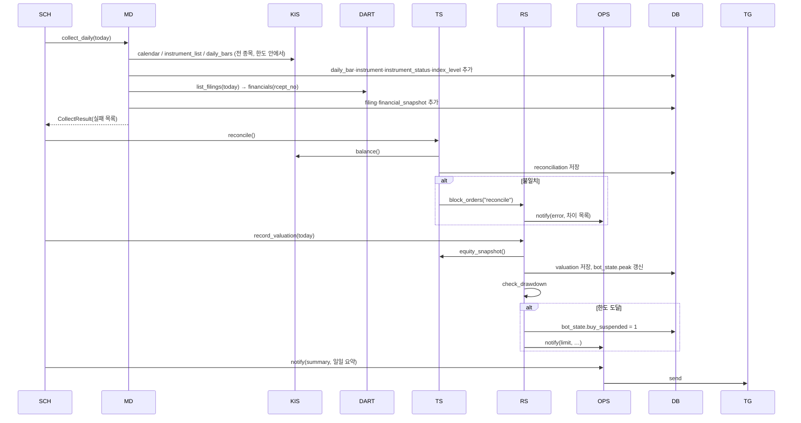
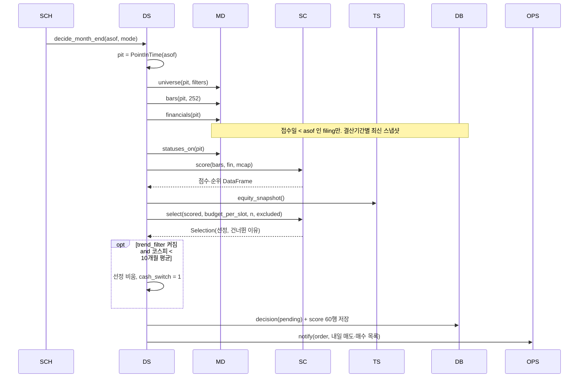
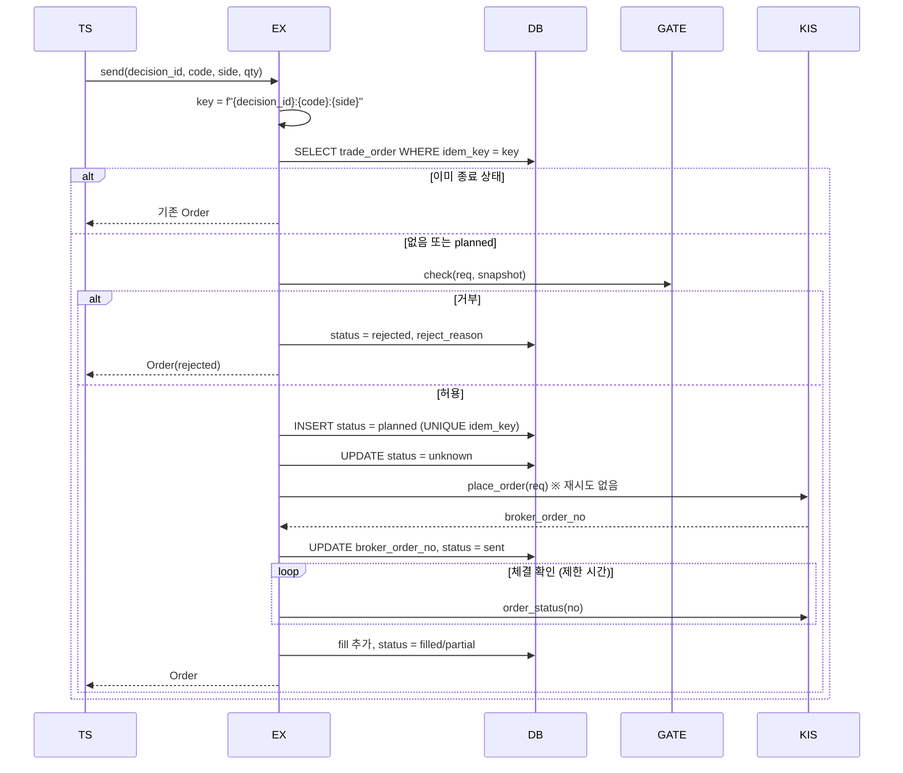
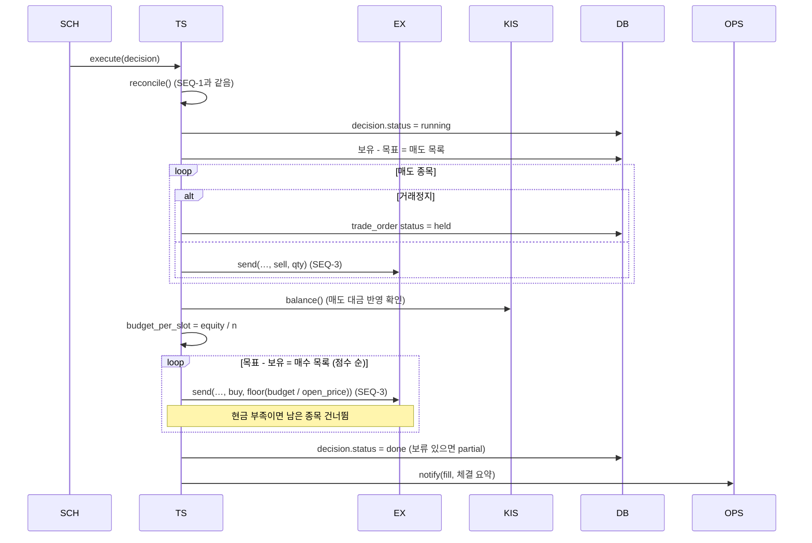
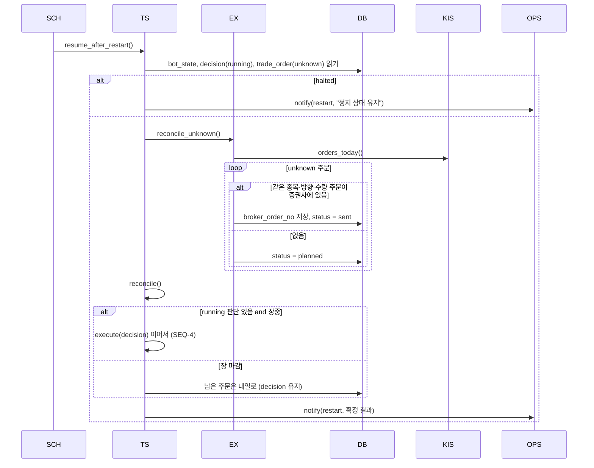
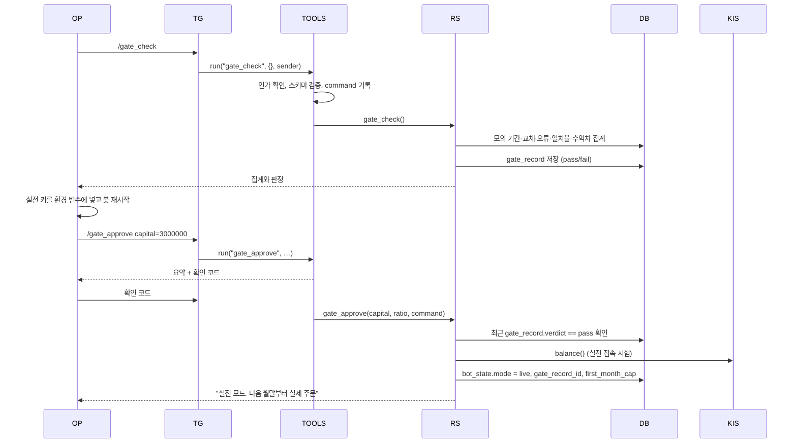

# SEQUENCE

## 0. 이 문서가 다루는 것

클래스 명세의 클래스들이 시간 순으로 어떻게 부르는지를 그린다. 흐름 6개만 그린다. 돈이 걸린 흐름과 재현성이 걸린 흐름이다. 나머지 유스케이스는 이 6개의 조합이거나 단순 조회라서 그리지 않는다.

### 0.1 생명선

| 생명선 | 약어 | 실체 | 종류 | 정의한 곳 |
|---|---|---|---|---|
| 스케줄 | SCH | `entry/schedule/jobs.py` | 입구 | [[QBOT-DOM-002#ToolRegistry]] |
| 도구 등록표 | TOOLS | ToolRegistry | 입구 | [[QBOT-DOM-002#ToolRegistry]] |
| 시장 데이터 | MD | MarketDataService | 서비스 | [[QBOT-DOM-002#MarketDataService]] |
| 판단 | DS | DecisionService | 서비스 | [[QBOT-DOM-002#DecisionService]] |
| 점수기 | SC | Scorer | 순수 함수 | [[QBOT-DOM-002#Scorer]] |
| 매매 | TS | TradingService | 서비스 | [[QBOT-DOM-002#TradingService]] |
| 주문 실행기 | EX | OrderExecutor | 서비스 | [[QBOT-DOM-002#OrderExecutor]] |
| 관문 | GATE | OrderGate | 서비스 | [[QBOT-DOM-002#OrderGate]] |
| 위험 관리 | RS | RiskService | 서비스 | [[QBOT-DOM-002#RiskService]] |
| 운영 | OPS | OpsService | 서비스 | [[QBOT-DOM-002#OpsService]] |
| 데이터베이스 | DB | SQLite | 저장소 | [[QBOT-DOM-003]] |
| 증권사 | KIS | BrokerPort → KisAdapter | 외부 | [[QBOT-DOM-002#BrokerPort]] |
| 전자공시 | DART | FilingPort → DartAdapter | 외부 | [[QBOT-DOM-002#FilingPort]] |
| 메신저 | TG | NotifierPort → TelegramAdapter | 외부 | [[QBOT-DOM-002#OpsService]] |
| 운영자 | OP | 사람 | 액터 | [[QBOT-UC-001]] 1장 |

## 1. 시퀀스

#### SEQ-1 거래일 저녁 수집과 점검

근거: [[QBOT-UC-001#UC-A1]], [[QBOT-UC-001#UC-A5]]

**읽을 때 볼 것**: 수집 실패는 흐름을 멈추지 않고 결과 목록에 담겨 알림으로 간다. 계좌 불일치와 손실 한도는 여기서 상태만 바꾸고, 그 상태를 읽는 것은 SEQ-3의 관문이다.

#### SEQ-2 월말 판단

근거: [[QBOT-UC-001#UC-A2]], [[QBOT-UC-001#UC-S1]], [[QBOT-UC-001#UC-S2]]

**읽을 때 볼 것**: 시장 데이터 조회 네 번이 전부 같은 `pit`를 받는다. Scorer는 DB도 시계도 모른다. 이 두 가지가 재현([[QBOT-UC-001#UC-H4]])이 같은 결과를 내는 이유다. 재현은 이 흐름을 FrozenClock으로 돌리고 마지막 두 단계를 "replay 저장, 알림 없음"으로 바꾼 것이다.

#### SEQ-3 주문 하나 보내기

근거: [[QBOT-UC-001#UC-S3]], [[QBOT-UC-001#UC-S6]], [[QBOT-INFRA-001#C8]]

**읽을 때 볼 것**: `planned → unknown → sent` 순서가 핵심이다. `unknown`으로 바꾼 뒤에 전송하므로, 전송 직후 죽어도 재시작 때 "보냈을 수도 있는 주문"으로 남는다. 반대로 전송 전에 죽으면 `planned`라 안전하게 다시 보낼 수 있다. UNIQUE(idem_key)가 두 프로세스가 동시에 같은 주문을 넣는 것도 막는다.

#### SEQ-4 판단 실행 (매도 후 매수)

근거: [[QBOT-UC-001#UC-A3]]

**읽을 때 볼 것**: 매도와 매수 사이에 `balance()`를 한 번 더 부른다. 예산을 판단 시점 평가액이 아니라 매도가 반영된 실제 현금으로 계산하기 위해서다. 판단 시점의 `budget_per_slot`는 참고값으로만 저장된다.

#### SEQ-5 재시작 후 이어 하기

근거: [[QBOT-UC-001#UC-A4]]

**읽을 때 볼 것**: `unknown` 주문을 확정하기 전에는 어떤 주문도 나가지 않는다. `orders_today()`는 조회 호출이라 재시도된다. 이 흐름이 끝나야 스케줄이 평소 작업을 다시 등록한다.

#### SEQ-6 실전 전환

근거: [[QBOT-UC-001#UC-H2]], [[QBOT-API-001#gate_check]], [[QBOT-API-001#gate_approve]]

**읽을 때 볼 것**: 관문 통과 기록을 확인하는 곳은 `gate_approve`와 SEQ-3의 관문 둘이다. 설정 파일만 바꿔서는 SEQ-3의 관문이 거부한다.

## 2. 대응표

| 유스케이스 | 시퀀스 |
|---|---|
| UC-A1 거래일 저녁 수집과 점검 | SEQ-1 |
| UC-A2 월말 판단 | SEQ-2 |
| UC-A3 판단 실행 | SEQ-4, SEQ-3 |
| UC-A4 재시작 후 이어 하기 | SEQ-5 |
| UC-A5 손실 한도 감시 | SEQ-1 |
| UC-A6 월간 성과 보고 | 단순 집계. 그리지 않음 |
| UC-H1 봇 정지와 재개 | SEQ-6의 도구 실행 경로와 같음. 그리지 않음 |
| UC-H2 실전 전환 | SEQ-6 |
| UC-H3 규칙 재점검 승인 | SEQ-6과 같은 경로. 그리지 않음 |
| UC-H4 과거 날짜 재현 | SEQ-2 변형 |
| UC-H5 설치와 적재 | SEQ-1의 수집 부분을 기간으로 반복. 그리지 않음 |
| UC-H6 계좌 기준으로 맞춤 | SEQ-6과 같은 경로. 그리지 않음 |
| UC-S1 시점 고정 조회 | SEQ-2 |
| UC-S2 종목 점수 계산 | SEQ-2 |
| UC-S3 주문 하나 보내기 | SEQ-3 |
| UC-S4 계좌 대조 | SEQ-1, SEQ-4, SEQ-5 |
| UC-S5 알림 | 모든 시퀀스의 OPS |
| UC-S6 주문 허용 판정 | SEQ-3 |
| UC-S7 외부 호출 재시도 | KIS·DART·TG 화살표 안에 숨어 있음 |

## 3. 되먹일 것

| 대상 | 내용 |
|---|---|
| [[QBOT-DOM-002#OrderExecutor]] | `send`가 `planned → unknown → sent` 세 번 상태를 바꾼다. 클래스 명세의 설명에는 이 순서가 있지만 "unknown으로 바꾼 뒤 전송"이 핵심임을 강조해야 한다 |
| [[QBOT-DOM-002#TradingService]] | 매도와 매수 사이에 `balance()`를 다시 부른다. 클래스 명세의 `execute` 설명에 "예산 계산"이 실제 현금 기준임을 적어야 한다 |
| [[QBOT-DOM-003]] | `decision.budget_per_slot`은 참고값이다. DD의 뜻 컬럼에 "판단 시점 추정치, 실행 시 재계산"을 적어야 한다 |

## 4. 미결사항

- [ ] SEQ-3의 체결 확인 제한 시간과 재시도 가격 폭. 제안은 5분, 호가 2단계
- [ ] SEQ-4에서 매도 체결이 부분 체결로 끝났을 때 매수 예산에 반영할지. 제안은 반영(실제 현금 기준이므로 자동)
